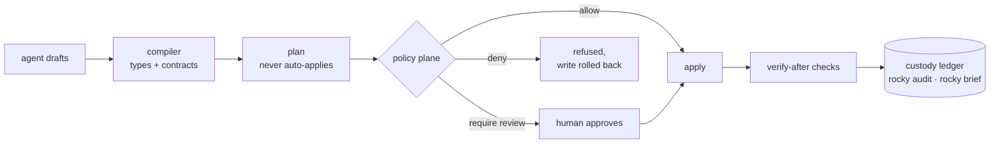

<p align="center">
  <picture>
    <source media="(prefers-color-scheme: dark)" srcset="docs/rocky-readme-dark.svg" />
    
  </picture>
</p>

[](https://github.com/rocky-data/rocky/actions/workflows/engine-ci.yml)
[](https://github.com/rocky-data/rocky/actions/workflows/sdk-ci.yml)
[](https://github.com/rocky-data/rocky/actions/workflows/dagster-ci.yml)
[](https://github.com/rocky-data/rocky/actions/workflows/vscode-ci.yml)
[](LICENSE)

**Rocky is a SQL transformation engine that type-checks your whole pipeline and catches breaking changes before they run.**

Works with Databricks, Snowflake, BigQuery, and DuckDB. You keep your warehouse and your existing SQL. Apache 2.0.

The failures that cost data teams the most are the quiet ones: a source column type changes and breaks something downstream, a column gets renamed and three models stop working, a query runs fine in dev but fails in prod. Rocky catches all of these at check time, before anything runs.

<p align="center">
  
</p>

## Try it in 60 seconds

```bash
# macOS / Linux
curl -fsSL https://raw.githubusercontent.com/rocky-data/rocky/main/engine/install.sh | bash

# Windows (PowerShell)
irm https://raw.githubusercontent.com/rocky-data/rocky/main/engine/install.ps1 | iex
```

```bash
rocky playground my-first-project
cd my-first-project
rocky compile && rocky test && rocky run
```

No credentials needed — the playground runs on local DuckDB.

For production deploys, use `rocky plan` (saves what will change) then `rocky apply <plan-id>` (runs it). For local work and automation, `rocky run` does it all in one step.

## Who Rocky is for

Built first for **data engineers on Databricks** where silent failures cost real money and Dagster is the scheduler. **Snowflake and BigQuery** adapters are in Beta — see [Where Rocky is today](#where-rocky-is-today).

## See it in action

Each demo is in [`examples/playground/pocs/`](examples/playground/). `cd` in, run `./run.sh`.

### See what breaks before you merge, with `rocky lineage-diff`

Compare two versions of your project and get a list of which downstream tables and columns each change affects — ready to paste into a GitHub PR comment.

<p align="center">
  
</p>

[POC: `06-developer-experience/11-lineage-diff`](examples/playground/pocs/06-developer-experience/11-lineage-diff/)

### More demos

- [Schema drift recovery](examples/playground/pocs/02-performance/06-schema-drift-recover/): source column type changes upstream; Rocky detects it and rebuilds safely.
- [Data contracts](examples/playground/pocs/01-quality/01-data-contracts-strict/): missing required columns, dropped protected columns, or unsafe type changes surface as errors (`E010`, `E011`, `E013`) before a row is written.
- [BigQuery cost to the byte](examples/playground/pocs/07-adapters/05-bigquery-native-queries/): `bytes_scanned` in the run receipt matches BigQuery's billing number exactly (requires credentials).
- [Named branches + replay](examples/playground/pocs/00-foundations/06-branches-replay-lineage/): run against an isolated schema copy, inspect, then drop or promote.
- [Agent policy](examples/playground/pocs/03-ai/07-policy/): a `[policy]` block grades what an agent may do on its own; pinned scenarios catch a loosened rule in CI.
- [Column lineage](examples/playground/pocs/06-developer-experience/01-lineage-column-level/): trace a column in a downstream model back to its source.
- [Incremental loads](examples/playground/pocs/02-performance/01-incremental-watermark/): set `strategy = "incremental"` and Rocky only processes new rows each run.
- [Data masking](examples/playground/pocs/04-governance/05-classification-masking-compliance/): tag PII columns, set masking per environment, fail the check if anything goes out unmasked.
- [AI model generation](examples/playground/pocs/03-ai/01-model-generation/): describe what you want; Rocky writes the SQL, checks it, and retries if something's wrong.

## In your editor

The checker runs as a language server in VS Code, so you see type mismatches and broken references while you write, not in CI. Column types show on hover, go-to-definition works across all your models.

The Rocky Inspector shows a model's columns, where each came from, its tests, cost, and which columns hold sensitive data.

<p align="center">
  
</p>

[Install the VS Code extension →](https://marketplace.visualstudio.com/items?itemName=rocky-data.rocky)

## When an AI agent writes your pipelines

Agents already author real pipeline changes, and the failure mode is no longer hypothetical: an over-trusted agent with production access can destroy real data in seconds. Rocky treats an agent as a first-class operator with a governed path to production. Every change an agent drafts is type-checked on write. What comes out is a plan, and a plan never auto-applies: it clears the policy you declared, then lands in a ledger you can query.



- **A policy plane in `rocky.toml`.** `[policy]` rules grade what a principal may do by capability and scope: allow, require review, or deny. A blast-radius ceiling degrades an allow back to review when a change touches too many downstream models, or when the radius can't be computed. Policies are themselves testable: `[[policy.tests]]` scenarios run through the real evaluator, so `rocky policy test` in CI catches a careless edit that would have opened a hole.
- **AI-authored plans stop for a human by default.** An agent proposes; unless a `[policy]` rule you wrote explicitly grants that scope, `rocky apply` refuses an unapproved AI-authored plan at the engine level, not by convention.
- **A queryable custody chain.** `rocky audit --for <table>` answers who changed what, under whose authority, with what verification. `rocky review --queue` ranks what's waiting on you. `rocky brief` is the morning digest, every line cited to the ledger.
- **What an agent materializes on the content-addressed path is provably rebuildable.** `rocky gc --derivable` inventories artifacts whose recorded recipe reproduces them, eviction is review-gated and leaves a tombstone, and `rocky restore` rebuilds the exact bytes or refuses.
- **The agent surface is MCP.** `rocky mcp` exposes 28 tools: schema and data grounding, draft tools that compile in the same call, and propose. A denied draft leaves nothing on disk.

<p align="center">
  
</p>

[POC: `04-governance/11-agent-policy`](examples/playground/pocs/04-governance/11-agent-policy/) drives this end to end, and the policy itself is regression-tested: `rocky policy test` runs pinned scenarios in CI and fails when an edit loosens a rule ([POC: `03-ai/07-policy`](examples/playground/pocs/03-ai/07-policy/)).

Autonomy is earned rung by rung: retrying a proven-transient failure is free, a provably additive schema change can be allowed to flow under policy, and everything else waits for review unless you explicitly grant it. Budgets tighten on repeated failure and never widen on their own; `rocky policy freeze` is the kill switch. How an agent authors, proposes, and clears the gates is in [Operating Rocky with agents](https://rocky-data.dev/concepts/operating-rocky-with-agents/).

## Where Rocky is today

Core features are production-ready on Databricks: the checker, named branches, replay, column lineage, rule enforcement, per-model cost. Everything else is in progress.

- **Databricks is the 2026 focus.** Snowflake, BigQuery, and Trino work for the core loop but aren't as thorough yet. [Talk to us](https://github.com/rocky-data/rocky/discussions) if you need them in production now.
- **AI features are early.** Generate → check → fix is shipped, and `rocky ai-test` writes assertions for a model from its intent. Mass refactoring and auto-migration on type changes are on the roadmap.
- **Replay re-executes, with honest scoping.** Every run leaves a content-addressed record that `rocky replay` inspects and verifies against the ledger. For deterministic content-addressed models, `rocky replay --execute --verify` re-runs the recorded recipe and checks the output reproduces bit-for-bit, locally or on the live warehouse in an isolated replay schema. A model that reads a mutable source is classified as non-replayable instead of being silently re-run against current data, and nondeterministic SQL is flagged so its divergence is reported as expected rather than passed off as a failure.
- **Iceberg.** Reading from a REST catalog is Beta. Content-addressed writes land as Iceberg-readable tables through Delta UniForm today; native Iceberg writes without the Delta intermediate are on the roadmap.
- **No built-in metrics layer.** Use Cube, the dbt Semantic Layer, or whatever you have.
- **Dagster is the one built-in scheduler integration** ([`dagster-rocky`](integrations/dagster/)). For anything else, use the [`rocky-sdk`](sdk/python/) Python client or `rocky serve`.

[Open a discussion](https://github.com/rocky-data/rocky/discussions) if any of these are a blocker.

## How it compares to dbt Core

| Problem | dbt Core | Rocky |
|---|---|---|
| Source column type changes | Silent | Detected at run, rebuilt safely |
| Required column disappears | Opt-in `contract: enforced` | `E010` at check time, blocks PR |
| Column renamed, unknown blast radius | Table-level lineage, post-hoc | `rocky lineage-diff` at PR time, column-level |
| `SELECT *` pulls an unexpected column | Silent | `P002` warning, downstream models named |
| Snowflake-only SQL in a Databricks project | No check | `P001` portability warning |
| Run costs double, no one knows which model | Dig through warehouse history | `cost_summary` per model, every run |
| Auditor asks what changed `fct_revenue.amount` | Run history, no code record | `rocky replay <run_id>` |
| Pipeline fails at 3 AM, half already ran | `dbt retry` from failed model | `rocky run --resume-latest`, skips succeeded models |

`rocky import-dbt` converts a vanilla dbt Core project in one command. Rocky also closes the dbt-Core feature gaps teams hit first: deterministic surrogate keys (`[[surrogate_key]]`, the same value `dbt_utils.generate_surrogate_key` produces on each warehouse), named data-quality tests defined once and reused by name (the analogue of dbt Core's generic tests), and fixture-driven unit tests that mock upstream inputs and assert the output. See the [model format reference](https://rocky-data.dev/reference/model-format/).

- **No vendor lock-in.** `rocky emit-sql` renders every transformation model as plain, dependency-ordered SQL, offline with no warehouse connection. It's a one-command export, not a rewrite, so adopting Rocky is never a one-way door. See [No lock-in](https://rocky-data.dev/guides/no-lock-in/).

In June 2026 dbt Labs released Fusion (dbt Core v2.0, Rust, Apache 2.0, alpha) with SQL type-checking and column lineage, though it still templates with Jinja and safety checks are opt-in. Neither dbt Core v2.0 nor Fusion includes named branches, a code-and-output record per run, per-model cost as a built-in, a cross-database portability check, or declarative masking. Those are in dbt's paid platform; Rocky's are Apache 2.0.

## Subprojects

| Path | What ships | Language | What it does |
|---|---|---|---|
| [`engine/`](engine/) | `rocky` CLI | Rust | Core engine: SQL checking, drift detection, incremental loads, adapters |
| [`sdk/python/`](sdk/python/) | `rocky-sdk` (PyPI) | Python | Python client wrapping the CLI, for notebooks and scripts |
| [`integrations/dagster/`](integrations/dagster/) | `dagster-rocky` (PyPI) | Python | Dagster resource built on `rocky-sdk` |
| [`editors/vscode/`](editors/vscode/) | Rocky VS Code extension | TypeScript | Live checking, syntax highlighting, AI commands |
| [`examples/playground/`](examples/playground/) | (config only) | TOML / SQL | Sample DuckDB pipeline, no credentials needed |

## Adapters

| Role | Adapter | Status |
|------|---------|--------|
| Warehouse | Databricks | Production |
| Warehouse | Snowflake | Beta |
| Warehouse | BigQuery | Beta |
| Warehouse | DuckDB | Local / Testing |
| Warehouse | Trino | Beta |
| Source | Fivetran | Production |
| Source | Airbyte | Beta |
| Source | Iceberg | Beta |
| Source | Manual | Production |

Building a connector for ClickHouse, Redshift, or another warehouse? See the [Adapter SDK guide](https://rocky-data.dev/guides/adapter-sdk/) and the [skeleton POC](examples/playground/pocs/07-adapters/06-rust-native-adapter-skeleton/).

## Building from source

```bash
git clone https://github.com/rocky-data/rocky.git
cd rocky
just build   # engine + sdk + dagster + vscode
just test
just lint
```

See [`CONTRIBUTING.md`](CONTRIBUTING.md) for per-subproject build commands.

## Releases

Each artifact ships independently via CI-driven tags:

- `engine-v*` → Rocky CLI binary on GitHub Releases (macOS, Linux, Windows)
- `sdk-v*` → `rocky-sdk` on PyPI
- `dagster-v*` → `dagster-rocky` on PyPI
- `vscode-v*` → Rocky extension on the VS Code Marketplace

## Documentation

Full docs at **[rocky-data.dev](https://rocky-data.dev)**.

New to Rocky? **[`ROCKY_EXPLAINED.md`](ROCKY_EXPLAINED.md)** is a plain-English walkthrough of the whole system, with diagrams.

## Contributing

See [`CONTRIBUTING.md`](CONTRIBUTING.md). Schema or DSL changes need to update all dependent pieces at once — read the cross-project change guidance before opening a PR.

## Sponsoring

Rocky is free and open source. If it saves your team time, consider [sponsoring the project](https://github.com/sponsors/hugocorreia90).

## License

[Apache 2.0](LICENSE)
