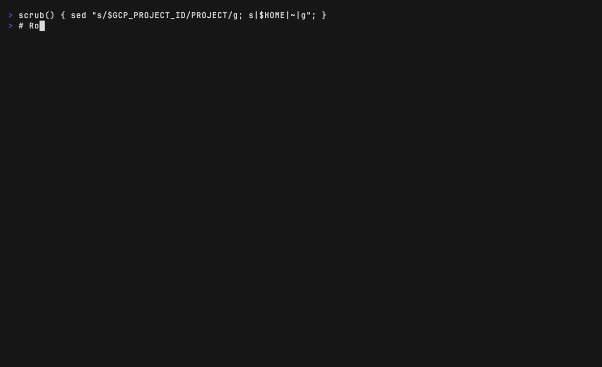
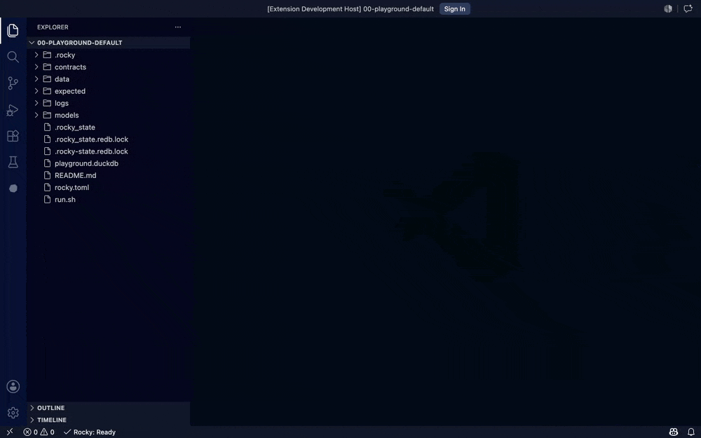

<p align="center">
  <picture>
    <source media="(prefers-color-scheme: dark)" srcset="docs/rocky-readme-dark.svg" />
    
  </picture>
</p>

[](https://github.com/rocky-data/rocky/actions/workflows/engine-ci.yml)
[](https://github.com/rocky-data/rocky/actions/workflows/dagster-ci.yml)
[](https://github.com/rocky-data/rocky/actions/workflows/vscode-ci.yml)
[](LICENSE)

**Rocky is the typed graph between your code and whichever warehouse, table format, or query engine you've chosen.**

It is a typed compiler that runs over your existing Databricks, Snowflake, BigQuery, or DuckDB and owns the graph between your code and your data: named branches, content-addressed replay, column-level lineage, compile-time contracts, and per-model cost. Storage and compute stay where they are, and Rocky works on the SQL you already have. The `.rocky` DSL is there when you want it. Apache 2.0.

The failures that cost data teams the most are invisible to the warehouse and out of scope for the templating layer above it: schema drift, column-rename blast radius, dialect divergence, cost spikes nobody can attribute. Rocky turns them into compile errors and blocked PRs.

<p align="center">
  
</p>

## Try it in 60 seconds

```bash
# macOS / Linux
curl -fsSL https://raw.githubusercontent.com/rocky-data/rocky/main/engine/install.sh | bash

# Windows (PowerShell)
irm https://raw.githubusercontent.com/rocky-data/rocky/main/engine/install.ps1 | iex
```

```bash
rocky playground my-first-project
cd my-first-project
rocky compile && rocky test && rocky run
```

No credentials needed; the playground runs end-to-end on local DuckDB.

`rocky run` is the one-step path for local iteration and automation. For production or PR-gated deploys, split it into `rocky plan` (builds and persists an auditable plan to `.rocky/plans/<id>.json`) followed by `rocky apply <plan-id>`.

## Who Rocky is for

Rocky is built first for **data platform engineers running production-critical, multi-tenant pipelines on Databricks**, where silent failures cost real money and Dagster is already the orchestrator. That is the launch wedge, and where Rocky is most battle-tested.

The next ring out: **Snowflake and BigQuery shops** evaluating SQLMesh, who want correctness in the compiler rather than the planner and prefer SQL by default. Adapters are Beta today; see [Where Rocky is today](#where-rocky-is-today) below.

## See it in action

Each demo below is a self-contained POC in [`examples/playground/pocs/`](examples/playground/): `cd` in, run `./run.sh`, and reproduce it locally.

### Detects schema drift the moment it happens

A source column type changes upstream. On the next run, Rocky diffs source against target, drops the target, and recreates it. No silent data corruption.

<p align="center">
  
</p>

[POC: `02-performance/06-schema-drift-recover`](examples/playground/pocs/02-performance/06-schema-drift-recover/)

### Enforces data contracts at compile time

Missing required columns, protected columns being removed, or unsafe type changes surface as diagnostic codes (`E010`, `E013`) before a single row is written.

<p align="center">
  
</p>

[POC: `01-quality/01-data-contracts-strict`](examples/playground/pocs/01-quality/01-data-contracts-strict/)

### Named branches for risk-free experiments

Create a branch, run against it in an isolated schema, inspect, then drop or promote. Column-level lineage shows the downstream blast radius before you ship.

<p align="center">
  
</p>

[POC: `00-foundations/06-branches-replay-lineage`](examples/playground/pocs/00-foundations/06-branches-replay-lineage/)

### Column-level lineage, not table-level

Trace a single column from a downstream fact back through its aggregations, all the way to the seed. Blast-radius analysis without reading every model.

<p align="center">
  
</p>

[POC: `06-developer-experience/01-lineage-column-level`](examples/playground/pocs/06-developer-experience/01-lineage-column-level/)

### AI model generation with a compile-validate loop

Describe what you want in plain English. Rocky generates a Rocky DSL model, compiles it, and retries on parse failure. The `Attempts: 2` line shows the loop catching a first-pass error.

<p align="center">
  
</p>

[POC: `03-ai/01-model-generation`](examples/playground/pocs/03-ai/01-model-generation/)

### PR-time blast-radius with `rocky lineage-diff`

Compare two git refs and get a per-changed-column readout of downstream consumers; the pre-rendered Markdown drops straight into a GitHub PR comment. CODEOWNERS-style review tooling can't reach this granularity without a compiled engine.

<p align="center">
  
</p>

[POC: `06-developer-experience/11-lineage-diff`](examples/playground/pocs/06-developer-experience/11-lineage-diff/)

### Classify columns, mask by environment, gate CI

Tag PII columns in the model sidecar, and bind tags to mask strategies in `[mask]` / `[mask.<env>]`. `rocky compliance --env prod --fail-on exception` exits 1 the moment a classified column has no resolved strategy: a one-line CI gate against accidentally unmasked data.

<p align="center">
  
</p>

[POC: `04-governance/05-classification-masking-compliance`](examples/playground/pocs/04-governance/05-classification-masking-compliance/)

### Incremental loads with persistent watermark state

`strategy = "incremental"` plus a `timestamp_column` is all it takes. Rocky writes the high-water mark to the embedded state store, and subsequent runs only `INSERT … WHERE timestamp > watermark`. Append 25 rows after a 500-row load, and run 2 still finishes in 0.2s.

<p align="center">
  
</p>

[POC: `02-performance/01-incremental-watermark`](examples/playground/pocs/02-performance/01-incremental-watermark/)

### Native BigQuery: materialize live, cost to the byte

Swap the adapter to BigQuery and the same project materializes a full-refresh `CREATE TABLE AS` against the live warehouse. Rocky's run receipt reports `bytes_scanned` and `cost_usd`, and a cross-check confirms that `bytes_scanned` matches BigQuery's own `totalBytesBilled` for the job, to the byte. The same models run against Snowflake or Databricks by changing only the adapter.

<p align="center">
  
</p>

[POC: `07-adapters/05-bigquery-native-queries`](examples/playground/pocs/07-adapters/05-bigquery-native-queries/) — the live path requires BigQuery credentials

## In your editor

The same compiler runs as a language server inside VS Code, so you catch drift, type errors, and contract violations where you write the code, not just in CI.

Your `.rocky` models compile to SQL live as you type, with type-aware hover, inline column types, and go-to-definition across the graph.

<p align="center">
  
</p>

The Inspector turns any model into a trust dashboard: schema, column-level lineage, tests, per-model cost, and a governance card that flags classified columns and unmasked PII.

<p align="center">
  
</p>

[Install the VS Code extension →](https://marketplace.visualstudio.com/items?itemName=rocky-data.rocky)

## Where Rocky is today

The trust primitives (compiler, branches, replay, lineage, contracts, cost attribution) are production-grade on Databricks. The rest is in progress:

- **Databricks is the production target for 2026.** Snowflake, BigQuery, and Trino adapters are Beta: connection, execution, and the core run loop work, but conformance coverage is still growing. If your enterprise warehouse is Snowflake or BigQuery and you need it production-grade today, talk to us.
- **AI is a growing surface, not a finished product.** The compile-validate loop (generate, type-check, auto-fix, then land) is shipped. The broader story (mass refactor across the DAG, auto-migration from a column-type change, schema-aware assertion generation) is on the roadmap.
- **Iceberg.** REST-catalog source discovery is Beta. Content-addressed writes round-trip as Iceberg through Delta UniForm, shipped end-to-end. First-class Iceberg-native writes without the Delta intermediate are on the 2026 roadmap.
- **No built-in semantic layer.** Rocky's typed IR is the right home for one. Today, integrate with Cube, the dbt Semantic Layer, or your existing metric store.
- **Orchestration: Dagster is first-class.** A `rocky serve` standalone path exists; native Airflow and Prefect integrations are not yet shipped, so they're called from the CLI like any other binary.

If those gaps are blockers for your team, [open a discussion](https://github.com/rocky-data/rocky/discussions). The roadmap is shaped by where production pipelines are actually getting hurt.

## How it compares to dbt Core

| Disaster | What dbt Core does | What Rocky does |
|---|---|---|
| Upstream changes a column type | Silent; surfaces as a downstream failure later | `E013` at compile, blocks the PR |
| Required column dropped from a contract | Caught at build time via `contract: enforced` | `E010` at compile, blocks the PR |
| Column rename with unknown blast radius | `dbt docs` is post-hoc and table-level; dbt Cloud Enterprise adds column lineage in the UI, also post-hoc and not PR-blocking | `rocky lineage-diff` at PR time, column-level, downstream consumers listed, blocks the merge |
| `SELECT *` pulls a new column you didn't expect | Silent | `P002` warning, downstream consumers named |
| Snowflake-only function written for a Databricks project | No dialect-portability lint; runs in dev, fails in prod | `P001` dialect-portability lint at compile |
| Run cost doubles, no one knows which model | No per-model cost attribution; reconstruct it from warehouse query history | `RunOutput.cost_summary` per model, every run |
| Auditor asks: who changed `fct_revenue.amount`, when, and why? | Run history in dbt Cloud, but no content-addressed record of code and output | `rocky replay <run_id>`: a content-addressed record of the exact code and the output it produced |
| Sev-2 at 3 AM, half the pipeline already ran | `dbt retry` resumes from the failed model; no within-run checkpoint or circuit breaker | `rocky run --resume-latest`: checkpoint, three-state circuit breaker, skip what succeeded |

Each row is a real failure mode and a Rocky command that turns it into a non-event. The same primitives back every row: typed compiler, content-addressed state, column-level lineage, per-model cost.

dbt Core defined this category, and `rocky import-dbt` converts a vanilla dbt project to Rocky in one command. In June 2026 dbt Labs open-sourced the Fusion runtime as dbt Core v2.0 (Rust, Apache 2.0, alpha); the recommended **Fusion** distribution adds SQL type-checking and column-level lineage on top, though it still templates with Jinja and its static analysis is opt-in. Neither dbt Core v2.0 nor Fusion ships named branches, a content-addressed run record, per-model cost as a first-class column, a cross-warehouse dialect lint, or declarative RBAC and masking; dbt's governance and cost features live in its paid platform, while Rocky's are open source under Apache 2.0.

## Subprojects

| Path | Artifact | Language | Description |
|---|---|---|---|
| [`engine/`](engine/) | `rocky` CLI binary | Rust | Core SQL transformation engine, 23-crate Cargo workspace |
| [`integrations/dagster/`](integrations/dagster/) | `dagster-rocky` PyPI wheel | Python | Dagster resource and component wrapping the Rocky CLI |
| [`editors/vscode/`](editors/vscode/) | Rocky VSIX | TypeScript | VS Code extension; LSP client + commands for AI features |
| [`examples/playground/`](examples/playground/) | (config only) | TOML / SQL | Self-contained DuckDB sample pipeline used for smoke tests and benchmarks |

Each subproject has its own README with detailed usage. The [`engine/README.md`](engine/README.md) is the canonical product reference for the Rocky CLI.

## Adapters

| Role | Adapter | Status | Notes |
|------|---------|--------|-------|
| Warehouse | Databricks | Production | SQL Statement API · Unity Catalog · `SHALLOW CLONE` for branches |
| Warehouse | Snowflake | Beta | REST connector · zero-copy `CLONE` for branches · masking policies |
| Warehouse | BigQuery | Beta | REST connector · `CREATE TABLE … COPY` for branches |
| Warehouse | DuckDB | Local / Testing | Embedded · powers `rocky playground` (no credentials needed) |
| Warehouse | Trino | Beta | REST `/v1/statement` polling client · Basic + JWT auth · Docker conformance harness behind `trino-conformance` feature |
| Source | Fivetran | Production | REST connector + table discovery |
| Source | Airbyte | Beta | Catalog discovery |
| Source | Iceberg | Beta | REST catalog discovery of namespaces and tables |
| Source | Manual | Production | Schema/table lists inline in `rocky.toml` |

Building a warehouse Rocky doesn't ship in-tree (ClickHouse, Redshift, …)? See the [Adapter SDK guide](https://rocky-data.dev/guides/adapter-sdk/) and the [Rust-native skeleton POC](examples/playground/pocs/07-adapters/06-rust-native-adapter-skeleton/).

## Building from source

```bash
git clone https://github.com/rocky-data/rocky.git
cd rocky
just build       # builds engine + dagster wheel + vscode extension
just test        # runs all test suites
just lint        # cargo clippy/fmt + ruff + eslint
```

`just` is optional; you can also build each subproject directly. See [`CONTRIBUTING.md`](CONTRIBUTING.md) for per-subproject build commands.

## Releases

Each artifact is released independently using a tag-namespaced scheme:

- `engine-v*` → Rocky CLI binary (cross-compiled, on GitHub Releases)
- `dagster-v*` → `dagster-rocky` wheel
- `vscode-v*` → Rocky VSIX

See [`CONTRIBUTING.md`](CONTRIBUTING.md#releases) for the full release flow.

## Documentation

Full documentation lives at **[rocky-data.dev](https://rocky-data.dev)**: concepts, guides, CLI reference, Dagster integration, and the adapter SDK.

## Contributing

See [`CONTRIBUTING.md`](CONTRIBUTING.md). Before opening a PR, please read the cross-project change guidance: schema and DSL changes must update consumers atomically.

## Sponsoring

Rocky is free and open source. If it saves your team time, consider [sponsoring the project](https://github.com/sponsors/hugocorreia90) so development can continue.

## License

[Apache 2.0](LICENSE)
