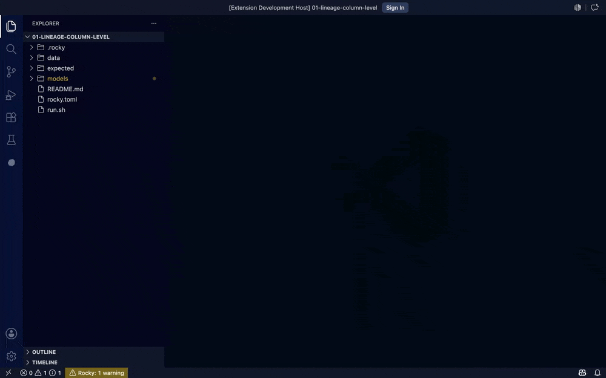

<p align="center">
  <picture>
    <source media="(prefers-color-scheme: dark)" srcset="docs/rocky-readme-dark.svg" />
    
  </picture>
</p>

[](https://github.com/rocky-data/rocky/actions/workflows/engine-ci.yml)
[](https://github.com/rocky-data/rocky/actions/workflows/sdk-ci.yml)
[](https://github.com/rocky-data/rocky/actions/workflows/dagster-ci.yml)
[](https://github.com/rocky-data/rocky/actions/workflows/vscode-ci.yml)
[](LICENSE)

**Rocky checks your SQL data pipelines and runs them, so problems get caught before they reach your warehouse.**

It works with Databricks, Snowflake, BigQuery, and DuckDB. You keep your warehouse and your existing SQL. Rocky reads your pipeline, figures out what every column does, and tells you when something's wrong before it runs anything. Apache 2.0.

Most of the expensive failures in data work are the quiet ones. A source table changes its columns and breaks a model downstream. Someone renames a column and three other models stop working without a peep. A query runs fine in dev, then fails in prod because it uses a function the production database doesn't have. Rocky catches all of these when you check the pipeline, before any data moves.

<p align="center">
  
</p>

## Try it in 60 seconds

```bash
# macOS / Linux
curl -fsSL https://raw.githubusercontent.com/rocky-data/rocky/main/engine/install.sh | bash

# Windows (PowerShell)
irm https://raw.githubusercontent.com/rocky-data/rocky/main/engine/install.ps1 | iex
```

```bash
rocky playground my-first-project
cd my-first-project
rocky compile && rocky test && rocky run
```

No credentials needed. The playground runs entirely on a local database (DuckDB), so you can try everything offline.

`rocky run` does the whole pipeline in one command, which is what you want for local work and automation. For production or PR-gated deploys, split it in two: `rocky plan` saves a record of exactly what will change, then `rocky apply <plan-id>` carries it out. You get an audit trail and a chance to look things over before anything runs.

## Who Rocky is for

Rocky was built first for **data engineers running critical, multi-tenant pipelines on Databricks**, where a silent failure costs real money and Dagster is already doing the scheduling. That's who it's built around, and it's where Rocky is most battle-tested.

After that come **Snowflake and BigQuery teams** who'd rather catch problems before a pipeline runs than after. Those adapters are in Beta today; see [Where Rocky is today](#where-rocky-is-today) below.

## See it in action

Each demo is a self-contained example in [`examples/playground/pocs/`](examples/playground/). `cd` in, run `./run.sh`, and reproduce it yourself.

### See what breaks before you merge, with `rocky lineage-diff`

Compare two versions of your project and Rocky tells you which downstream tables and columns each change affects. The output drops straight into a GitHub PR comment, so reviewers can see the impact without digging through code.

<p align="center">
  
</p>

[POC: `06-developer-experience/11-lineage-diff`](examples/playground/pocs/06-developer-experience/11-lineage-diff/)

### More demos

- [Schema drift recovery](examples/playground/pocs/02-performance/06-schema-drift-recover/): a source column's type changes upstream. Rocky notices and rebuilds the affected table safely instead of letting it corrupt quietly.
- [Data contracts at check time](examples/playground/pocs/01-quality/01-data-contracts-strict/): a required column goes missing, a protected column gets dropped, or a type change isn't safe. Each one shows up as an error (`E010` / `E013`) before a single row is written.
- [Native BigQuery, cost to the byte](examples/playground/pocs/07-adapters/05-bigquery-native-queries/): the models run live against BigQuery, and the run receipt's `bytes_scanned` matches BigQuery's own billing number exactly (requires credentials).
- [Named branches + replay](examples/playground/pocs/00-foundations/06-branches-replay-lineage/): run your pipeline against an isolated copy of your schema, look at the results, then drop it or promote it to production.
- [Column-level lineage](examples/playground/pocs/06-developer-experience/01-lineage-column-level/): trace one column in a downstream report all the way back to the source it came from.
- [Incremental loads](examples/playground/pocs/02-performance/01-incremental-watermark/): set `strategy = "incremental"` and a timestamp column, and Rocky only processes the rows that are new since the last run.
- [Data masking and compliance](examples/playground/pocs/04-governance/05-classification-masking-compliance/): tag the columns that hold personal data, pick a masking strategy per environment, and fail the check if sensitive data would go out unmasked.
- [AI model generation](examples/playground/pocs/03-ai/01-model-generation/): describe what you want in plain English. Rocky writes the SQL, checks it, and tries again on its own if something's off.

## In your editor

The same checker that runs in CI also runs as a language server inside VS Code. So you see the problems (a column type mismatch, a broken reference, a rule you've violated) while you're writing the code, not hours later in a failed CI run. Your `.rocky` files compile to SQL live as you type, with column types on hover and go-to-definition across all your models.

The Rocky Inspector puts everything about a model in one place: its columns, where each one came from, what tests it has, what it costs to run, and which columns hold sensitive data.

<p align="center">
  
</p>

[Install the VS Code extension →](https://marketplace.visualstudio.com/items?itemName=rocky-data.rocky)

## Where Rocky is today

The core features are production-ready on Databricks: the checker, named pipeline branches, replay, column lineage, rule enforcement, and per-model cost tracking. The rest is still in progress.

- **Databricks is the main focus for 2026.** The Snowflake, BigQuery, and Trino adapters connect, run queries, and handle the core pipeline loop, but they aren't as thoroughly tested as the Databricks one yet. If you need Snowflake or BigQuery in production today, [talk to us](https://github.com/rocky-data/rocky/discussions).
- **AI features are early.** The generate → check → fix loop is shipped. The bigger stuff is on the roadmap: refactoring across a whole pipeline at once, auto-migrating when a column type changes, and generating data-quality assertions for you.
- **Iceberg support.** Reading from an Iceberg catalog works in Beta. Writing straight to Iceberg, without going through Delta format first, is planned for 2026.
- **No built-in metrics layer.** Rocky knows your columns and where they come from, but it won't define business metrics for you. Use Cube, the dbt Semantic Layer, or whatever metrics tool you already have.
- **Dagster is the one built-in scheduler integration ([`dagster-rocky`](integrations/dagster/)).** For anything else (Airflow, Prefect, Flyte, a cron script), the [`rocky-sdk`](sdk/python/) Python client lets you wrap Rocky in a task, and there's a `rocky serve` HTTP mode too. We haven't shipped pre-built integrations for other schedulers yet, but you can build one on the SDK.

If one of these gaps is a blocker for your team, [open a discussion](https://github.com/rocky-data/rocky/discussions). What gets built next depends on where real pipelines are actually breaking.

## How it compares to dbt Core

| Problem | What dbt Core does | What Rocky does |
|---|---|---|
| A source table's column type changes | Silent; shows up as a failure later in a downstream model | Caught at check time as error `E013`, blocks the PR |
| A required column disappears | Caught at build time if you've opted into `contract: enforced` | Caught at check time as error `E010`, blocks the PR |
| A column gets renamed and you don't know what breaks | `dbt docs` shows table-level lineage after the fact; dbt Cloud Enterprise adds column lineage in the UI, also after the fact | `rocky lineage-diff` at PR time shows exactly which downstream columns are affected, by name |
| `SELECT *` pulls in a new column you didn't ask for | Silent | Warning `P002`, naming the downstream models it touches |
| SQL that only works on Snowflake gets written for a Databricks project | No check; works in dev, fails in prod | `P001` database-portability warning at check time |
| A run costs twice as much as last week and no one knows which model | No per-model cost; you'd have to dig through warehouse query history | `RunOutput.cost_summary` gives you the cost per model, every run |
| An auditor asks who changed `fct_revenue.amount`, when, and why | Run history in dbt Cloud, but no record of the exact code that produced a given output | `rocky replay <run_id>` gives you a complete record of the code and the output it produced |
| A pipeline fails at 3 AM and half the models already ran | `dbt retry` resumes from the failed model | `rocky run --resume-latest` picks up from the last checkpoint and skips the models that already succeeded |

dbt Core created this category, and `rocky import-dbt` converts a vanilla dbt project in one command. In June 2026 dbt Labs open-sourced a new Rust-based runtime called Fusion as dbt Core v2.0 (Apache 2.0, alpha). Fusion adds SQL type-checking and column-level lineage, but it still uses Jinja templates, and its safety checks are opt-in rather than enforced.

A few things neither dbt Core v2.0 nor Fusion has: named pipeline branches, a record of the exact code and output for each run, per-model cost as a built-in field, a cross-database SQL portability check, and declarative data-access rules with masking. dbt keeps its governance and cost features in the paid platform; Rocky's are all Apache 2.0.

## Subprojects

| Path | What ships | Language | What it does |
|---|---|---|---|
| [`engine/`](engine/) | `rocky` CLI binary | Rust | The core engine: SQL checking, schema drift detection, incremental loads, warehouse adapters. 23 Rust crates. |
| [`sdk/python/`](sdk/python/) | `rocky-sdk` (PyPI) | Python | A Python client that wraps the Rocky CLI, for use in notebooks, scripts, and custom schedulers |
| [`integrations/dagster/`](integrations/dagster/) | `dagster-rocky` (PyPI) | Python | Dagster resource built on `rocky-sdk`; maps results to Dagster assets and checks |
| [`editors/vscode/`](editors/vscode/) | Rocky VS Code extension | TypeScript | VS Code extension: live checking, syntax highlighting, AI commands |
| [`examples/playground/`](examples/playground/) | (config only) | TOML / SQL | A self-contained sample pipeline on DuckDB, no credentials needed, used for testing and demos |

Each subproject has its own README with more detail. [`engine/README.md`](engine/README.md) is the main reference for the Rocky CLI.

## Adapters

| Role | Adapter | Status | Notes |
|------|---------|--------|-------|
| Warehouse | Databricks | Production | SQL Statement API · Unity Catalog · schema-prefix branches |
| Warehouse | Snowflake | Beta | REST connector · permission reconciliation · schema-prefix branches |
| Warehouse | BigQuery | Beta | REST connector · schema-prefix branches |
| Warehouse | DuckDB | Local / Testing | Embedded database · powers `rocky playground` (no credentials needed) |
| Warehouse | Trino | Beta | REST polling client · Basic + JWT auth |
| Source | Fivetran | Production | REST connector + table discovery |
| Source | Airbyte | Beta | Catalog discovery |
| Source | Iceberg | Beta | REST catalog — discovers namespaces and tables |
| Source | Manual | Production | List schemas and tables directly in `rocky.toml` |

Need a warehouse Rocky doesn't ship yet, like ClickHouse or Redshift? You can build your own connector. See the [Adapter SDK guide](https://rocky-data.dev/guides/adapter-sdk/) and the [example skeleton POC](examples/playground/pocs/07-adapters/06-rust-native-adapter-skeleton/).

## Building from source

```bash
git clone https://github.com/rocky-data/rocky.git
cd rocky
just build       # builds engine + sdk + dagster wheels + vscode extension
just test        # runs all test suites
just lint        # cargo clippy/fmt + ruff + eslint
```

`just` is optional; you can build each subproject on its own too. See [`CONTRIBUTING.md`](CONTRIBUTING.md) for per-subproject build commands.

## Releases

Each piece ships independently, tagged separately:

- `engine-v*` → Rocky CLI binary (built for macOS, Linux, and Windows, available on GitHub Releases)
- `sdk-v*` → `rocky-sdk` Python package on PyPI
- `dagster-v*` → `dagster-rocky` Python package on PyPI
- `vscode-v*` → Rocky VS Code extension on the Marketplace

See [`CONTRIBUTING.md`](CONTRIBUTING.md#releases) for the full release process.

## Documentation

Full documentation is at **[rocky-data.dev](https://rocky-data.dev)**: concepts, guides, CLI reference, the Python SDK, Dagster integration, and the adapter SDK.

New to Rocky and want the whole thing explained in plain English? **[`ROCKY_EXPLAINED.md`](ROCKY_EXPLAINED.md)** is a single file that walks through every part of Rocky from the ground up: the checker, the pipeline model, how adapters work, incremental watermarks, data contracts, masking, column lineage, and the rest, with diagrams throughout.

## Contributing

See [`CONTRIBUTING.md`](CONTRIBUTING.md). Before you open a PR, read the cross-project change guidance: a change to the output format or the Rocky DSL needs to update all the dependent pieces at once.

## Sponsoring

Rocky is free and open source. If it saves your team time, consider [sponsoring the project](https://github.com/sponsors/hugocorreia90) so development can continue.

## License

[Apache 2.0](LICENSE)
