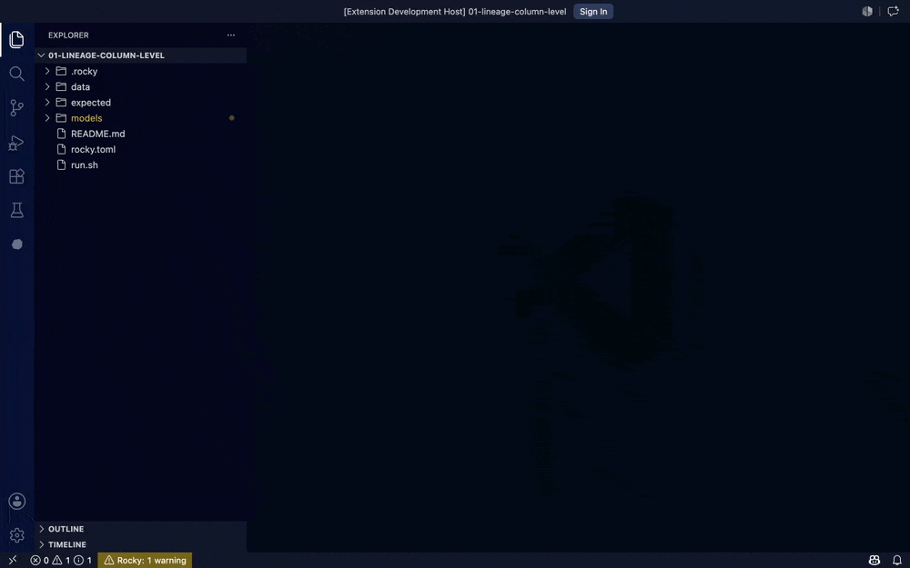

<p align="center">
  <picture>
    <source media="(prefers-color-scheme: dark)" srcset="docs/rocky-readme-dark.svg" />
    
  </picture>
</p>

[](https://github.com/rocky-data/rocky/actions/workflows/engine-ci.yml)
[](https://github.com/rocky-data/rocky/actions/workflows/sdk-ci.yml)
[](https://github.com/rocky-data/rocky/actions/workflows/dagster-ci.yml)
[](https://github.com/rocky-data/rocky/actions/workflows/vscode-ci.yml)
[](LICENSE)

**Rocky checks your whole SQL pipeline before it runs, and tells you what a change will break.**

Rocky works with Databricks, Snowflake, BigQuery, and DuckDB. You keep your warehouse and your existing SQL. Apache 2.0.

The failures that cost the most are the quiet ones. A source column changes type. Someone renames a column and three models stop working. A query works in dev and fails in production. Rocky finds all of these at check time.

```
   you edit SQL          rocky compile              rocky run
        │                      │                        │
        ▼                      ▼                        ▼
   ┌─────────┐        ┌──────────────────┐        ┌───────────┐
   │  model  │───────►│  check the whole │───────►│ warehouse │
   │  files  │        │  pipeline: types,│        │  writes   │
   └─────────┘        │  refs, contracts │        └───────────┘
                      └──────────────────┘
                               │
                               │ a problem is found here,
                               ▼ so nothing runs
                        E010: required column
                        `order_id` is missing
```

<p align="center">
  
</p>

That is what the GIF shows, in text:

```
$ rocky compile
  ✓ raw_orders (6 columns)
  ✓ customer_orders (4 columns)
  ✓ revenue_summary (5 columns)
  Compiled: 3 models, 0 errors, 0 warnings

$ rocky run
transformation pipeline complete: 3 model(s) executed in 20ms
  playground.main.raw_orders (full_refresh)
  playground.main.customer_orders (full_refresh)
  playground.main.revenue_summary (full_refresh)
```

## Try it in 60 seconds

```bash
# macOS / Linux
curl -fsSL https://raw.githubusercontent.com/rocky-data/rocky/main/engine/install.sh | bash

# Windows (PowerShell)
irm https://raw.githubusercontent.com/rocky-data/rocky/main/engine/install.ps1 | iex
```

```bash
rocky playground my-first-project
cd my-first-project
rocky compile && rocky test && rocky run
```

No credentials needed — the playground runs on local DuckDB.

For production deploys, use `rocky plan` (saves what will change) then `rocky apply <plan-id>` (runs it). For local work and automation, `rocky run` does it all in one step.

## Who Rocky is for

Rocky is built first for **data engineers on Databricks**. That is where a silent failure costs the most, and where Dagster usually runs the schedule.

Rocky also runs on Snowflake, BigQuery, Trino and DuckDB. See [Adapters](#adapters) for what each one does today.

## See it in action

Each demo is in [`examples/playground/pocs/`](examples/playground/pocs/). Change into a demo directory and run `./run.sh`.

### See what breaks before you merge, with `rocky lineage-diff`

Compare two versions of your project. Rocky lists the downstream tables and columns that each change affects. Paste the list into a GitHub pull request comment.

<p align="center">
  
</p>

The command writes Markdown, ready to paste. Abridged here to two of the six column changes:

```
$ rocky lineage-diff main

### Rocky Lineage Diff

**2 row(s) changed** (2 modified, 0 added, 0 removed, 0 unchanged)

stg_orders — modified (3 column changes)

| Column      | Change  | Downstream consumers      |
|-------------|---------|---------------------------|
| amount_usd  | added   | fct_revenue.total_revenue |
| amount      | removed | (removed; not traceable)  |
```

The right-hand column is the part that matters. Renaming `amount` to `amount_usd`
tells you `fct_revenue.total_revenue` reads it, before you merge.

[POC: `06-developer-experience/11-lineage-diff`](examples/playground/pocs/06-developer-experience/11-lineage-diff/)

### More demos

- [Schema drift recovery](examples/playground/pocs/02-performance/06-schema-drift-recover/): a source column changes type. Rocky spots it and rebuilds safely.
- [Data contracts](examples/playground/pocs/01-quality/01-data-contracts-strict/): a missing or dropped column stops the build. You get `E010`, `E011` or `E013` before a row is written.
- [BigQuery cost to the byte](examples/playground/pocs/07-adapters/05-bigquery-native-queries/): the run receipt matches your bill exactly. Needs credentials.
- [Named branches and replay](examples/playground/pocs/00-foundations/06-branches-replay-lineage/): run against an isolated copy, look at it, then drop or promote it.
- [Agent policy](examples/playground/pocs/03-ai/07-policy/): decide what an agent may do alone. CI catches a rule you loosen by accident.
- [Column lineage](examples/playground/pocs/06-developer-experience/01-lineage-column-level/): trace one column back to its source.
- [Incremental loads](examples/playground/pocs/02-performance/01-incremental-watermark/): set `strategy = "incremental"`. Rocky then reads only new rows.
- [Data masking](examples/playground/pocs/04-governance/05-classification-masking-compliance/): tag the personal columns. The check fails if one goes out unmasked.
- [AI model generation](examples/playground/pocs/03-ai/01-model-generation/): say what you want. Rocky writes the SQL, checks it, and retries if it is wrong.

## In your editor

The checker runs as a language server in VS Code. You see type mismatches and broken references while you write, not later in CI. Column types show when you hover. Go-to-definition works across all your models.

The Rocky Inspector shows a model's columns, where each column came from, its tests, its cost, and which columns hold sensitive data.

<p align="center">
  
</p>

A sketch of that panel:

```
┌─ Rocky Inspector ─ fct_revenue ──────────────────────────┐
│                                                          │
│  Columns                                                 │
│    order_id        BIGINT     from  stg_orders.id        │
│    total_revenue   DECIMAL    from  stg_orders.amount    │
│                                                          │
│  Tests             2 passing                             │
│  Cost              last run $0.04                        │
│                                                          │
│  Governance        2 columns hold personal data          │
│                    ⚠ 1 of them is not masked             │
│                                                          │
└──────────────────────────────────────────────────────────┘
```

[Install the VS Code extension →](https://marketplace.visualstudio.com/items?itemName=rocky-data.rocky)

## When an AI agent writes your pipelines

Agents now write real pipeline changes. An agent that is trusted too much, with production access, can destroy real data in seconds. Rocky treats an agent as an operator with a controlled path to production.

Rocky type-checks every change an agent writes. The agent produces a plan. A plan never applies itself. It must first pass the rules you wrote, and every decision goes into a ledger you can query.

```
   an agent drafts a change
              │
              ▼
   ┌─────────────────────┐
   │ compiler            │   types and contracts are checked
   │                     │   as the agent writes
   └──────────┬──────────┘
              ▼
   ┌─────────────────────┐
   │ plan                │   a plan never applies itself
   └──────────┬──────────┘
              ▼
   ┌─────────────────────┐
   │ rocky apply reads   │   this gate runs before any
   │ your [policy] rules │   SQL reaches the warehouse
   └──────────┬──────────┘
              │
     ┌────────┴────────┬──────────────────┐
     │ require review  │ allow            │ deny
     ▼                 ▼                  ▼
  ┌───────────────────────────┐ ┌───────────────────┐
  │ an AI-authored plan needs │ │ refused. No SQL   │
  │ an approval marker naming │ │ runs, so there is │
  │ it. BOTH branches cross   │ │ nothing to undo.  │
  │ this check.               │ └─────────┬─────────┘
  └─────────────┬─────────────┘           │
                ▼                         │
     ┌────────────────────┐               │
     │ the warehouse runs │               │
     │ the plan           │               │
     └─────────┬──────────┘               │
               ▼                          │
     ┌──────────────────────────┐         │
     │ a rule can require that  │         │
     │ named checks passed here │         │
     └─────────┬────────────────┘         │
               │                          │
               └────────────┬─────────────┘
                            ▼
              ┌──────────────────────────────┐
              │ every decision lands here:   │
              │ rocky audit · rocky brief    │
              └──────────────────────────────┘
```

The diagram shows the gate at `rocky apply`. The MCP `draft` and `propose` tools read the same rules earlier, before Rocky keeps a file or a plan. Rocky leaves no new file for a denied draft, and writes no plan for a denied proposal.

A rule can also name checks that must pass in that run. If one fails, or never ran, Rocky stops and records the failure. It cannot undo the write: the change stays until a human reverts it.

- **You write the rules.** A `[policy]` rule in `rocky.toml` says what each principal may do, and where. The answer is allow, require review, or deny. Set `max_downstreams` to cap how far one change may reach.
- **An AI-written plan needs an approval marker.** `rocky apply` refuses an AI-authored plan unless a marker file is present that parses and names that exact plan. That check runs whatever your rules say, so an `allow` rule cannot waive it. The marker is not signed, so it records that an approval was made on this machine, not who made it.
- **You can test the rules.** `[[policy.tests]]` scenarios run through the real evaluator, so `rocky policy test` catches an edit that opens a hole.
- **You can ask what happened.** `rocky audit --for <table>` says who changed what, and under whose authority. `rocky review --queue` ranks what waits on you.
- **Agents connect over MCP.** `rocky mcp` exposes 31 tools. Seven can write. Five of those pass the same rules; `pause_schedule` and `review_queue` carry their own guards.

<p align="center">
  
</p>

You can ask the rules a question before an agent ever runs:

```
$ rocky policy check --principal agent --capability apply --model dim_customer
policy check: agent / apply / dim_customer
  effect: require_review
  matched: (none)
  reason: no rule matched; default_agent_effect = require_review
  model: contracted=false layer=silver classifications=[pii] downstreams=0
```

[POC: `04-governance/11-agent-policy`](examples/playground/pocs/04-governance/11-agent-policy/) drives this end to end, and the policy itself is regression-tested: `rocky policy test` runs pinned scenarios in CI and fails when an edit loosens a rule ([POC: `03-ai/07-policy`](examples/playground/pocs/03-ai/07-policy/)).

An agent earns freedom one step at a time. You grant each step. `rocky policy freeze` is the kill switch.

Full detail: [Operating Rocky with agents](https://rocky-data.dev/concepts/operating-rocky-with-agents/).

## Declare a data product

You write one spec file. `products/<name>.toml` states what the product must be: its grain, its columns, its checks, and how fresh it has to be. The spec adds no new runtime machinery. A field either lowers onto something the engine already has, such as a contract or the model's sidecar, or it is refused when the spec is parsed. Not every field ends up as an engine check: freshness is observed by the loop after the apply, not enforced at compile time.

```
   products/<name>.toml
          │
          ├── rocky product approve  freezes the revision as a snapshot
          │                          addressed by its digest
          ├── rocky product verify   checks the trust posture, the masking
          │                          tags, and identity collisions
          ├── rocky product compile  one phase per call: renders the
          │                          contract, or merges the sidecar
          │                          (grain, non-null columns and checks
          │                          become declarative [[tests]])
          │
          └── rocky fulfill <name>   drives these verbs, and the drafting
                                     agent between them. Stops at each gate
                                     with the exact next command to run

   The loop stops for spec approval FIRST, then verifies, then lowers.
   Each verb also runs on its own, in any order you need.
```

`rocky fulfill` runs the drafting agent through the driver you set in `[fulfill.driver]`. There are two. The subprocess driver runs a command you choose: the worker sees only the environment variables you allowlist, and the whole task runs in one process group the loop kills when the task ends. The replay driver runs a recorded session against the worker-profile MCP server instead, which is what CI uses.

Rocky ships a narrowed MCP surface for that worker. `rocky mcp --profile worker` serves the read and inspect tools, the compile and test loop, and two draft tools. It serves no other tools, and a tool added later stays out until someone adds it deliberately. The MCP prompts stay available in both profiles. Point your driver command at it. The engine does not force the command you configure to use it.

The runner then re-reads what the agent wrote from disk, re-verifies it, and hands it to the same governed `propose` as any other agent change.

The plan records the digest of the approved spec. A bare `rocky apply` refuses a product-bound plan. You run `rocky apply <plan-id> --expect-spec-digest <digest>`, and it refuses when the digest you pass does not match the one on the plan. `rocky fulfill` is experimental.

Full detail: [Product commands](https://rocky-data.dev/reference/commands/products/) and [Fulfill commands](https://rocky-data.dev/reference/commands/fulfill/).

## Where Rocky is today

The checker, named branches, replay, column lineage, rule enforcement and per-model cost are the most complete parts. Here is what is still thin.

- **AI features are early.** Generate, check and fix works. `rocky ai-test` writes assertions for a model from its stated intent. Large refactors are still on the roadmap.
- **Replay says what it cannot re-run.** `rocky replay --execute --verify` runs a recorded recipe again and confirms the output is identical, byte for byte. If a model reads a source that can change, Rocky marks it non-replayable rather than re-running it against today's data.
- **Iceberg.** Rocky reads tables from a REST catalog. Writes land as Iceberg-readable tables through Delta UniForm. Native Iceberg writes are on the roadmap.
- **No built-in metrics layer.** Use Cube, or whichever metrics layer you already run.
- **Dagster is the one built-in scheduler integration** ([`dagster-rocky`](integrations/dagster/)). For anything else, use the [`rocky-sdk`](sdk/python/) Python client or `rocky serve`. `rocky tick` runs cron and freshness schedules with no orchestrator, but it is experimental.

[Open a discussion](https://github.com/rocky-data/rocky/discussions) if any of these are a blocker.

## You can leave

`rocky emit-sql` writes your models out as plain SQL, in dependency order. It runs offline. It is one command, not a rewrite.

Three limits to know:

- **Some models produce no standalone SQL.** Rocky inlines an ephemeral model as a CTE. Others need a live warehouse to render, such as a Snowflake dynamic table. Rocky lists what it skipped on stderr.
- **An incremental model exports only its steady-state `INSERT` or `MERGE`.** That statement assumes the table already exists. Rocky prefixes it with a note saying so.
- **Every model renders in one dialect.** Rocky picks one dialect for the whole project. With no config it uses DuckDB.

See [No lock-in](https://rocky-data.dev/guides/no-lock-in/).

Already have a project in another tool? `rocky import-dbt` converts a dbt Core project in one command. See the [import guide](https://rocky-data.dev/guides/migrate-from-dbt/).

## Subprojects

| Path | What ships | Language | What it does |
|---|---|---|---|
| [`engine/`](engine/) | `rocky` CLI and `rocky-lsp` | Rust | Core engine: SQL checking, drift detection, incremental loads, adapters |
| [`sdk/python/`](sdk/python/) | `rocky-sdk` (PyPI) | Python | Python client wrapping the CLI, for notebooks and scripts |
| [`integrations/dagster/`](integrations/dagster/) | `dagster-rocky` (PyPI) | Python | Dagster resource built on `rocky-sdk` |
| [`editors/vscode/`](editors/vscode/) | Rocky VS Code extension | TypeScript | Live checking, syntax highlighting, AI commands |
| [`examples/playground/`](examples/playground/) | (config only) | TOML / SQL | Sample DuckDB pipeline, no credentials needed |

## Adapters

Rocky **writes** to a warehouse. It **reads** from a source to learn what tables exist.

| Adapter | Rocky uses it to | What works today |
|---|---|---|
| Databricks | write | Every feature in this README |
| Snowflake | write | Check, plan, run, incremental and merge loads, cost per run |
| BigQuery | write | Check, plan, run, incremental and merge loads, cost per run |
| Trino | write | Check, plan, run. No merge yet, so `strategy = "merge"` is refused. |
| DuckDB | write | Local work and tests. No account needed. |
| Fivetran | read | Find your connectors and the tables they land |
| Airbyte | read | Find your connections and the tables they land |
| Iceberg | read | Find tables in a REST catalog |
| Manual | read | You list the tables yourself in `rocky.toml` |

The checker works the same everywhere, because Rocky checks your models before it talks to a warehouse. Databricks is the most complete on everything after that.

Building a connector for ClickHouse, Redshift, or another warehouse? See the [Adapter SDK guide](https://rocky-data.dev/guides/adapter-sdk/) and the [skeleton POC](examples/playground/pocs/07-adapters/06-rust-native-adapter-skeleton/).

## Building from source

```bash
git clone https://github.com/rocky-data/rocky.git
cd rocky
just build   # engine + sdk + dagster + vscode
just test
just lint
```

See [`CONTRIBUTING.md`](CONTRIBUTING.md) for per-subproject build commands.

## Releases

Each artifact ships independently via CI-driven tags:

- `engine-v*` → Rocky CLI binary on GitHub Releases (macOS, Linux, Windows)
- `sdk-v*` → `rocky-sdk` on PyPI
- `dagster-v*` → `dagster-rocky` on PyPI
- `vscode-v*` → Rocky extension on the VS Code Marketplace

## Documentation

Full docs at **[rocky-data.dev](https://rocky-data.dev)**.

New to Rocky? **[`ROCKY_EXPLAINED.md`](ROCKY_EXPLAINED.md)** is a plain-English walkthrough of the whole system, with diagrams.

## Contributing

See [`CONTRIBUTING.md`](CONTRIBUTING.md). Schema or DSL changes need to update all dependent pieces at once — read the cross-project change guidance before opening a PR.

## Sponsoring

Rocky is free and open source. If it saves your team time, consider [sponsoring the project](https://github.com/sponsors/hugocorreia90).

## License

[Apache 2.0](LICENSE)
