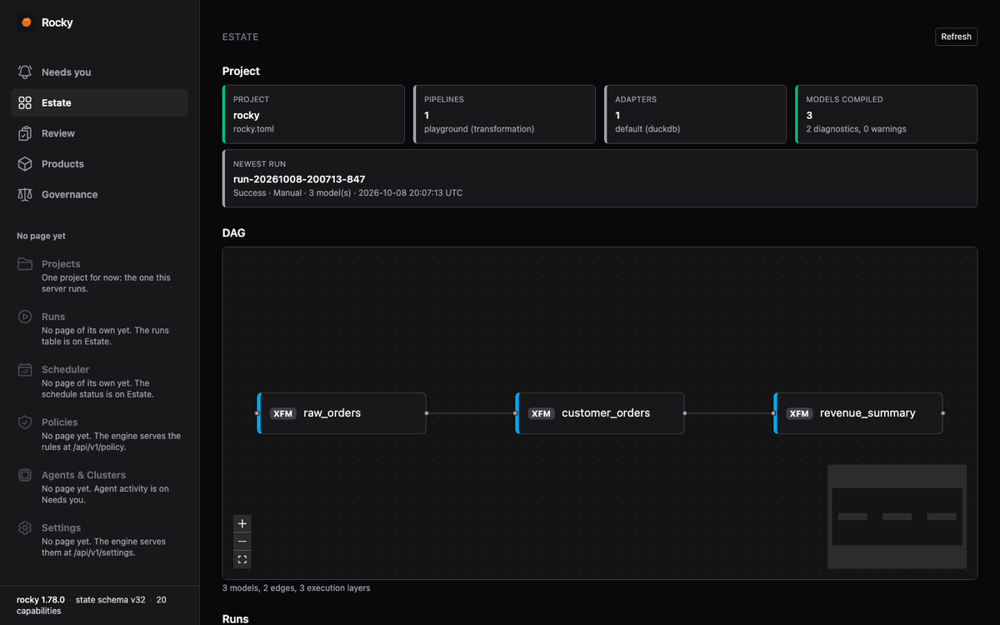
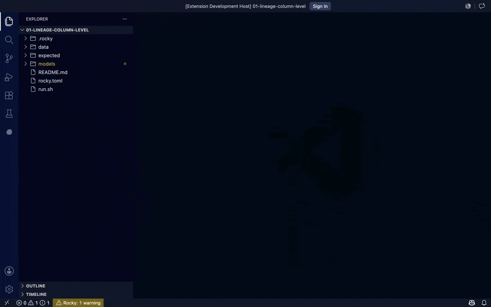

<p align="center">
  <picture>
    <source media="(prefers-color-scheme: dark)" srcset="docs/rocky-readme-dark.svg" />
    
  </picture>
</p>

[](https://github.com/rocky-data/rocky/actions/workflows/engine-ci.yml)
[](https://github.com/rocky-data/rocky/actions/workflows/sdk-ci.yml)
[](https://github.com/rocky-data/rocky/actions/workflows/dagster-ci.yml)
[](https://github.com/rocky-data/rocky/actions/workflows/vscode-ci.yml)
[](LICENSE)

**Rocky compiles SQL models, reports supported static problems, and helps you review changes before execution.**

You keep your warehouse and your existing SQL. Rocky runs on Databricks, Snowflake, BigQuery, DuckDB and [more](#adapters). Apache 2.0.

The failures that cost the most are the quiet ones: a source column changes type, or a rename breaks a downstream model. Rocky reports type and contract problems when the SQL, schemas and configuration make them visible. A clean compile does not prove that every query runs or produces correct values.

```
   you edit SQL          rocky compile              rocky run
        │                      │                        │
        ▼                      ▼                        ▼
   ┌─────────┐        ┌──────────────────┐        ┌───────────┐
   │  model  │───────►│  check selected  │───────►│ warehouse │
   │  files  │        │  types, refs,    │        │  execution│
   └─────────┘        │  and contracts   │        └───────────┘
                      └──────────────────┘
                               │ an error makes this compile
                               ▼ exit nonzero
                        E010: required column
                        `order_id` is missing
```

<p align="center">
  
</p>

## Contents

- [Try it in 60 seconds](#try-it-in-60-seconds)
- [See your project: browser UI and VS Code](#see-your-project)
- [See what breaks before you merge](#see-what-breaks-before-you-merge)
- [When an AI agent writes your pipelines](#when-an-ai-agent-writes-your-pipelines)
- [Declare a data product](#declare-a-data-product)
- [Where Rocky is today](#where-rocky-is-today) · [You can leave](#you-can-leave)
- [Adapters](#adapters) · [Subprojects](#subprojects) · [Build from source](#build-from-source)

## Try it in 60 seconds

```bash
# macOS / Linux
curl -fsSL https://raw.githubusercontent.com/rocky-data/rocky/main/engine/install.sh | bash

# Windows (PowerShell)
irm https://raw.githubusercontent.com/rocky-data/rocky/main/engine/install.ps1 | iex
```

```bash
rocky playground my-first-project
cd my-first-project
rocky compile && rocky test && rocky run
```

The playground runs on local DuckDB. You need no credentials.

```
$ rocky compile
  ✓ raw_orders (6 columns)
  ✓ customer_orders (4 columns)
  ✓ revenue_summary (5 columns)
  Compiled: 3 models, 0 errors, 0 warnings

$ rocky run
transformation pipeline complete: 3 model(s) executed in 20ms
```

- **In production**, run `rocky plan` (it saves what will change), then `rocky apply <plan-id>`. `rocky run` does both in one step.
- **The installer fetches the latest release.** `main` can be ahead of it. Check `rocky --version` against the [release notes](https://github.com/rocky-data/rocky/releases).
- [Tell us how your first run went](https://github.com/rocky-data/rocky/issues/new?template=first_run_feedback.yml), even if it worked.

Rocky is built first for **data engineers on Databricks**, where Dagster usually runs the schedule. The [adapter table](#adapters) shows what works on each warehouse.

## See your project

### In your browser

`rocky serve --ui` serves a read-only view of your project. The UI is built into the release binary. It shows what needs you now, the estate (models, the DAG and runs), plans that wait for a human, your data products, and a record of what agents did and why.

```bash
rocky serve --ui --token "$(openssl rand -hex 16)" --token-scope read-only
# Rocky UI: http://127.0.0.1:8080/login?t=...
```

<p align="center">
  
</p>

The page cannot run or approve anything. Its token is read-only. You approve a plan in a terminal. See the [browser UI guide](https://rocky-data.dev/guides/browser-ui/).

### In VS Code

The checker runs as a language server. You see type mismatches and broken references while you type, not later in CI. Hover shows column types. Go-to-definition works across models.

The Rocky Inspector panel shows a model's columns, lineage, tests, run metrics and classified columns.

<p align="center">
  
</p>

[Install the VS Code extension →](https://marketplace.visualstudio.com/items?itemName=rocky-data.rocky)

## See what breaks before you merge

`rocky lineage-diff` compares two versions of your project. It lists the downstream tables and columns that each change affects, as Markdown you can paste into a pull request.

<p align="center">
  
</p>

```
$ rocky lineage-diff main

stg_orders — modified (3 column changes)

| Column      | Change  | Downstream consumers      |
|-------------|---------|---------------------------|
| amount_usd  | added   | fct_revenue.total_revenue |
| amount      | removed | (removed; not traceable)  |
```

Rename `amount` to `amount_usd`, and Rocky tells you that `fct_revenue.total_revenue` reads it, before you merge. [POC](examples/playground/pocs/06-developer-experience/11-lineage-diff/).

Every demo below is in [`examples/playground/pocs/`](examples/playground/pocs/). Change into its directory and run `./run.sh`.

| Demo | What it shows |
|---|---|
| [Schema drift recovery](examples/playground/pocs/02-performance/06-schema-drift-recover/) | A source column changes type. Rocky spots it and rebuilds safely. |
| [Data contracts](examples/playground/pocs/01-quality/01-data-contracts-strict/) | A known missing or dropped output column refuses the model with `E010`, `E011` or `E013`. An unresolved reference needs source schemas or a runtime check. |
| [Incremental loads](examples/playground/pocs/02-performance/01-incremental-watermark/) | Set `strategy = "incremental"`. Rocky reads only new rows. |
| [Column lineage](examples/playground/pocs/06-developer-experience/01-lineage-column-level/) | Trace one column back to its source. |
| [Named branches and replay](examples/playground/pocs/00-foundations/06-branches-replay-lineage/) | Run against an isolated copy, look at it, then drop or promote it. |
| [Data masking](examples/playground/pocs/04-governance/05-classification-masking-compliance/) | Tag personal columns. The check fails if one goes out unmasked. |
| [Agent policy](examples/playground/pocs/03-ai/07-policy/) | Decide what an agent may do alone. CI catches a rule you loosen by accident. |
| [AI model generation](examples/playground/pocs/03-ai/01-model-generation/) | Rocky drafts a model and checks it against project context. Review it and run its tests before execution. |
| [BigQuery cost attribution](examples/playground/pocs/07-adapters/05-bigquery-native-queries/) | `rocky cost` derives an allocation when a run records scanned bytes. Compare it with your bill. Needs credentials. |

## When an AI agent writes your pipelines

An agent with too much trust and production access can destroy real data in seconds. Rocky treats an agent as an operator with a controlled path to production.

```
   agent drafts a change
            │
            ▼
   compiler ── available types and contracts produce diagnostics
            │
            ▼
   plan ────── a plan never applies itself
            │
            ▼
   rocky apply reads your [policy] rules, before any SQL runs
            │
     ┌──────┴──────────┬───────────────────┐
     ▼ allow           ▼ require review    ▼ deny
     └───────┬─────────┘                   refused. No SQL runs.
             ▼
   an AI-authored plan needs an approval marker that names it
             │
             ▼
   warehouse runs the plan ──▶ required checks ──▶ rocky audit · rocky brief
```

The MCP `draft` and `propose` tools read the same rules earlier. A denied draft leaves no file. A denied proposal writes no plan.

- **You write the rules.** A `[policy]` rule in `rocky.toml` says what each principal may do, and where: allow, require review, or deny. `max_downstreams` caps how far one change may reach.
- **An AI-written plan needs an approval marker.** `rocky apply` refuses an AI-authored plan unless a marker names that exact plan. An `allow` rule cannot waive this (since engine v1.71.0). The marker is not signed. It records that an approval was made on this machine, not who made it.
- **Required checks have limits.** A rule can name checks that must pass in the run. A failed or missing check stops the governed action. A check that runs after a warehouse write cannot undo that write. A person must review, repair or revert it.
- **You can test the rules.** `rocky policy test` runs `[[policy.tests]]` scenarios through the real evaluator. It catches an edit that opens a hole.
- **You can ask what happened.** `rocky audit --for <table>` says who changed what, under whose authority. `rocky review --queue` ranks what waits on you.
- **Agents connect over MCP.** `rocky mcp` exposes 31 tools. Six can write: five pass the same rules, and `pause_schedule` has its own guard. No default tool writes the approval marker. That needs `rocky mcp --profile approver`.
- **`rocky policy freeze` is the kill switch.**

```
$ rocky policy check --principal agent --capability apply --model dim_customer
  effect: require_review
  reason: no rule matched; default_agent_effect = require_review
```

[POC: `04-governance/11-agent-policy`](examples/playground/pocs/04-governance/11-agent-policy/) · Full detail: [Operating Rocky with agents](https://rocky-data.dev/concepts/operating-rocky-with-agents/).

## Declare a data product

One spec file, `products/<name>.toml`, states what a product must be: its grain, columns, checks and freshness. Each field lowers onto something the engine already has (a contract or the model's sidecar), or Rocky refuses the spec when it parses it. Freshness is observed after apply, not enforced at compile time.

```
   products/<name>.toml
          │
          ├── rocky product approve   freeze the revision, addressed by digest
          ├── rocky product verify    trust posture, masking tags, identity collisions
          ├── rocky product compile   render the contract or merge the sidecar
          │
          └── rocky fulfill <name>    (experimental) drives the verbs above and a
                                      drafting agent; stops at each gate with the
                                      exact next command to run
```

What `rocky fulfill` does and does not guarantee:

- **The worker gets a narrow MCP surface.** `rocky mcp --profile worker` serves read, inspect, compile and test tools, plus one draft tool, `draft_model`. The engine does not force your driver command to use it.
- **The driver runs in a fenced process.** The subprocess driver sees only the environment variables you allowlist. The loop kills its process group when the task ends. CI uses the replay driver instead.
- **The narrow surface closes the tool route only.** The worker is a normal process in your project directory. If it can write files, it can write a check into a sidecar.
- **Verified is not approved.** The loop refuses to run a check set that differs from the one it verified. A check already present at verification runs like any other, and nobody is asked to sign it off. Read the sidecar to see what will run.
- **The spec digest is pinned.** A bare `rocky apply` refuses a product-bound plan. Run `rocky apply <plan-id> --expect-spec-digest <digest>`.
- **Output checks run after apply.** Failing output can already be live. A person reviews the repair or reverts the change.

Full detail: [Product commands](https://rocky-data.dev/reference/commands/products/) · [Fulfill commands](https://rocky-data.dev/reference/commands/fulfill/).

## Where Rocky is today

The checker, named branches, replay, column lineage, policy enforcement and per-model cost are the most complete parts. These are still thin:

| Area | Today |
|---|---|
| AI features | Early. Generate, check and fix work. `rocky ai-test` writes assertions from a model's intent. Large refactors are on the roadmap. |
| Replay | `rocky replay --execute --verify` re-runs a recipe and confirms byte-identical output. A model that reads a changing source is marked non-replayable. |
| Iceberg | Reads from a REST catalog. Writes land through Delta UniForm. Native Iceberg writes are on the roadmap. |
| Metrics layer | None built in. Use Cube or your existing one. |
| Scheduling | [`dagster-rocky`](integrations/dagster/) is the built-in integration. Otherwise use [`rocky-sdk`](sdk/python/) or `rocky serve`. `rocky tick` and `rocky serve --scheduler` are experimental. |

[Open a discussion](https://github.com/rocky-data/rocky/discussions) if one of these blocks you.

## You can leave

`rocky emit-sql` writes your models out as plain SQL, in dependency order, offline. Three limits:

- **Some models produce no standalone SQL**, such as a Snowflake dynamic table. Rocky lists what it skipped on stderr.
- **An incremental model exports only its steady-state `INSERT` or `MERGE`.** That statement assumes the table exists. Rocky adds a note that says so.
- **Every model renders in one dialect.** With no config, that is DuckDB.

See [No lock-in](https://rocky-data.dev/guides/no-lock-in/). Coming from dbt Core? `rocky import-dbt` converts a project in one command. See the [import guide](https://rocky-data.dev/guides/migrate-from-dbt/).

## Adapters

Rocky **writes** to a warehouse. It **reads** from a source to learn what tables exist. The checker works the same everywhere, because it runs before Rocky talks to a warehouse.

| Adapter | Role | What works today |
|---|---|---|
| Databricks | write | Every feature in this README. The most complete adapter. |
| Snowflake | write | Check, plan, run, incremental and merge loads, cost per run |
| BigQuery | write | Check, plan, run, incremental and merge loads, cost per run |
| Trino | write | Check, plan, run. No merge, so `strategy = "merge"` is refused. |
| PostgreSQL | write | Check, plan, run, merge (`MERGE` or `ON CONFLICT`), views, materialized views. Tested live. |
| Redshift (Beta) | write | Check, plan, run, merge, dist and sort keys, late-binding views. Password auth only. SQL is unit-tested, not run live. |
| ClickHouse (Beta) | write | Check, plan, run, views, append, `delete_insert`, `time_interval`, engine and sort keys. No `MERGE`, so `strategy = "merge"` is refused. Tested live. |
| SQL Server (Beta) | write | Check, plan, run, merge, views, incremental, `delete_insert`, `time_interval`. SQL auth or Entra ID tokens. Tested live on SQL Server 2022. Azure SQL and Fabric Warehouse are not run live. |
| DuckDB | write | Local work and tests. No account needed. |
| Fivetran | read | Your connectors and the tables they land |
| Airbyte | read | Your connections and the tables they land |
| Iceberg | read | Tables in a REST catalog |
| Manual | read | You list the tables in `rocky.toml` |

Building an adapter? See the [Adapter SDK guide](https://rocky-data.dev/guides/adapter-sdk/) and the [skeleton POC](examples/playground/pocs/07-adapters/06-rust-native-adapter-skeleton/).

## Subprojects

| Path | Ships as | What it does |
|---|---|---|
| [`engine/`](engine/) | `rocky` CLI (GitHub Releases, `ghcr.io/rocky-data/rocky`) | Rust engine: checking, drift, incremental loads, adapters, MCP, LSP |
| [`engine/ui/`](engine/ui/) | built into `rocky` | The browser UI behind `rocky serve --ui` |
| [`editors/vscode/`](editors/vscode/) | VS Code Marketplace | Live checking, Inspector, AI commands |
| [`sdk/python/`](sdk/python/) | `rocky-sdk` (PyPI) | Typed Python client over the CLI |
| [`integrations/dagster/`](integrations/dagster/) | `dagster-rocky` (PyPI) | Dagster resource built on `rocky-sdk` |
| [`deploy/`](deploy/) | config only | Docker Compose and Helm for a self-hosted `rocky serve`, plus an observability stack |
| [`examples/playground/`](examples/playground/) | config only | DuckDB sample pipeline and POCs. No credentials. |

Each artifact releases on its own tag: `engine-v*`, `sdk-v*`, `dagster-v*`, `vscode-v*`.

## Build from source

```bash
git clone https://github.com/rocky-data/rocky.git && cd rocky
just build             # engine + sdk + dagster + vscode (engine without the browser UI)
just build-engine-ui   # engine with the browser UI embedded, as releases ship it
just test
just lint
```

See [`CONTRIBUTING.md`](CONTRIBUTING.md). Schema and DSL changes must update every dependent subproject in the same PR.

## Learn more

- **Docs:** [rocky-data.dev](https://rocky-data.dev)
- **Plain-English tour:** [`ROCKY_EXPLAINED.md`](ROCKY_EXPLAINED.md)
- **Sponsor:** Rocky is free. If it saves your team time, [sponsor the project](https://github.com/sponsors/hugocorreia90).
- **License:** [Apache 2.0](LICENSE)
