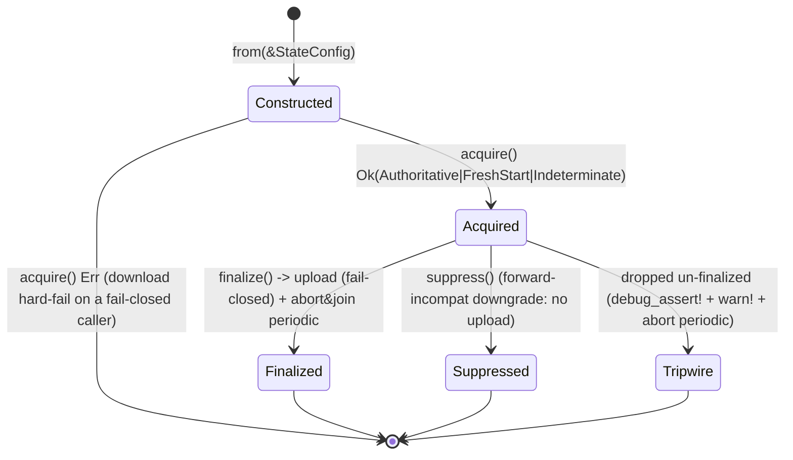

# ADR-STATE-SESSION — `RemoteStateSession`, config-snapshot threading, bypass closure, and governance-from-gated-snapshot (#1093)

**Status:** Proposed (PR-0 design gate — stop for maintainer sign-off before implementation)

**Work package:** WP-01 (remote-state protocol redesign) · **PR-B (Spine)**
**Closes:** audit finding **RD-003** (state-sync bypass), issue **#1120** (config-swap TOCTOU), issue **#1093** (governance reconcile fresh-compiles from disk)
**Depends on:** ADR-AUTHORITY (PR-A) — `acquire` returns the `StateAuthority` that PR-A defines
**Depended on by:** ADR-CONCURRENCY (**PR-C** consistent snapshot, **PR-D** CAS) — both hook `finalize`'s write choke-point and the `base` `Generation` field. **PR-F** (freeze markers) relies on this session's download-before-gate discipline to read `POLICY_DECISIONS`, but writes **separate** object-store marker objects (via `Create`), *not* through `finalize`.

> Sibling-doc boundary. This ADR owns **session lifecycle, config threading, bypass closure, and the #1093 governance-snapshot fold-in**. It *references* `StateAuthority` (as `acquire`'s return) and the CAS write (as `finalize`'s future hook + the base-`Generation` field CAS reads) but defers their semantics to ADR-AUTHORITY and ADR-CONCURRENCY. Nothing here specifies the authority enum's variants or the CAS protocol.

---

## Context

### The problem

Remote `[state]` (`s3`/`valkey`/`tiered` backends) is in **live, concurrent, multi-pod** production use. Every mutating run mode is supposed to: (1) download the durable ledger *before* it reads freeze/budget/watermark/provenance state, and (2) upload *after* it mutates, so the next pod's start-download sees the change. Today that discipline is implemented as **seven independently-written inline seams** (mapped in the Decision below) with divergent policies, and **three run modes skip it entirely**.

Two active defects converge on the same missing abstraction:

- **RD-003 (Critical, ACTIVE) — bypass.** Three entry points open a `StateStore` and mutate state-backed data with **no** remote download/upload:
  - `run --model` — `StateStore::open_with_policy` at `run.rs:1333`, no preceding `download_state`.
  - `run_local` transformation — `StateStore::open` at `run_local.rs:115` (inside the `if models_dir.exists()` guard at `run_local.rs:114`), no sync.
  - `rocky load` / the pipeline `Load` arm — `run_load` opens `<config_dir>/.rocky_state` at `load.rs:104` and writes `loaded_files` (replicated incremental-skip state) with no sync. Reached both standalone and via `run.rs:1596` (`PipelineConfig::Load` → `run_load` call at `run.rs:1600`).

  On a remote backend, each of these reads stale local state and its writes are silently reverted by the next pod's start-download. (Quality and snapshot pipelines, `run_local.rs:319`/`853`, open **no** state store — they are correctly *not* in scope.)

- **#1120 (Critical) — config-swap TOCTOU.** `run()` (`run.rs:1111`) takes a `config_path: &Path` and **re-reads it from disk twice more** after the caller already gated on it (`run.rs:1202` idempotency load, `run.rs:1262` main load; `run_dag_exec.rs:130` for the DAG). A `rocky.toml` swap timed between the gate and these re-reads points execution at an unverified config. The governed apply path loads the same config **three** times (`apply.rs:238`, `execute_run_plan` re-load at `apply.rs:479`, then `run()` at `run.rs:1262`), and the promote-apply path reloads a *second* config (`branch.rs:781`, in `run_promote_apply`) that was never routing-verified. `config_fingerprint` (`output.rs:59`) independently re-`std::fs::read`s the path (`output.rs:60`) — a fingerprint of a file that may already differ from the executed snapshot (Codex F10).

- **#1093 (Med) — governance from disk, not from the gated snapshot.** After a governed run executes the plan-verified compiled set, the classification/masking/tag **reconcile fresh-compiles the models from disk again** — at `run.rs:4041` (full-replication/DAG reconcile) and inside `apply_model_governance_tags` at `run.rs:7295`. A post-execution edit to a `.sql`/`.toml` file changes what governance is applied, out from under the fingerprint that gated execution.

### What #1089 already closed — do NOT re-do

Verified in-tree, out of scope for this ADR:
- Download failure is fail-closed `Err` (`download_state`, `state_sync.rs:297`; the object-store leg propagates via `download_from_object_store`, `state_sync.rs:984`); no unfiltered fallback.
- A single config snapshot threads the *governed decision* on the apply paths (commit `8dd55d6c`); cross-pod freeze **enforcement** on governed paths (the governed download-fail bail at `run.rs:1662`); fail-closed budget-pair writes; refuse-replication `verify_after`.
- Local-only-table preservation (`LOCAL_ONLY_TABLE_NAMES = ["schema_cache", "jobs"]`, `state.rs:219`) is sound once refresh occurs after the store is dropped.

### The residual this ADR closes

The three defects above share one root cause: there is **no object that owns a run's remote-state lifecycle**. The seams are copy-pasted, the config is a path re-read at each layer, and governance re-derives itself from disk. The spine introduces that object.

---

## Decision

### 1. `RemoteStateSession` — the lifecycle owner

A new type in `rocky-core::state_sync`, constructed from an **owned `StateConfig` snapshot** (`from(&StateConfig)`), **never** a `config_path`. Execute-from-owned by construction: a session cannot re-read a config off disk, so no seam can be redirected by a timed swap.

**Owns:**

| Field | Purpose |
|---|---|
| `StateConfig` (owned snapshot) | The backend/auth the whole lifecycle executes against |
| `state_path: PathBuf` | The local ledger path this session syncs |
| `StateAuthority` | Resolved at `acquire`; surfaced via `authority()` (defined by ADR-AUTHORITY) |
| `base: Mutex<Option<Generation>>` | The download's observed generation. Interior-mutable so the periodic uploader can advance it. **The field the CAS PR (PR-D) reads/CAS-writes** — inert until then |
| `finalize_policy` | Whether `finalize` uploads fail-closed vs `suppress` (forward-incompat) |
| `finalized: bool` (one-shot) | Guards double-finalize; arms the Drop tripwire |
| `periodic: Option<JoinHandle<()>>` | The mid-run uploader. Owned by the session, spawned during the run under **today's estimated-duration gating** (`run.rs:2620`, `estimated_run_secs` threshold; `None` on short runs and seam paths), **aborted _and joined_ at `finalize`** (fixes the abort-without-await leg of RD-004, `run.rs:3116`/`3259`) |

**Does NOT own the `StateStore`.** This is a hard lock-ordering constraint, not a convenience. `download_state` (`state_sync.rs:297`) internally takes the *same* advisory writer lock `StateStore::open` takes (`acquire_publish_lock`, called at `state_sync.rs:321`; the function's own doc comment at `state_sync.rs:338`–`341` states it is "the same lock `StateStore::open` takes"). It holds that lock only around the local-only-table merge + atomic publish (`publish_merged`, `state_sync.rs:331`) and **releases it before returning** (`drop(lock)`, `state_sync.rs:333`). If the session held a `StateStore` open across `acquire`, that download-publish lock would contend with the session-held writer lock. Additionally, the seams open the store with *different* policies (`open_with_policy` vs `open`). Keeping the store out of the session preserves both invariants.

**API:**

| Method | Role |
|---|---|
| `acquire(&mut self) -> Result<StateAuthority>` | Download-before-read. Records + returns the `StateAuthority`, owns/spawns the periodic uploader (gated as above). **`StateBackend::Local` is a zero-I/O `Authoritative` no-op handled inside `acquire`** — mirrors `download_state`'s Local early-return (`state_sync.rs:301`–`304`) — the only skip |
| `authority(&self) -> StateAuthority` | The recorded authority, for the governor. `Indeterminate` is the download-level non-authoritative signal (maps today's `state_download_ok == false`, `run.rs:1650`–`1672`) |
| `require_synced(&self) -> Result<()>` | Fail-closed guard: bails **only on `Indeterminate`**. Replaces the governed bail at `run.rs:1662` (which currently inlines `exec_fp_gate.is_some() && rocky_cfg.policy.is_some()`), so an **ungoverned** run whose download failed still warns-and-continues on local state (preserves #1089's no-policy no-abort) |
| `finalize(self) -> Result<()>` | Upload-after, **fail-closed**, one-shot. **The single write choke-point CAS (PR-D) hooks** via the base `Generation`. Aborts+joins the periodic task first. **PR-B repositions this call to run *after* the run's terminal state writes** (`persist_run_record`/verify-after/`finalize_idempotency`, `run.rs:4312`/`4334`/`4379`) — making it fatal at today's `run.rs:4250` position would `return Err` *before* `persist_run_record` and the verify-after custody row (the `InFlight` idempotency claim itself is safe either way: `finalize_idempotency_on_error`, invoked at `run.rs:4547` by the `run_result` error-path guard, releases it on any `Err` — the skipped writes are the history record and custody row). Store-drop + consistent-snapshot copy is PR-C; CAS is PR-D. See the behaviour-change note in Consequences — for the full-run paths this is stricter than today's best-effort end-of-run upload |
| `suppress(self)` | Forward-incompat recreate path: consume the session **without** uploading a downgraded blob (mirrors `was_recreated_for_forward_incompat`, `run.rs:1711`, and today's `suppress_state_upload`). This — not `require_synced` — handles the recreated-store case, so a governed run on a forward-incompat-recreated store does **not** newly hard-bail |

**Half-seam associated functions** — a *lifecycle shape* (download-XOR-upload; no `acquire`/`finalize` pairing; no Drop tripwire) for the ledger seams that touch remote state only one way:
- `download_only(cfg, state_path)` — replaces `apply::sync_remote_ledger_before_gate` (`apply.rs:821`), its **blocking sibling** `sync_remote_ledger_before_gate_blocking` (`apply.rs:846`, used by the synchronous promote gate at `:2027` — served via the PR-A-generalized `block_on_state_sync`), and `apply::download_remote_ledger_unconditional` (`apply.rs:873`).
- `upload_only_fail_closed(cfg, state_path, reason)` — replaces `apply::upload_remote_ledger_fail_closed` (`apply.rs:902`). This seam is **already** fail-closed today; the session does not change its semantics.

> **Orthogonal to the CAS class.** The half-seam-vs-full-lifecycle split is *lifecycle shape*, not reconciliation policy. ADR-CONCURRENCY's **retry-vs-refuse** class is set by writer kind: full runs — **including backfill** (`acquire`/`finalize`) — are **REFUSE**; only genuine single-record ledger writes (gc tombstone, budget-pair, restore/verify-after custody, the `policy freeze` row) **RETRY**. Which helper a path uses does not set its CAS class.

**Session lifecycle state machine** (the full-run paths — `acquire`/`finalize`):

Legend: `Indeterminate` gates the governor and (under a `[policy]` plane) `require_synced`; it does not by itself stop an ungoverned run. `Tripwire` is a diagnostic + resource-cleanup net, **not** a durability guarantee (see below).

**`Drop` is a tripwire *and* a resource net:** `debug_assert!` + `warn!` if dropped un-finalized, **and** it aborts the periodic task so a leaked handle can't outlive the run. It is **not** a durability guarantee — a panic between mutation and `finalize` still skips the upload. The two paths that mutate the warehouse *and* must persist on failure keep their **explicit** upload-on-failure (`let r = mutate().await; drop(store); upload_only_fail_closed(…); r?`): `restore.rs` (already `let exec_result = …; drop(store); upload_remote_ledger_fail_closed(…); let output = exec_result?;`, `restore.rs:984`–`998`) and the backfill apply (`apply.rs:2656`/`2671`).

**Seam → session-method map** (replaces seven divergent inline copies with one policy):

| Current inline seam | Location | Replaced by |
|---|---|---|
| replication download | `run.rs:1650` (+ governed bail `1662`) | `acquire` (+ `require_synced`) |
| periodic uploader | `run.rs:2632`/`2635` (abort `3116`/`3259`) | owned `JoinHandle`, abort+join in `finalize` |
| end-of-run upload | `run.rs:4250` (`upload_state_unless_recreated`, best-effort today) | `finalize` (or `suppress`) |
| policy freeze download / upload | `policy.rs:471` / `policy.rs:547` | `download_only` / `upload_only_fail_closed` |
| restore download / upload | `restore.rs:948` / `restore.rs:991` | `download_only` / explicit `upload_only_fail_closed` |
| gc download / upload | `gc.rs:1530` / `gc.rs:1611` | `download_only` / `upload_only_fail_closed` |
| apply ledger sync-before-gate / upload | `apply.rs:821` (also `873`) / `apply.rs:902` | `download_only` / `upload_only_fail_closed` |

### 2. Config-snapshot threading (#1120)

**One owned config instance per invocation, threaded — never re-read.**

- `run()` (`run.rs:1111`) and `run_dag_exec::default_sub_runner`/`run_with_dag` (`run_dag_exec.rs:51`/`111`) take **`Arc<RockyConfig>`** (`Arc` so DAG sub-runs share one instance). **Delete** the internal re-reads at `run.rs:1202` and `run.rs:1262`; **delete** `run_dag_exec.rs:130`. These are the only production re-reads on the run path.
- Collapse the three governed loads to one: hard-load once at `apply.rs:238`, thread through `governed_run_context` (`apply.rs:334`) → `execute_run_plan` (**delete its re-load at `apply.rs:479`**) → `run()`. `verify_routing_identity` (`apply.rs:1907`, called at `run.rs:1805`) then checks the **one** instance that executes.
- Callers to update to pass the `Arc` — **five** production sites (second-review correction; the fifth calls `run(` unqualified via `use super::run::{…, run}` and escapes a naive grep): `apply.rs:627`, `apply.rs:2809`, `apply.rs:3227` (`run_apply_inline_for_run`, `apply.rs:3205` — the plain `rocky run` entry loads **nothing** today, so threading **adds** the single load here rather than collapsing one), `run_dag_exec.rs:64` (`default_sub_runner`), and **`run_watch.rs:265`**. Watch semantics require a **fresh config load per watch iteration** — today each iteration live-reloads via `run()`'s internal `:1262` load; the new load moves *inside* `iter_once`, never hoisted above the loop (a broken config fails that iteration and the watcher continues — parity).
- **Promote (Codex F5, in scope):** the promote gate `gate_promote_plan` (`apply.rs:2008`) hard-loads at `apply.rs:2018` and **returns the owned `Arc`**; thread it into `run_promote_apply` (`branch.rs:775`) and resolve the adapter from that instance instead of the **second** reload at `branch.rs:781`. Scope note: only the promote-apply config load is closed by this pass. `branch.rs` has other, unrelated config loads (`656`, `964`, `1212`, `1507`) that are out of scope.
- **Load:** `run_load` (`load.rs:34`) currently self-loads config at `load.rs:46`. Fold it into the same threading so the loaded-files session executes from the caller's owned snapshot.

**Two deliberate non-changes (honesty guards):**
- **Do NOT bind `[policy]`/`[state]` into `config_policy_identity`** (`apply.rs:1630`). That identity is compared **raw** (`config_policy_identity(cfg)` at `apply.rs:1911`, `expected == actual` at `apply.rs:1913`) and those sections are `${VAR}`-templated — binding them would false-refuse on an env-var-only difference. `config_policy_identity` stays adapters+pipelines (routing) only.
- **`config_fingerprint` (Codex F10, corrected by the second review):** hash the **raw bytes captured at the single load site** — `parse_rocky_config` already reads the file once via `read_to_string` (`config.rs:5468`); the fingerprinted loader hashes those bytes (same SipHash as today ⇒ values byte-identical for unswapped files) and returns the fingerprint alongside the config. Do **NOT** hash a serde serialization of the parsed config: `FreshnessConfig.overrides` is a `std::collections::HashMap` (`config.rs:1386`) reachable from `RockyConfig`, so serialization order — and therefore the hash — would be nondeterministic across processes, causing sporadic false config-mismatch refusals. The gate-path callers (`run.rs:1266`, `run.rs:5057`) switch to the captured fingerprint; the two output-only callers (`branch.rs:336`, `catalog.rs:370`) stay path-based.

### 3. Bypass closure (RD-003, Codex F6)

`acquire()` runs **unconditionally** at each mutating entry; the only skip is `StateBackend::Local`, absorbed inside `acquire` as a zero-I/O `Authoritative` no-op (so callers stay uniform).

| Entry point | Opens store at | Sync today | Action |
|---|---|---|---|
| `run --model` | `run.rs:1333` | **none (live bypass)** | wrap in `acquire`/`finalize` |
| `run_local` transformation | `run_local.rs:115` | **none (live bypass)** | wrap in `acquire`/`finalize` |
| `rocky load` / `Load` arm (`run_load`) | `load.rs:104` | **none (live bypass)** | insert `acquire`/`finalize` **inside `run_load`** |
| standalone backfill (`execute_backfill_set`) | `run.rs:5087` | **synced by caller** (`apply.rs:2545`/`2671`) | **consolidate** sync inward; delete the wrapper |
| quality / snapshot (`run_local.rs:319`/`853`) | — (no store) | n/a | **EXCLUDED** — do not claim coverage |

- **Load insertion point (precise):** `run_load` is the single funnel for both the `rocky load` command and the `rocky run --pipeline <load>` arm (`run.rs:1596`). Insert `acquire`/`finalize` **inside `run_load`** around its store open (`load.rs:104`). One insertion covers both callers. **Remote-key collision — load MUST be unified onto the canonical state path (second-review correction):** `remote_state_key` (`state_sync.rs:83-93`) keys on the parent *directory name* (`.rocky-state` = `STATE_NAMESPACE_DIR`), so load's `<config_dir>/.rocky_state` (`load.rs:103`) and the canonical `models/.rocky-state.redb` both map to the **same** remote object `state.redb` — syncing load's legacy path as-is would clobber the pipeline's canonical remote ledger on `finalize` (and overwrite load's local state on `acquire`). Fix: `run_load` uses the canonical threaded `state_path`; migration is a **logical import, not a rename** (a rename is erased by the next remote download replacing replicated `LOADED_FILES` wholesale, and a shared legacy DB can hold multiple pipelines keyed `pipeline|file_path`): acquire canonical first, then import only the selected pipeline's legacy `loaded_files` rows; idempotent; legacy left in place with a one-time warn. Load opens via `open_with_policy(state.on_schema_mismatch)` and propagates `was_recreated_for_forward_incompat()` into upload suppression (parity with the run path). Because `run_load` records successes per-file and errors only after all files (`load.rs:226-269`/`:330`), the session **captures the result → always finalizes → propagates** — `abandon` on a partial failure would drop successful files' state.
- **Backfill (honest framing + one-session rule):** `execute_backfill_set` (`run.rs:5033`) opens its store at `run.rs:5087` with no *own* sync, but its **only** production caller — `run_apply_backfill_plan` (`apply.rs:2480`), which invokes `execute_backfill_set` at `apply.rs:2656` — already wraps it with `download_remote_ledger_unconditional` (`apply.rs:2545`) and `upload_remote_ledger_fail_closed` (`apply.rs:2671`). Backfill is therefore **synced today** — the consolidation is a defense against a future direct caller, not the closure of a live hole, and must not be listed among the active RD-003 bypasses. **Shape (red-team-corrected): ONE session, acquired in `run_apply_backfill_plan` *before* the gate and threaded into `execute_backfill_set`.** A second in-executor download after the gate would wholesale-replace the replicated `POLICY_DECISIONS` table (downloads replace replicated tables) and **erase the decision row the policy gate writes between the two downloads** — the decision must survive to the final upload. The executor captures the execution result and **always finalizes** (parity with today's `apply.rs:2671` upload-even-on-failure), then propagates.
- **Optional structural guard:** an `open_synced_state_store(session, …)` proof-token so a store can only be opened through a session — makes "no future bypass" enforceable at the type level rather than by review.

### 4. #1093 fold-in — capture a `GovernanceSnapshot`, don't recompile (Codex F8)

`ModelIr.governance` (`ir.rs:537`) is a `GovernanceConfig` (`ir.rs:208`) carrying **only** `permissions_file` (`ir.rs:209`) / `auto_create_catalogs` (`ir.rs:210`) / `auto_create_schemas` (`ir.rs:211`) — it does **not** carry `[governance.tags]`, per-column classifications, or retention. Those live on `model.config` (TOML-sourced), which is why the reconcile re-compiles from disk rather than reusing the IR. So a purpose-built snapshot is needed, not `ProjectIr`.

- Define an immutable `GovernanceSnapshot`: the required config fields + the executed-model selection (each model's target ref, `governance.tags`, `classification`, retention).
- **Capture it inside `execute_models`** (`run.rs:5211`), **position-keyed**: immediately after the `if let Some(gate) { … gate.verify(…) }` block (`run.rs:5412-5437` — the verify runs only on *governed* paths, so the capture keys off the code position, which is unconditional) and **before the `--defer` in-place SQL rewrite block** (`if defer_opts.enabled { apply_defer_rewrite(&mut compile_result, …) }`, `run.rs:5489`), from `compile_result.project.models` — i.e. from the exact set the fingerprint gated (when governed), before defer mutates any SQL.
- Change `execute_models`'s return from `Result<()>` (signature at `run.rs:5297`) to `Result<GovernanceSnapshot>`, thread the snapshot out, and use it to **replace both fresh compiles**:
  - the full-replication/DAG reconcile compile at `run.rs:4041` (downstream of the `execute_models` call at `run.rs:3955`), and
  - `apply_model_governance_tags` (`run.rs:7287`), whose recompile is at `run.rs:7295`.
- **Blast radius:** `apply_model_governance_tags` has **three** production callers — `run.rs:1415` (model-only), `run.rs:5156` (backfill), `run_local.rs:164` (transformation). Replacing its recompile with a `&GovernanceSnapshot` parameter means changing its signature and updating all three sites plus each site's `execute_models` capture. This is more than "delete the compile."
- **Behavior-preserving (verified, not inherited):** the load-bearing fact is that **both reconcile sites discard the compile's diagnostics** — `run.rs:4041`–`4063` pattern-matches `Some(Ok(gov_compile))` and reads only `gov_compile.project.models`; `apply_model_governance_tags` reads only `project.models` in its `Ok` arm (`run.rs:7310`) and `warn`s-and-drops on the `Err` arm (`run.rs:7335`), and the function has **no `output` parameter** (`run.rs:7287`–`7293`), so it *cannot* push to `output.errors`. Reading tags/classification off a captured snapshot instead of a recompile therefore surfaces nothing that was previously surfaced. (Independently: the lighter gov-compile inputs — `contracts_dir: None`, empty `source_schemas` — feed only the W004 classification-completeness and W005 freshness-coverage diagnostics, `compile.rs:325`/`333`, which are exactly what both sites discard.)

---

## Consequences

### What changes
- One `RemoteStateSession` type replaces seven divergent inline seams; one owned `Arc<RockyConfig>` replaces six+ path re-reads across the run/apply/promote paths; one `GovernanceSnapshot` replaces two fresh governance recompiles.
- `run()`, `run_with_dag`, `default_sub_runner` take `Arc<RockyConfig>`; `execute_models` returns `Result<GovernanceSnapshot>`; `apply_model_governance_tags` takes `&GovernanceSnapshot`.
- `config_fingerprint` hashes the owned snapshot, not a re-read.

### One deliberate behavior change (not behavior-preserving on remote backends)
`finalize`'s durability is **split by governance class** (`FinalizeDurability::{Durable, ConfigDefault}`): **Durable** (forces `on_upload_failure = Fail`) for **governed** runs — incl. the default-`skip` config — and **backfill** (always review-gated); **ConfigDefault** for all **ungoverned** paths, including the newly-wrapped bypasses — `on_upload_failure = "skip"` is a documented liveness contract (`config.rs:532-549`), and an ungoverned run must not turn a successful warehouse run nonzero on a failed state PUT. `finalize` is also **lazy**: it skips the upload when no state mutation occurred (a no-op transformation without a models dir, an empty load). For governed runs this closes the **RD-001 residual** (today's `run.rs:4250` is `warn!`-and-exit-0 even for governed applies), landing here because the session owns the write choke-point. PR-B also **repositions** the upload to after the terminal state writes (`run.rs:4312`/`4334`/`4379`), so a fatal finalize cannot skip `finalize_idempotency`. The newly-wrapped bypass paths (`run --model`, transformation, `load`) likewise gain a fail-closed finalize — a remote-unreachable upload now fails these runs where before they had no remote interaction at all (that is the RD-003 closure). The single-record seam paths (`apply`/`restore`/`gc`/`policy`) are **already** fail-closed on upload — no change. Backfill's upload is also already fail-closed today (`upload_remote_ledger_fail_closed`); after consolidation it runs the full `acquire`/`finalize` lifecycle, and its CAS reconciliation class is **REFUSE** (per ADR-CONCURRENCY), not the single-record retry.

### Migration
- Internal refactor only — no `rocky.toml`, wire-format, or CLI-surface change. No redb schema bump.
- `[state] backend = "local"` is **byte-identical**: `acquire` is a zero-I/O no-op, `finalize` does no remote I/O, and no seam does remote I/O.
- Seam migration + config threading + `execute_models` signature + authority-caller migration land **atomically in PR-B** (per ADR-AUTHORITY's PR-A→PR-B contract), so callers never observe a half-migrated state.

### This is the keystone
PR-C (consistent snapshot) and PR-D (CAS) hook `finalize` and read the base-`Generation` field; PR-F (freeze markers) relies on the session's single-choke-point download/upload discipline. The spine must land first.

### What it does and does NOT close
**Closes:**
- **RD-003** — the three live bypasses (`run --model`, transformation, `rocky load`) sync remote state; the future-caller gap in backfill is structurally sealed.
- **#1120** — no config re-read window on run, apply, DAG, or promote; the fingerprint describes the executed snapshot.
- **#1093** — governance reconcile applies the plan-gated set, not a post-execution disk state.

**Does NOT close (honest boundary):**
- **No CAS / no lost-update protection.** `finalize` is still a whole-file `put` (last-writer-wins). RD-002 is closed by **PR-D**; this ADR only provides the hook. The base-`Generation` field is inert until then.
- **RD-004 only partially touched.** The periodic uploader's abort-without-await (`run.rs:3116`/`3259`) is fixed here by `finalize`'s abort+join. The consistent-snapshot copy under the writer lock, the streaming (non-whole-file-in-memory) upload, and watermark durability remain **PR-C**.
- **No freeze marker.** `require_synced` fail-closes on `Indeterminate` and the ledger `POLICY_DECISIONS` freeze row is still the read source — the rollout-independent add-wins marker is **PR-F**. An erasable-kill-switch window remains until PR-F.
- **`Drop` is a resource net, not durability.** A panic between mutation and `finalize` skips the upload; only `restore` and backfill carry explicit upload-on-failure.
- **#1093 is scoped to the governance-reconcile compiles.** `execute_models` becomes a governance-capture, not the broader within-apply provenance rework — the deferred `#1093` "provenance within apply" residual stays open.
- **The Load state-path divergence** (`.rocky_state` vs `models/.rocky-state.redb`) is flagged, not unified.

---

## Alternatives considered

| Alternative | Why rejected / escalation trigger |
|---|---|
| **Keep the seven inline seams**, fix each in place | Rejected — seven divergent copies is the root cause; each drift is a fresh RD-003/#1120. A single lifecycle owner is the only structural fix. |
| **Session owns the `StateStore`** | Rejected — `download_state` takes the same writer lock internally (`acquire_publish_lock` at `state_sync.rs:321`, released `state_sync.rs:333`; its doc comment names it "the same lock `StateStore::open` takes") and the seams need different open policies (`open_with_policy` vs `open`). A session-held store would contend and couldn't express both policies. Store stays out of the session. |
| **Bind `[policy]`/`[state]` into `config_policy_identity`** | Rejected — compared raw (`apply.rs:1911`/`1913`) and `${VAR}`-templated → false-refuse on env-only differences. Snapshot threading gives the same TOCTOU protection without the false refuse. |
| **Reuse `ProjectIr` for #1093** instead of a new `GovernanceSnapshot` | Rejected — `GovernanceConfig` (`ir.rs:208`) carries only `permissions_file`/`auto_create_catalogs`/`auto_create_schemas`; tags/classifications/retention are TOML-sourced on `model.config`. A `ProjectIr` thread wouldn't carry the governance metadata the reconcile needs. |
| **Pass `config_path` and re-read once inside the session** | Rejected — any in-session re-read reopens the swap window. Execute-from-owned by construction (`from(&StateConfig)`) is the invariant. |
| **Make `require_synced`/`acquire` fail-closed on *every* download failure** | Rejected — an ungoverned run (no `[policy]`) that hits a transient download blip warns-and-continues today (`run.rs:1669`); hard-failing it is an availability regression (#1089's no-policy no-abort). `Indeterminate` gates only governed runs via `require_synced`. |
| **Distributed lease / auto-merge replay for concurrency** | Deferred to ADR-CONCURRENCY as named escalations (sustained CAS thrash; common same-namespace long-runs). Not part of the spine. |

---

## Validation

**RD-003 parameterized lifecycle matrix** — one table-driven suite over `{replication, transformation, model-only, backfill, load}`, each asserting the full session contract:

| Assertion | What it proves |
|---|---|
| download-before-read | `acquire` ran before the first state read (no stale-local mutation) |
| final persistence | `finalize` uploaded (or `suppress` deliberately didn't) |
| download-failure fail-closed **(governed)** | injected `exists`/`get` failure under a `[policy]` plane + `exec_fp_gate` → `Indeterminate` → `require_synced` bails, nonzero exit, no incremental mutation, no upload |
| download-failure availability **(ungoverned)** | injected `exists`/`get` failure with no `[policy]` → `Indeterminate` → warns and continues on local state (exit follows the run, not the download); preserves #1089 |
| finalize fail-closed | injected final-`put` failure → nonzero exit for every mode with a live-run `finalize` (the RD-001 end-upload propagation) |
| bootstrap | a genuine not-found → `FreshStart` bootstraps (does not fail) |
| cleanup | periodic task aborted **and joined**; no leaked handle, no overlapping upload after finalize; `Drop` on an un-finalized session warns + aborts the task |

Plus:
- **#1120:** two `run`/apply invocations against one config, a `rocky.toml` swap timed between gate and execution → both execute the gated snapshot (fingerprint matches the owned instance). Kill-switch drill doubles as the #1120 demo (specified in ADR-CONCURRENCY).
- **Promote:** the swap can't redirect the adapter — one owned `Arc` reaches both promote executors.
- **#1093:** a post-execution `[governance.tags]`/`classification` edit does **not** change what the reconcile applies (snapshot captured post-fingerprint/pre-defer, `run.rs:5437`–`5489`); a golden test asserts the snapshot-driven reconcile and the (removed) recompile-driven reconcile produce identical tag/classification calls on a clean project.
- **Local backend byte-identical:** full suite green with `[state] backend = "local"` (`acquire`/`finalize` no-ops).
- **Gates:** `cargo nextest run`, `cargo clippy --all-targets --all-features -- -D warnings`, `cargo fmt --check`.

**Line-number note for reviewers:** anchors are symbol-anchored; treat line numbers as approximate. Several earlier-cited numbers had drifted and are corrected here — transformation store-open `run_local.rs:115` (guard at `114`; plan said `108`), quality/snapshot `run_local.rs:319`/`853` (plan said `315`/`849`), policy freeze seams `policy.rs:471`/`547` (plan said `467`/`543`), backfill store-open `run.rs:5087`, model-only store-open `run.rs:1333`, `execute_models` return-type signature `run.rs:5297`, the #1093 reconcile compiles `run.rs:4041`/`7295` (plan said `4040`/`7294`), `verify_routing_identity` at `apply.rs:1907`, and `download_remote_ledger_unconditional` at `apply.rs:873`. The symbols are exact.