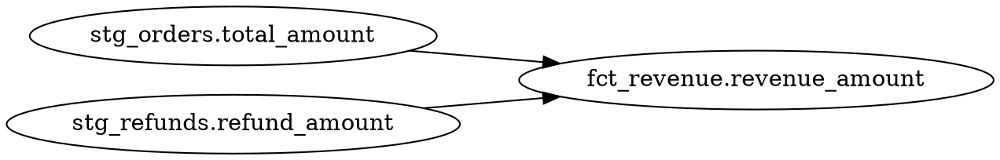

The modeling commands work with Rocky's SQL model system: compiling models to resolve dependencies and type-check, tracing column-level lineage, running local tests via DuckDB, and executing CI pipelines without warehouse credentials.

---

## `rocky compile`

Compile models: resolve dependencies, type-check SQL, validate data contracts, and build the semantic graph.

```bash
rocky compile [flags]
```

### Flags

| Flag | Type | Default | Description |
|------|------|---------|-------------|
| `--models <PATH>` | `PathBuf` | `models` | Directory containing `.sql` and `.toml` model files. |
| `--contracts <PATH>` | `PathBuf` | | Directory containing data contract definitions. |
| `--model <NAME>` | `string` | | Filter compilation to a single model by name. |

### Examples

Compile all models:

```bash
rocky compile
```

```json
{
  "version": "0.1.0",
  "command": "compile",
  "models_compiled": 14,
  "errors": [],
  "warnings": [],
  "dag": {
    "nodes": 14,
    "edges": 22
  }
}
```

Compile a single model with contracts:

```bash
rocky compile --model fct_revenue --contracts contracts/
```

```json
{
  "version": "0.1.0",
  "command": "compile",
  "models_compiled": 1,
  "errors": [],
  "warnings": [
    {
      "model": "fct_revenue",
      "message": "column 'discount_pct' not declared in contract"
    }
  ],
  "dag": {
    "nodes": 1,
    "edges": 3
  }
}
```

Compile models from a non-default directory:

```bash
rocky compile --models src/transformations/
```

### Related Commands

- [`rocky lineage`](#rocky-lineage) -- trace column-level dependencies
- [`rocky test`](#rocky-test) -- run local model tests
- [`rocky ci`](#rocky-ci) -- compile + test in one step
- [`rocky serve`](/reference/commands/development/#rocky-serve) -- expose the semantic graph via HTTP

---

## `rocky lineage`

Show column-level lineage for a model, tracing how each output column is derived from upstream sources.

```bash
rocky lineage <target> [flags]
```

### Arguments

| Argument | Type | Default | Description |
|----------|------|---------|-------------|
| `target` | `string` | **(required)** | Model name, or `model.column` to trace a specific column. |

### Flags

| Flag | Type | Default | Description |
|------|------|---------|-------------|
| `--models <PATH>` | `PathBuf` | `models` | Directory containing model files. |
| `--column <NAME>` | `string` | | Specific column to trace (alternative to `model.column` syntax). |
| `--format <FORMAT>` | `string` | | Output format. Use `dot` for Graphviz DOT output. |

### Examples

Show lineage for a model:

```bash
rocky lineage fct_revenue
```

```json
{
  "version": "0.1.0",
  "command": "lineage",
  "model": "fct_revenue",
  "columns": [
    {
      "name": "revenue_amount",
      "sources": [
        { "model": "stg_orders", "column": "total_amount" },
        { "model": "stg_refunds", "column": "refund_amount" }
      ]
    },
    {
      "name": "customer_id",
      "sources": [
        { "model": "stg_orders", "column": "customer_id" }
      ]
    }
  ]
}
```

Trace a specific column and export as Graphviz DOT:

```bash
rocky lineage fct_revenue --column revenue_amount --format dot
```



Use the dot syntax shorthand:

```bash
rocky lineage fct_revenue.revenue_amount --format dot | dot -Tpng -o lineage.png
```

### Related Commands

- [`rocky compile`](#rocky-compile) -- build the semantic graph that lineage reads
- [`rocky ai-explain`](/reference/commands/ai/#rocky-ai-explain) -- generate natural language descriptions of model logic

---

## `rocky test`

Run local model tests via DuckDB without needing warehouse credentials. Validates model SQL, contract compliance, and user-defined test assertions.

```bash
rocky test [flags]
```

### Flags

| Flag | Type | Default | Description |
|------|------|---------|-------------|
| `--models <PATH>` | `PathBuf` | `models` | Directory containing model files. |
| `--contracts <PATH>` | `PathBuf` | | Directory containing data contract definitions. |
| `--model <NAME>` | `string` | | Run tests for a single model only. |

### Examples

Run all model tests:

```bash
rocky test
```

```json
{
  "version": "0.1.0",
  "command": "test",
  "models_tested": 14,
  "passed": 12,
  "failed": 2,
  "results": [
    { "model": "fct_revenue", "status": "pass", "assertions": 3, "duration_ms": 42 },
    { "model": "dim_customers", "status": "pass", "assertions": 2, "duration_ms": 28 },
    {
      "model": "fct_orders",
      "status": "fail",
      "assertions": 4,
      "failures": [
        { "assertion": "not_null(order_id)", "message": "found 3 null values" }
      ],
      "duration_ms": 35
    }
  ]
}
```

Test a single model with contracts:

```bash
rocky test --model fct_revenue --contracts contracts/
```

```json
{
  "version": "0.1.0",
  "command": "test",
  "models_tested": 1,
  "passed": 1,
  "failed": 0,
  "results": [
    { "model": "fct_revenue", "status": "pass", "assertions": 3, "duration_ms": 42 }
  ]
}
```

### Related Commands

- [`rocky compile`](#rocky-compile) -- compile models before testing
- [`rocky ci`](#rocky-ci) -- compile + test in one step
- [`rocky ai-test`](/reference/commands/ai/#rocky-ai-test) -- generate test assertions from model intent

---

## `rocky ci`

Run the full CI pipeline: compile all models and run all tests. Designed for use in CI/CD environments where no warehouse credentials are available. Returns a non-zero exit code if any compilation error or test failure occurs.

```bash
rocky ci [flags]
```

### Flags

| Flag | Type | Default | Description |
|------|------|---------|-------------|
| `--models <PATH>` | `PathBuf` | `models` | Directory containing model files. |
| `--contracts <PATH>` | `PathBuf` | | Directory containing data contract definitions. |

### Examples

Run CI with default paths:

```bash
rocky ci
```

```json
{
  "version": "0.1.0",
  "command": "ci",
  "compile": {
    "models_compiled": 14,
    "errors": [],
    "warnings": 1
  },
  "test": {
    "models_tested": 14,
    "passed": 14,
    "failed": 0
  },
  "status": "pass"
}
```

Run CI with contracts in a GitHub Actions workflow:

```bash
rocky ci --models src/models --contracts src/contracts
```

```json
{
  "version": "0.1.0",
  "command": "ci",
  "compile": {
    "models_compiled": 14,
    "errors": [
      { "model": "fct_revenue", "message": "unknown column 'total' in ref('stg_orders')" }
    ],
    "warnings": 0
  },
  "test": {
    "models_tested": 0,
    "passed": 0,
    "failed": 0
  },
  "status": "fail"
}
```

### Related Commands

- [`rocky compile`](#rocky-compile) -- compile step only
- [`rocky test`](#rocky-test) -- test step only
- [`rocky validate`](/reference/commands/core-pipeline/#rocky-validate) -- validate config (often run before CI)
