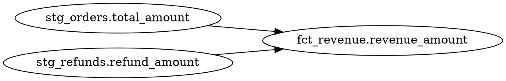

The modeling commands work with Rocky's SQL model system: compiling models to resolve dependencies and type-check, tracing column-level lineage, running local tests via DuckDB, and executing CI pipelines without warehouse credentials.

---

## `rocky compile`

Compile models: resolve dependencies, type-check SQL, validate data contracts, and build the semantic graph.

```bash
rocky compile [flags]
```

### Flags

| Flag | Type | Default | Description |
|------|------|---------|-------------|
| `--models <PATH>` | `PathBuf` | `models` | Directory containing `.sql` and `.toml` model files. |
| `--contracts <PATH>` | `PathBuf` | | Directory containing data contract definitions. |
| `--model <NAME>` | `string` | | Filter compilation to a single model by name. |

### Examples

Compile all models:

```bash
rocky compile
```

```json
{
  "version": "1.6.0",
  "command": "compile",
  "models": 14,
  "execution_layers": 4,
  "has_errors": false,
  "diagnostics": [],
  "compile_timings": { "load_ms": 8, "resolve_ms": 2, "typecheck_ms": 42 },
  "models_detail": [ /* one entry per model */ ]
}
```

Compile a single model with contracts, showing a warning diagnostic:

```bash
rocky compile --model fct_revenue --contracts contracts/
```

```json
{
  "version": "1.6.0",
  "command": "compile",
  "models": 1,
  "execution_layers": 1,
  "has_errors": false,
  "diagnostics": [
    {
      "severity": "warning",
      "code": "W010",
      "model": "fct_revenue",
      "message": "column 'discount_pct' not declared in contract",
      "span": null,
      "suggestion": null
    }
  ],
  "compile_timings": { "load_ms": 5, "resolve_ms": 1, "typecheck_ms": 12 }
}
```

Every diagnostic carries a severity (`"error"`, `"warning"`, `"info"`), a code (`E001`–`E026`, `W001`–`W011`, `V001`–`V020`), the owning model, and — when the compiler can locate it — a `span` and `suggestion`.

Compile models from a non-default directory:

```bash
rocky compile --models src/transformations/
```

### Related Commands

- [`rocky lineage`](#rocky-lineage) -- trace column-level dependencies
- [`rocky test`](#rocky-test) -- run local model tests
- [`rocky ci`](#rocky-ci) -- compile + test in one step
- [`rocky serve`](/reference/commands/development/#rocky-serve) -- expose the semantic graph via HTTP

---

## `rocky lineage`

Show column-level lineage for a model, tracing how each output column is derived from upstream sources.

```bash
rocky lineage <target> [flags]
```

### Arguments

| Argument | Type | Default | Description |
|----------|------|---------|-------------|
| `target` | `string` | **(required)** | Model name, or `model.column` to trace a specific column. |

### Flags

| Flag | Type | Default | Description |
|------|------|---------|-------------|
| `--models <PATH>` | `PathBuf` | `models` | Directory containing model files. |
| `--column <NAME>` | `string` | | Specific column to trace (alternative to `model.column` syntax). |
| `--format <FORMAT>` | `string` | | Output format. Use `dot` for Graphviz DOT output. |

### Examples

Show lineage for a model. Returns the model's columns, its upstream and downstream models, and every column-level edge with the transform kind:

```bash
rocky lineage fct_revenue
```

```json
{
  "version": "1.6.0",
  "command": "lineage",
  "model": "fct_revenue",
  "columns": [
    { "name": "customer_id" },
    { "name": "revenue_amount" }
  ],
  "upstream": ["stg_orders", "stg_refunds"],
  "downstream": [],
  "edges": [
    {
      "source": { "model": "stg_orders", "column": "customer_id" },
      "target": { "model": "fct_revenue", "column": "customer_id" },
      "transform": "direct"
    },
    {
      "source": { "model": "stg_orders", "column": "total_amount" },
      "target": { "model": "fct_revenue", "column": "revenue_amount" },
      "transform": "expression"
    },
    {
      "source": { "model": "stg_refunds", "column": "refund_amount" },
      "target": { "model": "fct_revenue", "column": "revenue_amount" },
      "transform": "expression"
    }
  ]
}
```

Tracing a single column returns a flat trace shape instead — use either `--column` or `model.column` syntax:

```bash
rocky lineage fct_revenue --column revenue_amount
```

```json
{
  "version": "1.6.0",
  "command": "lineage",
  "model": "fct_revenue",
  "column": "revenue_amount",
  "trace": [ /* LineageEdgeRecord entries, same shape as edges above */ ]
}
```

Trace a specific column and export as Graphviz DOT:

```bash
rocky lineage fct_revenue --column revenue_amount --format dot
```



Use the dot syntax shorthand:

```bash
rocky lineage fct_revenue.revenue_amount --format dot | dot -Tpng -o lineage.png
```

### Related Commands

- [`rocky compile`](#rocky-compile) -- build the semantic graph that lineage reads
- [`rocky ai-explain`](/reference/commands/ai/#rocky-ai-explain) -- generate natural language descriptions of model logic

---

## `rocky test`

Run local model tests via DuckDB without needing warehouse credentials. Validates model SQL, contract compliance, and user-defined test assertions.

```bash
rocky test [flags]
```

### Flags

| Flag | Type | Default | Description |
|------|------|---------|-------------|
| `--models <PATH>` | `PathBuf` | `models` | Directory containing model files. |
| `--contracts <PATH>` | `PathBuf` | | Directory containing data contract definitions. |
| `--model <NAME>` | `string` | | Run tests for a single model only. |

### Examples

Run all model tests:

```bash
rocky test
```

```json
{
  "version": "1.6.0",
  "command": "test",
  "total": 14,
  "passed": 12,
  "failed": 2,
  "failures": [
    { "name": "fct_orders.not_null(order_id)", "error": "found 3 null values" },
    { "name": "fct_orders.unique(order_id)",   "error": "found 1 duplicate" }
  ]
}
```

Test a single model with contracts:

```bash
rocky test --model fct_revenue --contracts contracts/
```

```json
{
  "version": "1.6.0",
  "command": "test",
  "total": 1,
  "passed": 1,
  "failed": 0,
  "failures": []
}
```

`--declarative` adds a `declarative` block summarising `[[tests]]` declared in model sidecars; see [Testing and Contracts](/concepts/testing/) for that surface.

### Related Commands

- [`rocky compile`](#rocky-compile) -- compile models before testing
- [`rocky ci`](#rocky-ci) -- compile + test in one step
- [`rocky ai-test`](/reference/commands/ai/#rocky-ai-test) -- generate test assertions from model intent

---

## `rocky ci`

Run the full CI pipeline: compile all models and run all tests. Designed for use in CI/CD environments where no warehouse credentials are available. Returns a non-zero exit code if any compilation error or test failure occurs.

```bash
rocky ci [flags]
```

### Flags

| Flag | Type | Default | Description |
|------|------|---------|-------------|
| `--models <PATH>` | `PathBuf` | `models` | Directory containing model files. |
| `--contracts <PATH>` | `PathBuf` | | Directory containing data contract definitions. |

### Examples

Run CI with default paths:

```bash
rocky ci
```

```json
{
  "version": "1.6.0",
  "command": "ci",
  "compile_ok": true,
  "tests_ok": true,
  "models_compiled": 14,
  "tests_passed": 14,
  "tests_failed": 0,
  "exit_code": 0,
  "diagnostics": [],
  "failures": []
}
```

Run CI with contracts in a GitHub Actions workflow. On a compile error, `tests_passed` / `tests_failed` are `0` because tests don't run — CI short-circuits and returns a non-zero `exit_code`:

```bash
rocky ci --models src/models --contracts src/contracts
```

```json
{
  "version": "1.6.0",
  "command": "ci",
  "compile_ok": false,
  "tests_ok": false,
  "models_compiled": 13,
  "tests_passed": 0,
  "tests_failed": 0,
  "exit_code": 1,
  "diagnostics": [
    {
      "severity": "error",
      "code": "E001",
      "model": "fct_revenue",
      "message": "unknown column 'total' in model 'stg_orders'",
      "span": null,
      "suggestion": "did you mean 'total_amount'?"
    }
  ],
  "failures": []
}
```

### Related Commands

- [`rocky compile`](#rocky-compile) -- compile step only
- [`rocky test`](#rocky-test) -- test step only
- [`rocky ci-diff`](#rocky-ci-diff) -- structural diff of changed models vs a base git ref
- [`rocky validate`](/reference/commands/core-pipeline/#rocky-validate) -- validate config (often run before CI)

---

## `rocky ci-diff`

Detect which models changed between a base git ref and `HEAD`, compile both sides, and report added/modified/removed columns. Emits both JSON (for CI pipelines) and a pre-rendered Markdown block suitable for posting as a PR comment.

```bash
rocky ci-diff [base_ref] [flags]
```

### Arguments

| Argument | Type | Default | Description |
|----------|------|---------|-------------|
| `base_ref` | `string` | `main` | Git ref to compare against. Rocky shells out to `git diff --name-only <base_ref> HEAD` to find changed `.sql`, `.rocky`, and sidecar `.toml` files. |

### Flags

| Flag | Type | Default | Description |
|------|------|---------|-------------|
| `--models <PATH>` | `PathBuf` | `models` | Directory containing model files. |

### Examples

Diff the current branch against `main`:

```bash
rocky ci-diff
```

```json
{
  "version": "1.7.0",
  "command": "ci-diff",
  "base_ref": "main",
  "head_ref": "HEAD",
  "summary": {
    "added": 1,
    "modified": 2,
    "removed": 0
  },
  "models": [
    {
      "model": "fct_orders",
      "status": "modified",
      "columns": [
        { "name": "order_status", "change": "added" },
        { "name": "amount_cents", "change": "type_changed", "from": "INT", "to": "BIGINT" }
      ]
    }
  ],
  "markdown": "### Model diff vs `main`\n\n| Model | Status | ... |"
}
```

Diff against a feature-branch base and a non-default models directory:

```bash
rocky ci-diff release/2026-04 --models src/models
```

The `markdown` field holds a ready-to-post report; in a GitHub Actions workflow you can `jq -r .markdown` the JSON output and feed it into `gh pr comment`.

### Related Commands

- [`rocky ci`](#rocky-ci) -- full compile + test for CI
- [`rocky compile`](#rocky-compile) -- compile a single branch without diffing
