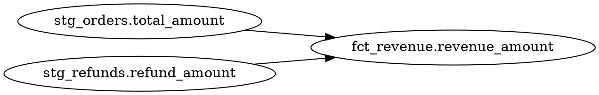

Commands for working with Rocky's SQL models: compile, lineage, local tests, and CI.

---

## `rocky compile`

Compile models: resolve dependencies, type-check SQL, validate data contracts, and build the semantic graph.

```bash
rocky compile [flags]
```

### Flags

| Flag | Type | Default | Description |
|------|------|---------|-------------|
| `--models <PATH>` | `PathBuf` | `models` | Directory containing `.sql` and `.toml` model files. |
| `--contracts <PATH>` | `PathBuf` | | Directory containing data contract definitions. |
| `--model <NAME>` | `string` | | Filter compilation to a single model by name. |
| `--expand-macros` | `bool` | `false` | Expand macros from `macros/` and include the expanded SQL in the output. |
| `--target-dialect <DIALECT>` | `dbx` \| `sf` \| `bq` \| `duckdb` | | Run the **P001 dialect-portability lint** against the chosen target. Non-portable constructs emit `error`-severity diagnostics. Precedence: flag > `[portability] target_dialect` in `rocky.toml` > unset. See [Portability linting](/concepts/linters/). |
| `--with-seed` | `bool` | `false` | Execute `data/seed.sql` against an in-memory DuckDB and use its `information_schema` as the source-of-truth for raw source schemas. Turns leaf `.sql` models from `Unknown` columns into concrete types. Requires the `duckdb` feature (enabled by default in the shipped binary). |

### Examples

Compile all models:

```bash
rocky compile
```

```json
{
  "version": "1.11.0",
  "command": "compile",
  "models": 14,
  "execution_layers": 4,
  "has_errors": false,
  "diagnostics": [],
  "compile_timings": { "load_ms": 8, "resolve_ms": 2, "typecheck_ms": 42 },
  "models_detail": [
    {
      "name": "fct_revenue",
      "strategy": { "type": "full_refresh" },
      "target": { "catalog": "acme_warehouse", "schema": "gold", "table": "fct_revenue" },
      "freshness": { "max_lag_seconds": 86400, "time_column": "order_date", "severity": "warning" },
      "contract_source": "auto",
      "incrementality_hint": {
        "is_candidate": true,
        "recommended_column": "order_date",
        "confidence": "medium",
        "signals": ["column name 'order_date' ends with '_date' (timestamp pattern)"]
      },
      "cost_hint": {
        "estimated_rows": 10000,
        "estimated_bytes": 2560000,
        "estimated_cost_usd": 0.0000228,
        "confidence": "high"
      },
      "depends_on": ["stg_orders", "stg_refunds"],
      "tags": { "domain": "finance", "tier": "gold", "owner": "analytics", "region": "emea" }
    }
    /* one entry per model */
  ]
}
```

`models_detail` carries each compiled model's declarative shape: `name`, materialization `strategy` (wire form `{"type": "..."}`), `target` coordinates, and direct `depends_on`. Optional fields appear only when present: `freshness`, `contract_source` (`"auto"` for a sibling `.contract.toml`, `"explicit"` for one passed via `--contracts`), `incrementality_hint` (a `full_refresh` model with a monotonic-looking column), and `cost_hint` (when upstream statistics support an estimate). The `tags` object holds the model's `[tags]` merged over any config-group baseline (sidecar wins). Empty `tags`, `depends_on`, and absent optional fields are omitted.

Compile a single model with contracts, showing a warning diagnostic:

```bash
rocky compile --model fct_revenue --contracts contracts/
```

```json
{
  "version": "1.6.0",
  "command": "compile",
  "models": 1,
  "execution_layers": 1,
  "has_errors": false,
  "diagnostics": [
    {
      "severity": "warning",
      "code": "W010",
      "model": "fct_revenue",
      "message": "column 'discount_pct' not declared in contract",
      "span": null,
      "suggestion": null
    }
  ],
  "compile_timings": { "load_ms": 5, "resolve_ms": 1, "typecheck_ms": 12 }
}
```

Every diagnostic carries a severity (`"error"`, `"warning"`, `"info"`), a code (`E###` errors, `W###` warnings, `P###` portability lints, or `V###` validation), the owning model, and (when the compiler can locate it) a `span` and `suggestion`.

Compile models from a non-default directory:

```bash
rocky compile --models src/transformations/
```

Reject SQL that won't run on BigQuery (P001 dialect-portability lint):

```bash
rocky compile --target-dialect bq
```

```json
{
  "version": "1.11.0",
  "command": "compile",
  "has_errors": true,
  "diagnostics": [
    {
      "severity": "error",
      "code": "P001",
      "model": "fct_revenue",
      "message": "NVL is not portable to BigQuery (supported by: Snowflake, Databricks)",
      "span": { "file": "models/fct_revenue.sql", "line": 1, "col": 1 },
      "suggestion": "use COALESCE"
    }
  ]
}
```

The `--target-dialect` flag and the `[portability]` config block (see [Configuration](/reference/configuration/)) drive the same check. Project-wide allow-lists and per-model `-- rocky-allow: …` pragmas exempt specific constructs. See [Portability linting](/concepts/linters/#p001--dialect-portability).

Compile with seeded source schemas so leaf `.sql` models pick up real types:

```bash
rocky compile --with-seed
```

`--with-seed` looks for `data/seed.sql` relative to the project root (one level up from `--models`). It opens an in-memory DuckDB, runs the seed, and feeds the resulting `information_schema.columns` back into the compiler so downstream incrementality and type-inference get concrete types instead of `RockyType::Unknown`. Bails if `data/seed.sql` is missing or fails to execute.

### Related Commands

- [`rocky lineage`](#rocky-lineage) -- trace column-level dependencies
- [`rocky test`](#rocky-test) -- run local model tests
- [`rocky ci`](#rocky-ci) -- compile + test in one step
- [`rocky serve`](/reference/commands/development/#rocky-serve) -- expose the semantic graph via HTTP

---

## `rocky lineage`

Show column-level lineage for a model, tracing how each output column is derived from upstream sources.

```bash
rocky lineage <target> [flags]
```

### Arguments

| Argument | Type | Default | Description |
|----------|------|---------|-------------|
| `target` | `string` | **(required)** | Model name, or `model.column` to trace a specific column. |

### Flags

| Flag | Type | Default | Description |
|------|------|---------|-------------|
| `--models <PATH>` | `PathBuf` | `models` | Directory containing model files. |
| `--column <NAME>` | `string` | | Specific column to trace (alternative to `model.column` syntax). |
| `--format <FORMAT>` | `string` | | Output format. Use `dot` for Graphviz DOT output. |
| `--downstream` | `bool` | `false` | Walk the column-level graph forward (consumers) instead of backward (sources). Mutually exclusive with `--upstream`. |
| `--upstream` | `bool` | `true` | Walk the column-level graph backward (sources). Default; the flag exists for explicitness in scripted callers. |

### Examples

Show lineage for a model. Returns the model's columns, its upstream and downstream models, and every column-level edge with the transform kind:

```bash
rocky lineage fct_revenue
```

```json
{
  "version": "1.6.0",
  "command": "lineage",
  "model": "fct_revenue",
  "columns": [
    { "name": "customer_id" },
    { "name": "revenue_amount" }
  ],
  "upstream": ["stg_orders", "stg_refunds"],
  "downstream": [],
  "edges": [
    {
      "source": { "model": "stg_orders", "column": "customer_id" },
      "target": { "model": "fct_revenue", "column": "customer_id" },
      "transform": "direct"
    },
    {
      "source": { "model": "stg_orders", "column": "total_amount" },
      "target": { "model": "fct_revenue", "column": "revenue_amount" },
      "transform": "expression"
    },
    {
      "source": { "model": "stg_refunds", "column": "refund_amount" },
      "target": { "model": "fct_revenue", "column": "revenue_amount" },
      "transform": "expression"
    }
  ]
}
```

Tracing a single column returns a flat trace shape instead. Use either `--column` or `model.column` syntax:

```bash
rocky lineage fct_revenue --column revenue_amount
```

```json
{
  "version": "1.6.0",
  "command": "lineage",
  "model": "fct_revenue",
  "column": "revenue_amount",
  "direction": "upstream",
  "trace": [ /* LineageEdgeRecord entries, same shape as edges above */ ]
}
```

Trace a specific column and export as Graphviz DOT:

```bash
rocky lineage fct_revenue --column revenue_amount --format dot
```



Use the dot syntax shorthand:

```bash
rocky lineage fct_revenue.revenue_amount --format dot | dot -Tpng -o lineage.png
```

Walk downstream to see every consumer of a column (the answer to "what breaks if I change this?"):

```bash
rocky lineage stg_orders.customer_id --downstream
```

```json
{
  "version": "1.11.0",
  "command": "lineage",
  "model": "stg_orders",
  "column": "customer_id",
  "direction": "downstream",
  "trace": [
    {
      "source": { "model": "stg_orders", "column": "customer_id" },
      "target": { "model": "fct_revenue", "column": "customer_id" },
      "transform": "direct"
    },
    {
      "source": { "model": "fct_revenue", "column": "customer_id" },
      "target": { "model": "mart_ltv",    "column": "customer_id" },
      "transform": "direct"
    }
  ]
}
```

Upstream output has `"direction": "upstream"` (the default shape, unchanged). The transitive walker is backed by an `edges_by_source_model` index so cost scales with fan-out rather than total edges.

### Related Commands

- [`rocky compile`](#rocky-compile) -- build the semantic graph that lineage reads
- [`rocky ai-explain`](/reference/commands/ai/#rocky-ai-explain) -- generate natural language descriptions of model logic

---

## `rocky catalog`

Emit a project-wide column-level lineage snapshot to disk. Walks every model in the SemanticGraph and serializes the result as persisted catalog artifacts (a `catalog.json` front door plus `edges.parquet` / `assets.parquet`) so downstream consumers (BI tools, governance dashboards, AI review bots) can query lineage without re-invoking the engine.

```bash
rocky catalog [flags]
```

### Flags

| Flag | Type | Default | Description |
|------|------|---------|-------------|
| `--models <PATH>` | `PathBuf` | `models` | Directory containing `.sql` and `.toml` model files. |
| `--out <PATH>` | `PathBuf` | `.rocky/catalog/` | Output directory. `catalog.json` is written to `<out>/catalog.json`; the Parquet artifacts to `<out>/edges.parquet` and `<out>/assets.parquet`. |
| `--format <FORMAT>` | `json` \| `parquet` \| `both` | `both` | Which artefact family to emit. `json` writes only `catalog.json`; `parquet` writes only `edges.parquet` + `assets.parquet`; `both` writes all three. |
| `--catalog <NAME>` | `string` | | Scope the snapshot to a single warehouse catalog. Only assets whose FQN sits in the named catalog are emitted, and edges referencing dropped assets are pruned. |

### Behaviour

By default (`--format both`) `rocky catalog` writes `<out>/catalog.json`, `<out>/edges.parquet`, and `<out>/assets.parquet`; pass `--format json` to write only the JSON front door. The CLI's stdout is a short summary in the default `--output table` mode, or the same JSON payload mirrored to stdout in `--output json` mode.

The artifact contains:

- `assets` — one entry per model or upstream source, with columns (name plus inferred type and nullability when known, and a per-column `description` from the sidecar `[columns]` table when set), upstream / downstream lists, and the model's intent description when supplied.
- `edges` — one entry per column-level lineage edge: source column, target column, transform kind (`direct`, `cast`, `expression`, `aggregation: <fn>`), and a confidence grade (`High` for explicit projections, `Medium` for star-expanded edges, `Low` reserved for future use).
- `stats` — aggregate counts (`asset_count`, `edge_count`, `column_count`, `assets_with_star`, `orphan_columns`, `duration_ms`).
- A `config_hash` fingerprint of `rocky.toml` so consumers can tell whether the catalog was built against the current configuration.

### Examples

Build the default snapshot:

```bash
rocky catalog
```

```text
rocky catalog
  project:          playground
  assets:           3
  columns:          13
  edges:            13
  wrote:            .rocky/catalog/catalog.json
  wrote:            .rocky/catalog/edges.parquet
  wrote:            .rocky/catalog/assets.parquet
  duration:         12ms
```

Pipe the JSON shape directly:

```bash
rocky catalog --output json | jq '.stats'
```

Write to a custom directory (for example, when building a per-PR artifact):

```bash
rocky catalog --out build/catalog
```

### Limitations

- Per-asset `last_run_id` and `last_materialized_at` are populated from the state store when a matching successful run exists; they stay `null` for assets that have never been materialized (or built before the run history was captured).
- Lineage extraction inherits the existing extractor's coverage: window functions, CTEs, set operations, `CASE WHEN` projections, and join keys are not yet surfaced as edges. Asset-level partial lineage is flagged via `stats.assets_with_star`.

### Related Commands

- [`rocky lineage`](#rocky-lineage) -- per-model lineage exploration with `--column` traces
- [`rocky compile`](#rocky-compile) -- build the semantic graph that the catalog reads

---

## `rocky emit-sql`

Render the runnable SQL each transformation model would emit, without a warehouse connection and without running anything. The SQL is generated through the same path `rocky run` uses, including declared surrogate-key columns wrapped exactly as they are at materialization.

```bash
rocky emit-sql [flags]
```

### Flags

| Flag | Type | Default | Description |
|------|------|---------|-------------|
| `--models <PATH>` | `PathBuf` | `models` | Directory containing `.sql` and `.toml` model files. |
| `--model <NAME>` | `string` | | Render a single model by name instead of the whole project. |
| `--out-dir <PATH>` | `PathBuf` | | Write one `<model>.sql` file per model into this directory, in dependency order. When omitted, the concatenated SQL is printed to stdout (also in dependency order). |

### Dialect and the runnable guarantee

The dialect is the project's configured target adapter type, resolved from `rocky.toml` without credentials. With no resolvable config it defaults to DuckDB. All models render in this one resolved dialect, so for a project whose models target more than one adapter, the emitted SQL matches `rocky run` only for the models whose target uses that dialect.

Full-refresh models emit a complete `CREATE OR REPLACE TABLE … AS …` that runs as-is against a fresh warehouse and matches what a run executes in the resolved dialect. Incremental and merge models emit their steady-state statement instead: a bare `INSERT` or `MERGE` that operates on an existing target. `rocky run` bootstraps the target table on first build and threads the incremental watermark from state, neither of which a static emit can reproduce, so those files carry a leading note to that effect:

```sql
-- NOTE: incremental/merge statement — operates on an existing target.
-- `rocky run` bootstraps the table on first build and threads the
-- incremental watermark from state; this static SQL does neither.
MERGE INTO ...
```

Models that produce no standalone SQL are reported on stderr rather than silently dropped, so you never mistake the emitted set for the complete project. Two cases are skipped this way: ephemeral models (inlined as CTEs upstream, so they have no statement of their own) and strategies that cannot render offline, such as a Snowflake dynamic table that needs a live compute-warehouse name.

### Examples

Print the whole project's SQL to stdout in dependency order:

```bash
rocky emit-sql
```

```sql
-- model: stg_orders
CREATE OR REPLACE TABLE main.stg_orders AS
SELECT order_id, customer_id, total_amount FROM raw.orders;

-- model: fct_revenue
CREATE OR REPLACE TABLE main.fct_revenue AS
SELECT customer_id, SUM(total_amount) AS revenue_amount FROM main.stg_orders GROUP BY customer_id;
```

Write one file per model, ready to commit or hand to another tool:

```bash
rocky emit-sql --out-dir build/sql/
```

```text
emit-sql: wrote 2 model(s) to build/sql/ in dependency order
```

Render a single model, and capture the project-wide SQL into one file:

```bash
rocky emit-sql --model fct_revenue
rocky emit-sql > build/all.sql
```

When some models cannot be emitted as standalone SQL, the skip report goes to stderr:

```text
emit-sql: 1 model(s) not emitted:
  - dim_session (ephemeral — inlined as a CTE)
```

### Related Commands

- `rocky dag` -- inspect the dependency order `emit-sql` renders in
- [`rocky catalog`](#rocky-catalog) -- the same compiled graph, exported as a lineage snapshot rather than runnable SQL
- [No lock-in](/guides/no-lock-in/) -- the full fallback recipe for stepping away from the engine

---

## `rocky test`

Run local model tests via DuckDB without needing warehouse credentials. Validates model SQL, contract compliance, and user-defined test assertions.

```bash
rocky test [flags]
```

### Flags

| Flag | Type | Default | Description |
|------|------|---------|-------------|
| `--models <PATH>` | `PathBuf` | `models` | Directory containing model files. |
| `--contracts <PATH>` | `PathBuf` | | Directory containing data contract definitions. |
| `--model <NAME>` | `string` | | Run tests for a single model only. |

### Examples

Run all model tests:

```bash
rocky test
```

```json
{
  "version": "1.6.0",
  "command": "test",
  "total": 14,
  "passed": 12,
  "failed": 2,
  "failures": [
    { "name": "fct_orders.not_null(order_id)", "error": "found 3 null values" },
    { "name": "fct_orders.unique(order_id)",   "error": "found 1 duplicate" }
  ]
}
```

Test a single model with contracts:

```bash
rocky test --model fct_revenue --contracts contracts/
```

```json
{
  "version": "1.6.0",
  "command": "test",
  "total": 1,
  "passed": 1,
  "failed": 0,
  "failures": []
}
```

The default `rocky test` path also runs fixture-driven `[[test]]` unit tests declared in model sidecars. Each `[[test]]` block mocks upstream inputs with inline rows (`given`) and asserts the model's output rows (`expect`), executed in-memory against DuckDB. When at least one model declares a `[[test]]` block, the JSON output gains a `unit_tests` summary; the key is omitted entirely when no model declares one. A failing unit test makes `rocky test` exit non-zero, the same as a failing model assertion.

```json
{
  "version": "1.11.0",
  "command": "test",
  "total": 3,
  "passed": 3,
  "failed": 0,
  "failures": [],
  "unit_tests": {
    "total": 2,
    "passed": 1,
    "failed": 1,
    "results": [
      { "model": "fct_revenue", "test": "discount_caps_at_total", "passed": true, "error": null, "mismatches": [] },
      {
        "model": "fct_revenue",
        "test": "refunds_subtract",
        "passed": false,
        "error": "ordered output mismatch (1 expected vs 1 actual row(s))",
        "mismatches": [
          { "row_index": 0, "expected": "customer_id=7, revenue_amount=80", "actual": "customer_id=7, revenue_amount=100", "kind": "value_diff" }
        ]
      }
    ]
  }
}
```

Each `results` entry carries the model name, the `[[test]]` block's `test` name, a `passed` flag, an `error` message (`null` when the test passed), and the `mismatches` array of row-level diffs. Each mismatch renders its row as `col=val, col=val`. A mismatch `kind` is `missing` (expected but not produced), `extra` (produced but not expected), or `value_diff` (same positional row, differing values, from an `ordered` expectation).

`--declarative` is a separate surface: it adds a `declarative` block summarising `[[tests]]` (plural) declared in model sidecars, run against the configured warehouse adapter rather than DuckDB. See [Testing and Contracts](/concepts/testing/) for both surfaces.

### Related Commands

- [`rocky compile`](#rocky-compile) -- compile models before testing
- [`rocky ci`](#rocky-ci) -- compile + test in one step
- [`rocky ai-test`](/reference/commands/ai/#rocky-ai-test) -- generate test assertions from model intent

---

## `rocky ci`

Run the full CI pipeline: compile all models and run all tests. Designed for use in CI/CD environments where no warehouse credentials are available. Returns a non-zero exit code if any compilation error or test failure occurs.

```bash
rocky ci [flags]
```

### Flags

| Flag | Type | Default | Description |
|------|------|---------|-------------|
| `--models <PATH>` | `PathBuf` | `models` | Directory containing model files. |
| `--contracts <PATH>` | `PathBuf` | | Directory containing data contract definitions. |

### Examples

Run CI with default paths:

```bash
rocky ci
```

```json
{
  "version": "1.6.0",
  "command": "ci",
  "compile_ok": true,
  "tests_ok": true,
  "models_compiled": 14,
  "tests_passed": 14,
  "tests_failed": 0,
  "exit_code": 0,
  "diagnostics": [],
  "failures": []
}
```

Run CI with contracts in a GitHub Actions workflow. On a compile error, `tests_passed` / `tests_failed` are `0` because tests don't run, and CI short-circuits and returns a non-zero `exit_code`:

```bash
rocky ci --models src/models --contracts src/contracts
```

```json
{
  "version": "1.6.0",
  "command": "ci",
  "compile_ok": false,
  "tests_ok": false,
  "models_compiled": 13,
  "tests_passed": 0,
  "tests_failed": 0,
  "exit_code": 1,
  "diagnostics": [
    {
      "severity": "error",
      "code": "E001",
      "model": "fct_revenue",
      "message": "unknown column 'total' in model 'stg_orders'",
      "span": null,
      "suggestion": "did you mean 'total_amount'?"
    }
  ],
  "failures": []
}
```

### Related Commands

- [`rocky compile`](#rocky-compile) -- compile step only
- [`rocky test`](#rocky-test) -- test step only
- [`rocky ci-diff`](#rocky-ci-diff) -- structural diff of changed models vs a base git ref
- [`rocky validate`](/reference/commands/core-pipeline/#rocky-validate) -- validate config (often run before CI)

---

## `rocky ci-diff`

Detect which models changed between a base git ref and `HEAD`, compile both sides, and report added/modified/removed columns. Emits both JSON (for CI pipelines) and a pre-rendered Markdown block suitable for posting as a PR comment.

```bash
rocky ci-diff [base_ref] [flags]
```

### Arguments

| Argument | Type | Default | Description |
|----------|------|---------|-------------|
| `base_ref` | `string` | `main` | Git ref to compare against. Rocky shells out to `git diff --name-only <base_ref> HEAD` to find changed `.sql`, `.rocky`, and sidecar `.toml` files. |

### Flags

| Flag | Type | Default | Description |
|------|------|---------|-------------|
| `--models <PATH>` | `PathBuf` | `models` | Directory containing model files. |
| `--semantic` | flag | off | Also run the typed-IR semantic breaking-change classifier and surface findings under `breaking_findings` in the JSON output. Informational only — even a `Breaking` finding does not change `ci-diff`'s exit code. The hard gate lives on [`rocky branch promote`](/reference/commands/core-pipeline/#rocky-branch). |

### Examples

Diff the current branch against `main`:

```bash
rocky ci-diff
```

```json
{
  "version": "1.31.0",
  "command": "ci-diff",
  "base_ref": "main",
  "head_ref": "HEAD",
  "summary": {
    "added": 1,
    "modified": 2,
    "removed": 0
  },
  "models": [
    {
      "model": "fct_orders",
      "status": "modified",
      "columns": [
        { "name": "order_status", "change": "added" },
        { "name": "amount_cents", "change": "type_changed", "from": "INT", "to": "BIGINT" }
      ]
    }
  ],
  "markdown": "### Model diff vs `main`\n\n| Model | Status | ... |"
}
```

Diff against a feature-branch base and a non-default models directory:

```bash
rocky ci-diff release/2026-04 --models src/models
```

The `markdown` field holds a ready-to-post report; in a GitHub Actions workflow you can `jq -r .markdown` the JSON output and feed it into `gh pr comment`.

Run with `--semantic` to surface classified breaking-change findings alongside the structural diff:

```bash
rocky ci-diff --semantic
```

```json
{
  "version": "1.31.0",
  "command": "ci-diff",
  "base_ref": "main",
  "head_ref": "HEAD",
  "summary": { "added": 0, "modified": 1, "removed": 0 },
  "models": [ /* ... */ ],
  "markdown": "...",
  "breaking_findings": [
    {
      "change": {
        "kind": "column_type_changed",
        "model": "analytics.marts.fct_orders",
        "column": "amount_cents",
        "old_type": "BIGINT",
        "new_type": "INT",
        "narrowing": true
      },
      "severity": "breaking"
    }
  ]
}
```

The `breaking_findings` array is omitted from JSON output when empty or when `--semantic` is not set. Each finding carries a tagged `change` object (`kind` discriminator) and a `severity` (`breaking` / `warning` / `info`). Use `--semantic` in `ci-diff` to surface findings on every PR; rely on [`rocky branch promote`](/reference/commands/core-pipeline/#rocky-branch) to block promotion when `severity == "breaking"`.

The `breaking_findings` field is JSON-only: `--output table` still renders the structural diff but does not print the semantic findings list. Use `--output json` (and pipe through `jq`) to inspect them.

### Related Commands

- [`rocky ci`](#rocky-ci) -- full compile + test for CI
- [`rocky compile`](#rocky-compile) -- compile a single branch without diffing
- [`rocky preview`](#rocky-preview) -- pruned re-run + sampled data diff + cost delta on top of `ci-diff`'s structural diff
- [`rocky branch promote`](/reference/commands/core-pipeline/#rocky-branch) -- promote a branch's tables to production with a hard semantic breaking-change gate

---

## `rocky preview`

Run a PR-time preview of model changes: prune-and-copy substrate that re-executes only changed models and their downstream column lineage on a per-PR branch, copying everything else from the base ref. Three subcommands compose into a single review artifact: `preview create` runs the workflow, `preview diff` reports the structural and sampled row-level diff, and `preview cost` reports the cost delta vs. base.

For the design (why CTAS today and warehouse-native clones tomorrow, how the column-level pruner works, what the sampling window's correctness ceiling is), see the [How Preview Works](/concepts/preview-internals/) concept page. For a step-by-step walkthrough on a feature branch, see the [Preview a PR](/guides/preview-a-pr/) how-to.

```bash
rocky preview create --base <ref> [--name <branch_name>]
rocky preview diff   --name <branch_name> [--base <ref>] [--sample-size <N>]
rocky preview cost   --name <branch_name> [--base <ref>]
```

All three subcommands accept `--output json|markdown`. The Markdown form is pre-rendered for posting to a PR comment; the JSON form embeds the same Markdown in a top-level `markdown` field for orchestrator use.

### `rocky preview create`

Compute the prune set, copy the rest from the base schema, run only the prune set against a per-PR branch.

| Flag | Type | Default | Description |
|------|------|---------|-------------|
| `--base <REF>` | `string` | `main` | Git ref the change-set is computed against. Rocky shells out to `git diff --name-only <base>...HEAD` against the models directory. |
| `--name <NAME>` | `string` | derived from current branch | Branch name to register in the state store. The branch's `schema_prefix` becomes `branch__<name>` and is the target schema for the pruned run. |
| `--models <PATH>` | `PathBuf` | `models` | Directory containing model files. |

**Example.** Diff against `main` and create a preview branch:

```bash
rocky preview create --base main
```

```json
{
  "version": "1.18.0",
  "command": "preview-create",
  "branch_name": "preview-fix-price",
  "branch_schema": "branch__preview-fix-price",
  "base_ref": "main",
  "head_ref": "HEAD",
  "prune_set": [
    { "model_name": "fct_revenue", "reason": "changed", "changed_columns": ["amount_cents"] },
    { "model_name": "rev_by_region", "reason": "downstream_of_changed" }
  ],
  "copy_set": [
    { "model_name": "stg_orders",    "source_schema": "main", "target_schema": "branch__preview-fix-price", "copy_strategy": "ctas" },
    { "model_name": "stg_customers", "source_schema": "main", "target_schema": "branch__preview-fix-price", "copy_strategy": "ctas" }
  ],
  "skipped_set": [],
  "run_id": "run-20260428-141033-002",
  "run_status": "succeeded",
  "duration_ms": 4321
}
```

`copy_strategy` reports `"ctas"` for every successful copy regardless of which SQL primitive the adapter actually emitted. As of `engine-v1.19.1`, Databricks uses `SHALLOW CLONE` and BigQuery uses `CREATE TABLE … COPY` (both metadata-only) under the hood; DuckDB and Snowflake fall through to the portable CTAS default. Surfacing the per-adapter strategy in the wire output is a follow-up.

### `rocky preview diff`

Sampled row-level diff plus structural (column-level) diff for every model in the prune set.

| Flag | Type | Default | Description |
|------|------|---------|-------------|
| `--name <NAME>` | `string` | **(required)** | Branch name created by `preview create`. |
| `--base <REF>` | `string` | `main` | Git ref to compare against. Must match what `preview create` was invoked with. |
| `--sample-size <N>` | `usize` | `1000` | Number of rows to sample per model for row-level diffing. Larger windows reduce false-negative risk; see [coverage warning](/concepts/preview-internals/#coverage-warning-roll-up). |

**Example.** Render a Markdown report ready to post on a PR:

```bash
rocky preview diff --name preview-fix-price --output markdown
```

The JSON shape (`PreviewDiffOutput`) carries the same data plus the per-model `sampling_window` block with `coverage_warning`, and `rocky preview diff --output json | jq -r .markdown` reproduces the `--output markdown` report.

### `rocky preview cost`

Per-model cost delta between the branch run and the latest base-schema `RunRecord`.

| Flag | Type | Default | Description |
|------|------|---------|-------------|
| `--name <NAME>` | `string` | **(required)** | Branch name created by `preview create`. |
| `--base <REF>` | `string` | `main` | Git ref the base run is identified by. |

**Example.**

```bash
rocky preview cost --name preview-fix-price --output markdown
```

The JSON shape (`PreviewCostOutput`) reports per-model `delta_usd`, `branch_duration_ms`, `base_duration_ms`, and bytes scanned, plus an aggregate `summary.delta_usd`, `summary.savings_from_copy_usd`, and `models_skipped_via_copy`. Underlying cost math is identical to [`rocky cost`](/reference/commands/administration/#rocky-cost) (Databricks / Snowflake duration × DBU rate; BigQuery bytes × $/TB; DuckDB zero); fields fall back to `null` when no base `RunRecord` exists or when the adapter does not surface USD.

### Output shapes

Wire contracts for all three subcommands are exported by `rocky export-schemas`:

- `schemas/preview_create.schema.json`
- `schemas/preview_diff.schema.json`
- `schemas/preview_cost.schema.json`

These back the autogenerated Pydantic and TypeScript bindings. See [JSON Output](/reference/json-output/) for the codegen pipeline and version compatibility contract.

### Related Commands

- [`rocky ci-diff`](#rocky-ci-diff) -- structural diff alone, without the pruned re-run or row-level sampling
- [`rocky branch`](/reference/commands/core-pipeline/#rocky-branch) -- the schema-prefix branches `preview create` registers
- [`rocky cost`](/reference/commands/administration/#rocky-cost) -- the per-run cost rollup `preview cost` diffs across base and branch
- [`rocky compare`](/reference/cli/#rocky-compare) -- ad-hoc shadow comparison; `preview diff` extends the same kernel with sampled row-level diffing
