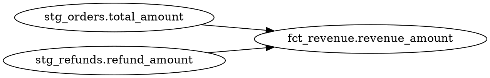

These commands work on Rocky models. They compile and test the models, trace lineage, render SQL, and compare a change against a base git ref. The last two publish and check schemas across teams.

---

## `rocky compile`

Compile models: resolve dependencies, type-check SQL, validate data contracts, and build the semantic graph.

```bash
rocky compile [flags]
```

### Flags

| Flag | Type | Default | Description |
|------|------|---------|-------------|
| `--models <PATH>` | `PathBuf` | every pipeline | Compile only the `.sql`, `.rocky` and `.toml` model files in this directory. Without it, Rocky compiles the models of every transformation pipeline together. See [The whole project by default](#the-whole-project-by-default). |
| `--contracts <PATH>` | `PathBuf` | | Directory containing data contract definitions. Default: the project `contracts/` directory beside the models directory, which is `models/` beside the config file when you pass no `--models`. |
| `--model <NAME>` | `string` | | Restrict the reported result and exit status to one exact model name — whether *that model's own source* is valid, not whether its upstreams can be rebuilt. The full project is still loaded and compile-checked internally for dependency and type context. |
| `--select <SELECTOR>...`, `-s` / `--exclude <SELECTOR>...` / `--state-ref <REF>` / `--state-working-tree` | `string` | | Report and fail on the [selected models](/reference/node-selection/) only. Cannot be combined with `--model`. |
| `--var <NAME=VALUE>` | `string` (repeatable) | | Bind a run variable, so `rocky compile` checks the same SQL `rocky run --var` executes. A required `@var(name)` with no value and no inline default is a compile error. See [`@var()` run variables](/reference/model-format/#var-run-variables). |
| `--expand-macros` | `bool` | `false` | Expand macros from `macros/` and include the expanded SQL in the output. |
| `--target-dialect <DIALECT>` | `dbx` \| `sf` \| `bq` \| `duckdb` | | Run the **P001 dialect-portability lint** against the chosen target. Non-portable constructs emit `error`-severity diagnostics. Precedence: flag > `[portability] target_dialect` in `rocky.toml` > unset. See [Portability linting](/concepts/linters/). The flag also selects the warehouse for the `E042`/`E043` operand checks, ahead of the adapter type. See [Aggregate and comparison operands](/concepts/compiler/#aggregate-and-comparison-operands). |
| `--deny-warnings <CODES>` | `string` (comma-separated, repeatable) | | Report the listed warning codes as errors and exit non-zero, such as `--deny-warnings W042,W043`. Other warnings stay warnings. A code that is not a warning code (`W999`, `W42`, `E042`) is refused before the compile, with the list of valid codes. |
| `--with-seed` | `bool` | `false` | Require `data/seed.sql`, and use only its tables as the source schemas. Without the flag, Rocky still uses the seed when the project has one. The flag makes a missing or broken seed an error. Requires the `duckdb` feature (enabled by default in the shipped binary). |
| `--strict-contracts` | `bool` | `false` | Refuse a contract column whose declared type Rocky cannot check. The `I003` info note becomes the `E059` error, which names the model and the column, says why the type is unknown, and says how to fix it. Same as `[contracts] strict = true`. |
| `--strict-sources` | `bool` | `false` | Treat every known source schema as current. A reference to a column the source lacks is the `E041` error, even when the schema came from a seed or an old cache entry. Without the flag, those schemas give the `W041` warning. A read of a table missing from a known schema is likewise the `E045` error instead of the `W045` warning. Same as `[cache.schemas] strict_sources = true`. See [Missing columns in external sources](/concepts/compiler/#missing-columns-in-external-sources-e041--w041). |
| `--dbt-project <DIR>` | `PathBuf` | | **Experimental.** Compile a dbt project in place (attach mode). See [Attach to a dbt project](#attach-to-a-dbt-project-experimental). Conflicts with `--models` and `--with-seed`. |

### Examples

Compile all models:

```bash
rocky compile
```

#### The whole project by default

With no `--models`, `rocky compile` reads the models of every transformation pipeline in `rocky.toml` and compiles them as one project graph. A model in one pipeline that reads the output of another pipeline gets that output's column types. So a type error across pipelines is found in one command.

```
[pipeline.transform]  models = "models/**"     ─┐
                                                 ├─► one compile, one graph
[pipeline.reporting]  models = "reporting/**"  ─┘
```

Each model is still checked against the warehouse of the pipeline that runs it. Two model files with the same name in different pipelines are an error.

A project with no transformation pipeline compiles the `models` directory. `--models <PATH>` compiles that one directory only, as before.

#### Source schemas

Rocky types the models that read source tables from these schemas, in this order:

1. With `--with-seed`: the tables of `data/seed.sql` only.
2. Otherwise: the schema cache, when `[cache.schemas]` is enabled.
3. Plus, when the project has `data/seed.sql`: every seed table the cache does not hold.

The seed runs in an in-memory DuckDB. Nothing contacts the warehouse. A seed that fails to run is skipped, and the compile goes on without it. Only `--with-seed` makes that an error. The seed is SQL from your repository, so it runs only for the `rocky compile` command itself. The compile behind `rocky serve` and the MCP compile tool does not run it.

`data/seed.sql` is beside `rocky.toml` for a whole-project compile. With `--models <PATH>`, it is one level up from that directory.

```json
{
  "version": "1.11.0",
  "command": "compile",
  "models": 14,
  "execution_layers": 4,
  "has_errors": false,
  "diagnostics": [],
  "compile_timings": { "load_ms": 8, "resolve_ms": 2, "typecheck_ms": 42 },
  "models_detail": [
    {
      "name": "fct_revenue",
      "strategy": { "type": "full_refresh" },
      "target": { "catalog": "acme_warehouse", "schema": "gold", "table": "fct_revenue" },
      "freshness": { "max_lag_seconds": 86400, "time_column": "order_date", "severity": "warning" },
      "contract_source": "auto",
      "cost_hint": {
        "estimated_rows": 10000,
        "estimated_bytes": 2560000,
        "estimated_cost_usd": 0.0000228,
        "confidence": "high"
      },
      "depends_on": ["stg_orders", "stg_refunds"],
      "tags": { "domain": "finance", "tier": "gold", "owner": "analytics", "region": "emea" }
    }
    /* one entry per model */
  ]
}
```

`models_detail` carries each compiled model's declarative shape. Four fields are always there: `name`, the materialization `strategy` (wire form `{"type": "..."}`), the `target` coordinates, and the direct `depends_on` list.

Three more appear only when they apply:

- `freshness` — the model's freshness expectation.
- `contract_source` — `"auto"` for a sibling `.contract.toml`, `"explicit"` for one passed via `--contracts`.
- `cost_hint` — set when the upstream statistics support an estimate.

The `tags` object holds the model's `[tags]` merged over any config-group baseline, with the sidecar winning. Rocky omits an empty `tags`, an empty `depends_on`, and any absent optional field.

Compile a single model with contracts, showing a warning diagnostic:

```bash
rocky compile --model fct_revenue --contracts contracts/
```

```json
{
  "version": "1.6.0",
  "command": "compile",
  "models": 1,
  "execution_layers": 1,
  "has_errors": false,
  "diagnostics": [
    {
      "severity": "warning",
      "code": "W010",
      "model": "fct_revenue",
      "message": "column 'discount_pct' not declared in contract",
      "span": null,
      "suggestion": null
    }
  ],
  "compile_timings": { "load_ms": 5, "resolve_ms": 1, "typecheck_ms": 12 }
}
```

Model selection is exact: an unknown name is an error. Rocky still loads and
compile-checks the full project internally so the selected model has dependency
and type context, but the visible counts, layers, model details, diagnostics,
and failure state describe only the selected model.

**What the exit status does and does not cover.** The selector filters
diagnostics by **exact attribution** — a diagnostic is reported only when its
owning model name equals the selector — and the exit status follows that
filtered set. The dividing line is *how a problem is reported*, not what kind of
problem it is:

- A **hard compilation failure** — one that aborts compilation rather than
  emitting a diagnostic, such as a model whose SQL cannot be parsed — fails the
  command regardless of the selector, because compilation never gets far enough
  to filter anything. Failures during semantic-graph construction and contract
  loading behave the same way.
- An **error diagnostic attributed to another model** is filtered out, so the
  selected model is reported clean. This holds even though that other model
  genuinely fails to compile: `rocky run` classifies such a model as a
  compile error and excludes it from execution. Selecting a model therefore
  tells you nothing about whether its upstreams compile.

Two consequences worth knowing:

- **Not every diagnostic names a model you can select.** Import-level
  diagnostics (`E033`, `E034`, `W012`) carry the *import* name, and `W011`
  carries a contract name that need not correspond to a model at all. Because
  `--model` requires a real model name, those cannot be surfaced by selecting
  anything — run without a selector to see them.
- **A diagnostic can be attributed to more than one model.** A target collision
  (`E036`) attaches an error to every participating model, so selecting any one
  of them reports it.

To check whether a model can actually be *built*, compile without a selector.
`rocky run --model` builds only the selected model and needs `--defer` to
resolve references to upstreams you did not build; without it the SQL is left
unchanged and the run succeeds only if the reference already resolves in the
active namespace.

Note that under `--model`, `execution_layers` counts only the layers containing
the selected model — so it reports `1`, not the model's depth in the DAG and not
how many layers rebuilding it would take.

Every diagnostic carries a severity (`"error"`, `"warning"`, `"info"`), a code (`E###` errors, `W###` warnings, `P###` portability lints, or `V###` validation), the owning model, and (when the compiler can locate it) a `span` and `suggestion`.

Compile models from a non-default directory:

```bash
rocky compile --models src/transformations/
```

Reject SQL that won't run on BigQuery (P001 dialect-portability lint):

```bash
rocky compile --target-dialect bq
```

```json
{
  "version": "1.11.0",
  "command": "compile",
  "has_errors": true,
  "diagnostics": [
    {
      "severity": "error",
      "code": "P001",
      "model": "fct_revenue",
      "message": "NVL is not portable to BigQuery (supported by: Snowflake, Databricks)",
      "span": { "file": "models/fct_revenue.sql", "line": 1, "col": 1 },
      "suggestion": "use COALESCE"
    }
  ]
}
```

The `--target-dialect` flag and the `[portability]` config block (see [Configuration](/reference/configuration/)) drive the same check. Project-wide allow-lists and per-model `-- rocky-allow: …` pragmas exempt specific constructs. See [Portability linting](/concepts/linters/#p001--dialect-portability).

Compile with seeded source schemas so leaf `.sql` models pick up real types:

```bash
rocky compile --with-seed
```

`--with-seed` opens an in-memory DuckDB, runs `data/seed.sql`, and gives the compiler the column types of the tables it made. So type inference gets concrete types instead of `RockyType::Unknown`. It stops with an error if `data/seed.sql` is missing or fails to run.

A seed can be out of date. So a reference to a column the seed lacks is the `W041` warning, and a read of a table the seed lacks in a schema it does create (`FROM staging.orderz` when the seed creates `staging.orders`) is the `W045` warning. The compile still exits `0`. Add `--strict-sources` to refuse them with the `E041` and `E045` errors instead:

```bash
rocky compile --with-seed --strict-sources
```

#### Attach to a dbt project (experimental)

:::caution
`--dbt-project` is an experimental spike. Its behavior can change in any release.
:::

Compile a dbt project without migrating it:

```bash
dbt compile --full-refresh
rocky compile --dbt-project path/to/dbt
```

Each run does these steps:

```
<DIR>/target/manifest.json ──▶ version check ──▶ import-dbt rules ──▶ temp dir ──▶ compile
   (+ run_results.json)          (v12 only)       (in memory)         (removed)
```

- Rocky reads `<DIR>/target/manifest.json` and its sibling `run_results.json` on every run.
- Rocky writes nothing under `<DIR>`. The translated project lives in a private temp directory. Rocky removes it when the command ends.
- Rocky refuses the same models that `rocky import-dbt` refuses, with the same reason. The error names each model and its construct, and the command exits non-zero.
- An incremental model needs a matching `run_results.json` from `dbt compile --full-refresh`. Without it, Rocky refuses the model and names that command.
- Rocky accepts manifest schema `v12` (dbt 1.8 and later). It refuses any other `dbt_schema_version` by name.
- `--config` is ignored. The adapter comes from `<DIR>/profiles.yml`, as in `rocky import-dbt`.
- `--output json` prints the normal `rocky compile` JSON. Attach notes and warnings go to stderr. Diagnostic file paths point into the temp directory.

### Related Commands

- [`rocky lineage`](#rocky-lineage) -- trace column-level dependencies
- [`rocky test`](#rocky-test) -- run local model tests
- [`rocky ci`](#rocky-ci) -- compile + test in one step
- [`rocky serve`](/reference/commands/development/#rocky-serve) -- expose the semantic graph via HTTP

---

## `rocky lineage`

Show column-level lineage for a model, tracing how each output column is derived from upstream sources.

```bash
rocky lineage <target> [flags]
```

### Arguments

| Argument | Type | Default | Description |
|----------|------|---------|-------------|
| `target` | `string` | **(required)** | Model name, or `model.column` to trace a specific column. |

### Flags

| Flag | Type | Default | Description |
|------|------|---------|-------------|
| `--models <PATH>` | `PathBuf` | `models` | Directory containing model files. |
| `--column <NAME>` | `string` | | Specific column to trace (alternative to `model.column` syntax). |
| `--format <FORMAT>` | `string` | | Output format. Use `dot` for Graphviz DOT output. |
| `--downstream` | `bool` | `false` | Walk the column-level graph forward (consumers) instead of backward (sources). Mutually exclusive with `--upstream`. |
| `--upstream` | `bool` | `true` | Walk the column-level graph backward (sources). Default; the flag exists for explicitness in scripted callers. |

### Examples

Show lineage for a model. Returns the model's columns, its upstream and downstream models, and every column-level edge with the transform kind:

```bash
rocky lineage fct_revenue
```

```json
{
  "version": "1.6.0",
  "command": "lineage",
  "model": "fct_revenue",
  "columns": [
    { "name": "customer_id" },
    { "name": "revenue_amount" }
  ],
  "upstream": ["stg_orders", "stg_refunds"],
  "downstream": [],
  "edges": [
    {
      "source": { "model": "stg_orders", "column": "customer_id" },
      "target": { "model": "fct_revenue", "column": "customer_id" },
      "transform": "direct"
    },
    {
      "source": { "model": "stg_orders", "column": "total_amount" },
      "target": { "model": "fct_revenue", "column": "revenue_amount" },
      "transform": "expression"
    },
    {
      "source": { "model": "stg_refunds", "column": "refund_amount" },
      "target": { "model": "fct_revenue", "column": "revenue_amount" },
      "transform": "expression"
    }
  ]
}
```

When the project declares [downstream consumers](/concepts/downstream-consumers/) that read the model, directly or through downstream models, the output adds a `consumers` array. Each entry has `name`, `kind`, `direct`, and `owner`, `url` and `description` when set. The human view prints a `Consumers:` list. The array is left out when no consumer reads the model.

Tracing a single column returns a flat trace shape instead. Use either `--column` or `model.column` syntax:

```bash
rocky lineage fct_revenue --column revenue_amount
```

```json
{
  "version": "1.6.0",
  "command": "lineage",
  "model": "fct_revenue",
  "column": "revenue_amount",
  "direction": "upstream",
  "trace": [ /* LineageEdgeRecord entries, same shape as edges above */ ]
}
```

Trace a specific column and export as Graphviz DOT:

```bash
rocky lineage fct_revenue --column revenue_amount --format dot
```


```dot
digraph lineage {
  rankdir=LR;
  "stg_orders.total_amount" -> "fct_revenue.revenue_amount";
  "stg_refunds.refund_amount" -> "fct_revenue.revenue_amount";
}
```

Use the dot syntax shorthand:

```bash
rocky lineage fct_revenue.revenue_amount --format dot | dot -Tpng -o lineage.png
```

Walk downstream to see every consumer of a column (the answer to "what breaks if I change this?"):

```bash
rocky lineage stg_orders.customer_id --downstream
```

```json
{
  "version": "1.11.0",
  "command": "lineage",
  "model": "stg_orders",
  "column": "customer_id",
  "direction": "downstream",
  "trace": [
    {
      "source": { "model": "stg_orders", "column": "customer_id" },
      "target": { "model": "fct_revenue", "column": "customer_id" },
      "transform": "direct"
    },
    {
      "source": { "model": "fct_revenue", "column": "customer_id" },
      "target": { "model": "mart_ltv",    "column": "customer_id" },
      "transform": "direct"
    }
  ]
}
```

Upstream output has `"direction": "upstream"` (the default shape, unchanged). The transitive walker is backed by an `edges_by_source_model` index so cost scales with fan-out rather than total edges.

#### Value derivation and row selection

A column trace reports two kinds of edge, labelled separately:

- **Value derivation** (`trace`): the source column feeds the output value. `SUM(s.amount) AS total` derives `total` from `amount`.
- **Row selection** (`row_selection`): the source column decides which rows or groups exist. It feeds no output value directly.

```text
SELECT c.region, SUM(s.amount) AS total
FROM stg s JOIN cust c ON s.customer_id = c.customer_id   <- join_key: stg.customer_id, cust.customer_id
WHERE s.status = 'paid'                                   <- filter:   stg.status
GROUP BY c.region                                         <- group_by: cust.region
                     SUM(s.amount) ─────────────────────▶ value:    stg.amount -> total
```

```bash
rocky lineage fct.total -o json | jq '.row_selection'
```

```json
[
  { "source": { "model": "cust", "column": "customer_id" }, "target_model": "fct", "kind": "join_key" },
  { "source": { "model": "stg",  "column": "status" },      "target_model": "fct", "kind": "filter" }
]
```

Each entry names the `source` column, the `target_model` whose rows it affects, and a `kind`: `join_key`, `filter`, `group_by`, `having`, `qualify`, `window_partition`, `window_order`, `distinct_on`, or `order_limit`. A `distinct_on` key comes from `DISTINCT ON (...)`, or from the `ORDER BY` of a `DISTINCT ON` query, because that order picks which row of each group survives. An `order_limit` key is an `ORDER BY` key in a query that also has `LIMIT`, `FETCH`, or `TOP`. A `NATURAL JOIN` records no join key, because the shared columns are known only to the warehouse catalog. A window key also carries `target_column`, the one output column its window feeds. Without `target_column`, the edge affects every column of `target_model`.

Upstream, `row_selection` lists the row-selection inputs of every model on the value trace. Downstream (`--downstream`), it lists the models whose rows the traced column, or a column derived from it, filters, joins, groups, or partitions. The table output prints the same edges under a `Row selection` heading. `trace` and `edges` stay value-only, so existing consumers see no change. JSON omits `row_selection` when it is empty.

Row selection is read from the model's top-level `SELECT`. These constructs produce no row-selection edge yet:

- predicates inside a `WITH` body, a derived table, or a subquery expression (`IN (SELECT …)`, `EXISTS`)
- correlated references
- `GROUP BY ALL`, `NATURAL` joins, `DISTINCT ON`, and `ORDER BY … LIMIT`
- set operations (`UNION`, `INTERSECT`, `EXCEPT`)
- a named window that references another named window
- an unqualified column in a multi-table query, because its table cannot be determined statically

`GROUP BY 1` and `GROUP BY <alias>` resolve to the projected expression's source columns.

### Related Commands

- [`rocky compile`](#rocky-compile) -- build the semantic graph that lineage reads
- [`rocky ai-explain`](/reference/commands/ai/#rocky-ai-explain) -- generate natural language descriptions of model logic

---

## `rocky lineage-diff`

Report the downstream blast radius of a change between two git refs, for PR review. It combines the structural diff from `rocky ci-diff` with the downstream consumers from `rocky lineage --downstream`. Together they show which downstream columns each changed column reaches.

By default the report describes the HEAD commit. Uncommitted edits are ignored. Pass `--working-tree` to include them. See [snapshot modes](#snapshot-modes) under `rocky ci-diff`.

```bash
rocky lineage-diff [base_ref] [flags]
```

### Arguments

| Argument | Type | Default | Description |
|----------|------|---------|-------------|
| `base_ref` | `string` | `main` | Git ref to compare against. Uses the same git-diff mechanism as [`rocky ci-diff`](#rocky-ci-diff). |

### Flags

| Flag | Type | Default | Description |
|------|------|---------|-------------|
| `--models <PATH>` | `PathBuf` | `models` | Directory containing model files. |
| `--working-tree` | flag | off | Compare the working tree instead of the HEAD commit, including staged, unstaged, untracked, renamed, and deleted files. |
| `-o, --output <FORMAT>` | `json` \| `table` \| `md` | terminal-aware | `json` emits the full payload, including the pre-rendered report in a `markdown` field. `table` and `md` print that same report directly. |

### Examples

Diff the current branch against `main` and print the Markdown report:

```bash
rocky lineage-diff main --output table
```

```text
Rocky Lineage Diff (main...HEAD)

### Rocky Lineage Diff

**2 row(s) changed** (2 modified, 0 added, 0 removed, 0 unchanged)

<details>
<summary><b>fct_revenue</b> — modified (3 column changes)</summary>

| Column | Change | Old Type | New Type | Downstream consumers |
|--------|--------|----------|----------|----------------------|
| `total_revenue` | added | - | Unknown | _none_ |
| `total_tax` | added | - | Unknown | _none_ |
| `total` | removed | Unknown | - | _(removed; not traceable on HEAD)_ |

</details>

<details>
<summary><b>stg_orders</b> — modified (3 column changes)</summary>

| Column | Change | Old Type | New Type | Downstream consumers |
|--------|--------|----------|----------|----------------------|
| `amount_usd` | added | - | Unknown | `fct_revenue.total_revenue` |
| `tax_amount_usd` | added | - | Unknown | `fct_revenue.total_tax` |
| `amount` | removed | Unknown | - | _(removed; not traceable on HEAD)_ |

</details>
```

The same diff as JSON, for a CI pipeline:

```bash
rocky lineage-diff main -o json
```

```json
{
  "version": "1.74.0",
  "command": "lineage-diff",
  "base_ref": "main",
  "head_ref": "HEAD",
  "summary": { "total_models": 2, "unchanged": 0, "modified": 2, "added": 0, "removed": 0 },
  "results": [
    {
      "model_name": "fct_revenue",
      "status": "modified",
      "column_changes": [
        { "column_name": "total_revenue", "change_type": "added", "new_type": "Unknown" },
        { "column_name": "total_tax", "change_type": "added", "new_type": "Unknown" },
        { "column_name": "total", "change_type": "removed", "old_type": "Unknown" }
      ]
    },
    {
      "model_name": "stg_orders",
      "status": "modified",
      "column_changes": [
        {
          "column_name": "amount_usd",
          "change_type": "added",
          "new_type": "Unknown",
          "downstream_consumers": [{ "model": "fct_revenue", "column": "total_revenue" }]
        },
        {
          "column_name": "tax_amount_usd",
          "change_type": "added",
          "new_type": "Unknown",
          "downstream_consumers": [{ "model": "fct_revenue", "column": "total_tax" }]
        },
        { "column_name": "amount", "change_type": "removed", "old_type": "Unknown" }
      ]
    }
  ],
  "markdown": "### Rocky Lineage Diff\n\n..."
}
```

A removed column has no downstream trace on HEAD, because it no longer exists there. JSON omits `downstream_consumers` when it is empty, so default a missing key to an empty list.

#### Consumers of a removed column

A removed column carries `consumer_impact` instead. Rocky compares the base and HEAD lineage graphs and classifies every model that read the column directly. A renamed column shows up as one removed and one added column, so its consumers are classified the same way.

| `status` | Meaning |
|----------|---------|
| `newly_broken` | HEAD still reads the removed column, or a model now reads it. This consumer breaks. |
| `unknown` | Rocky cannot decide. HEAD did not compile, or the consumer mentions the column where lineage cannot tell which relation it reads. |
| `deleted` | The consumer model no longer exists on HEAD. |
| `repaired` | The consumer still exists on HEAD and provably no longer reads the column. |

A read counts through either edge kind: a value read, or a row-selection read such as a join key or filter (see [`rocky lineage`](#value-derivation-and-row-selection)). Each entry carries `model`, `status`, `columns` (the consumer's output columns involved), `via` (`value` or a row-selection kind), and a one-line `reason`:

```json
{
  "column_name": "amount",
  "change_type": "removed",
  "consumer_impact": [
    { "model": "fct_broken", "status": "newly_broken", "columns": ["amount"], "via": ["value"],
      "reason": "HEAD still reads `stg_orders.amount`, which no longer exists" },
    { "model": "fct_filtered", "status": "newly_broken", "via": ["filter"],
      "reason": "HEAD still reads `stg_orders.amount`, which no longer exists" },
    { "model": "fct_deleted", "status": "deleted", "columns": ["deleted_amount"], "via": ["value"],
      "reason": "consumer model was removed on HEAD" },
    { "model": "fct_repaired", "status": "repaired", "columns": ["amount"], "via": ["value"],
      "reason": "HEAD no longer reads `stg_orders.amount`" }
  ]
}
```

The Markdown report adds a **Consumers of removed columns** table to each model with a classified removal. `unknown` is the conservative answer: Rocky never reports `repaired` unless HEAD's lineage proves it. A model that reads the upstream with `SELECT *`, while HEAD cannot list the upstream's columns, is `unknown`. So is an unqualified column name in a join.

`rocky lineage-diff` reports; it does not fail a build. Finding changed columns, however many, does not change the exit code. Only an error makes it exit non-zero: an invalid `base_ref`, a `git diff` that fails, or invalid or unreadable project configuration.

### Related Commands

- [`rocky ci-diff`](#rocky-ci-diff) -- the structural diff alone, without the downstream trace
- [`rocky lineage`](#rocky-lineage) -- trace a single column's lineage directly

---

## `rocky catalog`

Emit a project-wide column-level lineage snapshot to disk. Walks every model in the SemanticGraph and serializes the result as persisted catalog artifacts (a `catalog.json` front door plus `edges.parquet` / `assets.parquet`) so downstream consumers (BI tools, governance dashboards, AI review bots) can query lineage without re-invoking the engine.

```bash
rocky catalog [flags]
```

### Flags

| Flag | Type | Default | Description |
|------|------|---------|-------------|
| `--models <PATH>` | `PathBuf` | `models` | Directory containing `.sql` and `.toml` model files. |
| `--out <PATH>` | `PathBuf` | `.rocky/catalog/` | Output directory. `catalog.json` is written to `<out>/catalog.json`; the Parquet artifacts to `<out>/edges.parquet` and `<out>/assets.parquet`. |
| `--format <FORMAT>` | `json` \| `parquet` \| `both` | `both` | Which artefact family to emit. `json` writes only `catalog.json`; `parquet` writes only `edges.parquet` + `assets.parquet`; `both` writes all three. |
| `--catalog <NAME>` | `string` | | Scope the snapshot to a single warehouse catalog. Only assets whose FQN sits in the named catalog are emitted, and edges referencing dropped assets are pruned. |

### Behaviour

By default (`--format both`) `rocky catalog` writes `<out>/catalog.json`, `<out>/edges.parquet`, and `<out>/assets.parquet`; pass `--format json` to write only the JSON front door. The CLI's stdout is a short summary in the default `--output table` mode, or the same JSON payload mirrored to stdout in `--output json` mode.

The artifact contains:

- `assets` — one entry per model or upstream source, with columns (name plus inferred type and nullability when known, and a per-column `description` from the sidecar `[columns]` table when set), upstream / downstream lists, and the model's intent description when supplied.
- `edges` — one entry per column-level lineage edge: source column, target column, transform kind (`direct`, `cast`, `try_cast`, `expression`, `aggregation: <fn>`; `aggregation` and `cast` apply directly to a column, and a nested call such as `MAX(LENGTH(n))` or `CAST(MAX(x) AS BIGINT)` is `expression`), and a confidence grade (`High` for explicit projections, `Medium` for star-expanded edges, `Low` reserved for future use).
- `stats` — aggregate counts (`asset_count`, `edge_count`, `column_count`, `assets_with_star`, `orphan_columns`, `duration_ms`).
- A `config_hash` fingerprint of `rocky.toml` so consumers can tell whether the catalog was built against the current configuration.

### Examples

Build the default snapshot:

```bash
rocky catalog
```

```text
rocky catalog
  project:          playground
  assets:           3
  columns:          13
  edges:            13
  wrote:            .rocky/catalog/catalog.json
  wrote:            .rocky/catalog/edges.parquet
  wrote:            .rocky/catalog/assets.parquet
  duration:         12ms
```

Pipe the JSON shape directly:

```bash
rocky catalog --output json | jq '.stats'
```

Write to a custom directory (for example, when building a per-PR artifact):

```bash
rocky catalog --out build/catalog
```

### Limitations

- Per-asset `last_run_id` and `last_materialized_at` are populated from the state store when a matching successful run exists; they stay `null` for assets that have never been materialized (or built before the run history was captured).
- Lineage extraction inherits the existing extractor's value-lineage coverage: CTEs, set operations, and `CASE WHEN` projections are not yet surfaced as edges. Row-selection edges (join keys, filters, group and window keys) are reported by [`rocky lineage --column`](#value-derivation-and-row-selection) but are not yet written to the catalog. Asset-level partial lineage is flagged via `stats.assets_with_star`.

### Related Commands

- [`rocky lineage`](#rocky-lineage) -- per-model lineage exploration with `--column` traces
- [`rocky compile`](#rocky-compile) -- build the semantic graph that the catalog reads

---

## `rocky dag`

Print the whole project as one graph. Every pipeline stage is a node, the dependencies between stages are edges, and the nodes are grouped into the layers they execute in. `rocky run --dag` executes that same graph.

```bash
rocky dag [flags]
```

### Flags

| Flag | Type | Default | Description |
|------|------|---------|-------------|
| `--models <PATH>` | `PathBuf` | each pipeline's own configured location | Override the models directory. Omit it and every transformation pipeline uses its own configured `models` location. `rocky run --dag` does the same, which keeps the two in agreement. Passing it overrides the location for **every** transformation pipeline, so Rocky refuses a project that defines more than one rather than build each model twice. |
| `--seeds <PATH>` | `PathBuf` | | Seeds directory. |
| `--contracts <PATH>` | `PathBuf` | | Contracts directory. |
| `--column-lineage` | `bool` | `false` | Also emit column-level lineage edges. This one requires a compile, so it costs more than the plain graph. |

### What a node carries

Each node has an id of the form `{kind}:{name}`, for example `transformation:stg_orders`. The kind is one of `source`, `load`, `transformation`, `quality`, `snapshot`, `seed`, `test`, and `replication`.

A node also carries the fields that apply to its kind:

- the pipeline name from `rocky.toml`;
- the target table;
- the materialization strategy;
- the per-model freshness expectation;
- the partition shape;
- the ids it depends on.

### How execution layers work

`execution_layers` is the graph sorted into runnable groups.

```
   execution_layers        what the grouping means
   ────────────────        ────────────────────────────────────────
   layer 0  [ A , B ]      A and B depend on nothing, so Rocky can
              │            run them at the same time
              ▼
   layer 1  [ C , D ]      C and D depend only on earlier layers,
              │            never on each other
              ▼
   layer 2  [ E ]          E waits for every layer before it
```

Nodes inside one layer have no dependency on each other, so an orchestrator can run them in parallel. Each layer waits for the layer before it.

### Reading `column_lineage` correctly

`column_lineage` is empty unless you pass `--column-lineage`. An empty list on its own does not mean the project has no lineage.

- You did not pass `--column-lineage`: nothing was computed, and you can conclude nothing from the empty list.
- You passed it and `column_lineage_unavailable` is absent: the list is the complete answer, empty included.
- You passed it and `column_lineage_unavailable` is present: it carries a human-readable reason, and the empty list must **not** be read as "no lineage".

### Examples

Print the graph for the whole project:

```bash
rocky dag
```

Include column-level lineage edges:

```bash
rocky dag --column-lineage
```

### Related Commands

- [`rocky emit-sql`](#rocky-emit-sql) -- render the SQL for the models this graph orders
- [`rocky catalog`](#rocky-catalog) -- the same lineage, written to disk as a queryable snapshot
- [`rocky run --dag`](/reference/commands/core-pipeline/#rocky-run) -- execute every pipeline as one graph

---

## `rocky emit-sql`

Render the runnable SQL each transformation model would emit, without a warehouse connection and without running anything. The SQL is generated through the same path `rocky run` uses, including declared surrogate-key columns wrapped exactly as they are at materialization.

```bash
rocky emit-sql [flags]
```

### Flags

| Flag | Type | Default | Description |
|------|------|---------|-------------|
| `--models <PATH>` | `PathBuf` | `models`, or the `--pipeline`'s own models location | Directory containing `.sql` and `.toml` model files. |
| `--model <NAME>` | `string` | | Render one model by exact name. Cannot be combined with `--select`. |
| `--select <SELECTOR>...`, `-s` / `--exclude <SELECTOR>...` / `--state-ref <REF>` / `--state-working-tree` | `string` | | Render only the [selected models](/reference/node-selection/). |
| `--out-dir <PATH>` | `PathBuf` | | Write one `<model>.sql` file per model into this directory, in dependency order. When omitted, the concatenated SQL is printed to stdout (also in dependency order). |
| `--var <NAME=VALUE>` | `string` (repeatable) | | Bind a run variable, so the emitted SQL shows the resolved `@var(name)` text. |
| `--pipeline <NAME>` | `string` | the only transformation pipeline | Transformation pipeline whose target adapter sets the SQL dialect. Required when the project has more than one transformation pipeline. A name that matches no transformation pipeline is an error. |

### Dialect and the runnable guarantee

The dialect is the project's configured target adapter type, read from `rocky.toml`. No credentials are needed and no connection is opened. All models render in this one resolved dialect, so for a project whose models target more than one adapter, the emitted SQL matches `rocky run` only for the models whose target uses that dialect.

Three outcomes, and the middle one is the point of the no-credentials promise:

| `rocky.toml` | What happens |
|---|---|
| No file at the given path | Renders in DuckDB, the default dialect. |
| Present, with `${VAR}` placeholders in an adapter's connection fields you have not exported | Renders in the configured dialect. A credential is never sent anywhere, so it does not have to resolve. An unset placeholder anywhere else — an adapter `type`, an `[imports]` path — still refuses, because it changes what the config means. |
| Present but malformed, or it breaks a config rule | Refuses, and names the file. Rendering a broken Snowflake project in DuckDB would answer a question you did not ask. |

With a config present, `emit-sql` also runs the per-model-target checks of [`rocky compile`](#rocky-compile) (E042/E043, E044, E049, E051, E053, E054). It refuses to emit SQL that the pipeline's warehouse cannot run, such as a `merge` model on ClickHouse (E053).

One exception sits under row two: a placeholder written as a bare value, such as `port = ${PORT}`, is not valid TOML whether or not the variable is set. That is row three, and the error names `PORT`.

Full-refresh models emit a complete `CREATE OR REPLACE TABLE … AS …` that runs as-is against a fresh warehouse and matches what a run executes in the resolved dialect. Merge and `delete_insert` models emit their steady-state statement instead, which operates on an existing target. `rocky run` bootstraps the target table on first build, which a static emit cannot reproduce, so those files carry a leading note:

```sql
-- NOTE: merge/delete_insert statement — operates on an existing target.
-- `rocky run` creates the table on first build; this static SQL does not.
MERGE INTO ...
```

`emit-sql` refuses a project with any compile error, before it filters by model. `type = "incremental"` on a transformation model fails with `E037`, and an invalid `ephemeral` use fails with `E038`. Either stops the whole export, even when `--model` names a different model.

An `ephemeral` model gets no file of its own and is reported as skipped. Each consumer's statement carries it as a `__rocky_ephemeral__<model>` CTE.

A model whose SQL cannot be rendered offline is reported on stderr rather than silently dropped. So you never mistake the emitted set for the complete project. A Snowflake dynamic table is one: it needs a live compute-warehouse name.

### Examples

Print the whole project's SQL to stdout in dependency order:

```bash
rocky emit-sql
```

```sql
-- model: stg_orders
CREATE OR REPLACE TABLE main.stg_orders AS
SELECT order_id, customer_id, total_amount FROM raw.orders;

-- model: fct_revenue
CREATE OR REPLACE TABLE main.fct_revenue AS
SELECT customer_id, SUM(total_amount) AS revenue_amount FROM main.stg_orders GROUP BY customer_id;
```

Write one file per model, ready to commit or hand to another tool:

```bash
rocky emit-sql --out-dir build/sql/
```

```text
emit-sql: wrote 2 model(s) to build/sql/ in dependency order
```

Render a single model, and capture the project-wide SQL into one file:

```bash
rocky emit-sql --model fct_revenue
rocky emit-sql > build/all.sql
```

When some models cannot be emitted as standalone SQL, the skip report goes to stderr:

```text
emit-sql: 1 model(s) not emitted:
  - dim_session (cannot render offline: <the dialect's reason>)
```

### Related Commands

- [`rocky dag`](#rocky-dag) -- inspect the dependency order `emit-sql` renders in
- [`rocky catalog`](#rocky-catalog) -- the same compiled graph, exported as a lineage snapshot rather than runnable SQL
- [No lock-in](/guides/no-lock-in/) -- the full fallback recipe for stepping away from the engine

---

## `rocky lint`

Check model SQL for style problems. The rules find queries that are hard to read or easy to break, such as a bare `JOIN` or a column with no table name in a two-table query. They do not check that a query is correct. `rocky compile` does that.

```bash
rocky lint                          # Lint every .sql file under models/
rocky lint models/marts/            # Lint one directory
rocky lint models/fct_orders.sql    # Lint one file
rocky lint --fix                    # Rewrite the fixable findings in place
rocky lint --output json            # Machine-readable findings
```

`rocky lint` reads `.sql` files. It does not read `.rocky` files. Use [`rocky fmt`](/reference/cli/#rocky-fmt) for those.

**Arguments and flags:**

| Argument or flag | Default | Description |
|------------------|---------|-------------|
| `[PATHS]...` | `models` | `.sql` files or directories. Directories are searched recursively. Hidden directories and `target` are skipped. |
| `--fix` | off | Rewrite the findings marked "fixable" in the table below. Rocky does not write a file if the fix would make a readable file stop parsing. |

### Rules

| Code | Name | Default severity | Flags | Fix |
|------|------|------------------|-------|-----|
| `S001` | `ambiguous-column` | warning | A column with no table qualifier in a query that reads two or more tables. `JOIN ... USING` columns, output aliases, subquery columns and lambda parameters are not flagged. | Report only |
| `S002` | `implicit-inner-join` | warning | A bare `JOIN`. Write `INNER JOIN`. | `--fix` inserts `INNER` |
| `S003` | `select-star` | info | `SELECT *` or `t.*` in the final result of a statement. A `SELECT *` in a CTE or a subquery is not flagged. | Report only |
| `S004` | `target-order` | info | A plain column listed after a calculated column. Order the list as wildcards, plain columns, then calculations. | Report only |
| `S005` | `keyword-case` | warning | A keyword whose capitalisation differs from the rest of the file. The majority style wins. | `--fix` recases |
| `S006` | `trailing-whitespace` | warning | Spaces or tabs at the end of a line. Lines inside a multi-line string are not touched. | `--fix` trims |
| `S007` | `tab-character` | warning | A tab outside a string or a comment. | `--fix` writes spaces |

`S004` is report only because moving a column changes the model's output schema. `S003` complements the `P002` lint in [Linters](/concepts/linters/). `P002` fires only when a downstream model reads specific columns. `S003` fires on every final `SELECT *`.

`S001`, `S003` and `S004` need a parse. If a file does not parse, Rocky skips these three rules for that file, prints a note, and still runs the text rules.

### Configuration

Switch rules off or change their severity in `rocky.toml`. An unknown rule code is an error.

```toml
[lint]
disable = ["S003", "S004"]

[lint.severity]
S001 = "error"
```

Severity is `"error"`, `"warning"` or `"info"`. The command exits with code `1` when at least one finding has `error` severity. Warnings and info findings never fail the run.

### Example

```text
$ rocky lint models/
models/fct_orders.sql:6:12: warning[S001] column `amount` has no table qualifier in a query that reads 2 tables
    hint: write `<alias>.amount`
models/fct_orders.sql:8:1: warning[S002] bare JOIN does not say which kind of join it is
    hint: write INNER JOIN
3 file(s) checked: 0 error(s), 2 warning(s), 0 info
1 finding(s) can be fixed with `rocky lint --fix`
```

### JSON output

`rocky lint --output json` prints a `LintOutput` object:

```json
{
  "version": "1.78.0",
  "command": "lint",
  "files_checked": 3,
  "findings": [
    {
      "code": "S002",
      "rule": "implicit-inner-join",
      "severity": "warning",
      "file": "models/fct_orders.sql",
      "line": 8,
      "col": 1,
      "message": "bare JOIN does not say which kind of join it is",
      "hint": "write INNER JOIN",
      "fixable": true
    }
  ],
  "counts": { "error": 0, "warning": 1, "info": 0 },
  "fixed": 0,
  "files_fixed": [],
  "ast_rules_skipped": []
}
```

With `--fix`, `findings` lists what is left after the rewrite. `fixed` counts the findings that were rewritten.

### Related Commands

- [`rocky compile`](#rocky-compile) -- correctness diagnostics, including the `P001` and `P002` lints
- [Linters](/concepts/linters/) -- the semantic lints that run inside `rocky compile`

---

## `rocky test`

Run local model tests via DuckDB without needing warehouse credentials. Validates model SQL, contract compliance, and user-defined test assertions.

```bash
rocky test [flags]
```

### Flags

| Flag | Type | Default | Description |
|------|------|---------|-------------|
| `--models <PATH>` | `PathBuf` | `models/` beside the config file | Directory containing model files. |
| `--contracts <PATH>` | `PathBuf` | | Directory containing data contract definitions. Default: the project `contracts/` directory beside the models directory. |
| `--model <NAME>` | `string` | | Run tests for a single model only. |
| `--select <SELECTOR>...`, `-s` / `--exclude <SELECTOR>...` / `--state-ref <REF>` / `--state-working-tree` | `string` | | Report only the [selected models](/reference/node-selection/). Every model still runs. Not with `--declarative`. |
| `--var <NAME=VALUE>` | `string` (repeatable) | | Bind a run variable, as in `rocky compile --var`. |
| `--declarative` | `bool` | `false` | Run the `[[tests]]` of model sidecars against the warehouse instead of DuckDB. |
| `--pipeline <NAME>` | `string` | | With `--declarative`: run the tests of the models in `--models` against this pipeline's warehouse. Without it and without `--models`, every transformation pipeline runs its own models' tests against its own warehouse. |

`rocky test` runs `data/seed.sql` first, when the project has one, and types its compile from the tables the seed made. The models then run on those tables. So a contract type mismatch (`E011`) or a column the seed lacks (`W041`) is reported before any model runs.

With a `rocky.toml`, the compile also runs the per-model-target checks of [`rocky ci`](#rocky-ci) (`E042`/`E043`, `E057`, `E044`, `E049`, `E051`, `E053` and `E054`). An error from them fails `rocky test` before any model runs.

### Examples

Run all model tests:

```bash
rocky test
```

```json
{
  "version": "1.6.0",
  "command": "test",
  "total": 14,
  "passed": 12,
  "failed": 2,
  "failures": [
    { "name": "fct_orders.not_null(order_id)", "error": "found 3 null values" },
    { "name": "fct_orders.unique(order_id)",   "error": "found 1 duplicate" }
  ]
}
```

Test a single model with contracts:

```bash
rocky test --model fct_revenue --contracts contracts/
```

```json
{
  "version": "1.6.0",
  "command": "test",
  "total": 1,
  "passed": 1,
  "failed": 0,
  "failures": []
}
```

The default `rocky test` path also runs fixture-driven `[[test]]` unit tests declared in model sidecars. Each `[[test]]` block mocks upstream inputs with inline rows (`given`) and asserts the model's output rows (`expect`), executed in-memory against DuckDB. When at least one model declares a `[[test]]` block, the JSON output gains a `unit_tests` summary; the key is omitted entirely when no model declares one. A failing unit test makes `rocky test` exit non-zero, the same as a failing model assertion.

```json
{
  "version": "1.11.0",
  "command": "test",
  "total": 3,
  "passed": 3,
  "failed": 0,
  "failures": [],
  "unit_tests": {
    "total": 2,
    "passed": 1,
    "failed": 1,
    "results": [
      { "model": "fct_revenue", "test": "discount_caps_at_total", "passed": true, "error": null, "mismatches": [] },
      {
        "model": "fct_revenue",
        "test": "refunds_subtract",
        "passed": false,
        "error": "ordered output mismatch (1 expected vs 1 actual row(s))",
        "mismatches": [
          { "row_index": 0, "expected": "customer_id=7, revenue_amount=80", "actual": "customer_id=7, revenue_amount=100", "kind": "value_diff" }
        ]
      }
    ]
  }
}
```

Each `results` entry carries the model name, the `[[test]]` block's `test` name, a `passed` flag, an `error` message (`null` when the test passed), and the `mismatches` array of row-level diffs. Each mismatch renders its row as `col=val, col=val`. A mismatch `kind` is `missing` (expected but not produced), `extra` (produced but not expected), or `value_diff` (same positional row, differing values, from an `ordered` expectation).

`--declarative` is a separate surface: it adds a `declarative` block summarising `[[tests]]` (plural) declared in model sidecars, run against the configured warehouse adapter rather than DuckDB. See [Testing and Contracts](/concepts/testing/) for both surfaces.

### A selector that matches nothing fails

`rocky test` exits `1` when a selector names something the project does not have. This holds with and without `--declarative`.

| What you passed | Message on stderr |
|---|---|
| `--model <NAME>` naming no model in the project | `model '<NAME>' not found (no transformation model with that name)` |
| `--models <PATH>` naming a missing or empty directory | `no models found in <PATH>` |

Rocky refuses before it writes any output. Under `--output json` stdout stays empty, so read the exit code and stderr rather than the payload.

A model that exists but declares no tests is not an error. It still exits `0` and reports `total: 0`.

:::caution[This is a behavior change]
Earlier engine versions exited `0` in both rows above. A misspelled or renamed `--model` reported `total: 0` and passed, which looks the same as a real model with no tests. `rocky test --declarative` accepted a models directory that does not exist. A CI job that relied on either no-op now fails. Correct the selector, or remove it to test every model.
:::

### Related Commands

- [`rocky compile`](#rocky-compile) -- compile models before testing
- [`rocky ci`](#rocky-ci) -- compile + test in one step
- [`rocky ai-test`](/reference/commands/ai/#rocky-ai-test) -- generate test assertions from model intent

---

## `rocky ci`

Run the full CI pipeline: compile all models and run all tests. Designed for use in CI/CD environments where no warehouse credentials are available. Returns a non-zero exit code if any compilation error or test failure occurs.

```bash
rocky ci [flags]
```

### Flags

| Flag | Type | Default | Description |
|------|------|---------|-------------|
| `--models <PATH>` | `PathBuf` | every pipeline | Run only the models in this directory. Without it, `rocky ci` runs the models of every transformation pipeline. |
| `--contracts <PATH>` | `PathBuf` | | Directory containing data contract definitions. Default: the project `contracts/` directory beside the models directory, which is `models/` beside the config file when you pass no `--models`. |
| `--strict-contracts` | `bool` | `false` | Refuse a contract column whose declared type Rocky cannot check: the `I003` note becomes the `E059` error. Same as `[contracts] strict = true`. |
| `--var <NAME=VALUE>` | `string` (repeatable) | | Bind a run variable, as in `rocky compile --var`. |

With no `--models`, `rocky ci` compiles every transformation pipeline's models as one project graph, as [`rocky compile`](#the-whole-project-by-default) does. Then it runs them all in one in-memory DuckDB, in dependency order. So a model in a downstream pipeline reads the tables its upstream pipelines made.

```
data/seed.sql ─► in-memory DuckDB ─► compile (typed from the seed) ─► run every model, upstream first
```

The seed is `data/seed.sql` beside `rocky.toml`. The compile is typed from the tables it made, so `rocky ci` finds a contract type mismatch (`E011`) from the seed alone.

The compile runs the same per-model-target checks as [`rocky compile`](#rocky-compile). These are `E042`/`E043` (operand types), `E057` (unknown function), `E044` (`GROUP BY`), `E049`, `E051`, `E053` and `E054`. Each model is judged against the warehouse of the pipeline that loads it, as read from `rocky.toml`. An error from these checks fails `rocky ci` before any model runs, and its code is in `diagnostics`. `E054` is judged on the SQL each model runs, with its ephemeral upstreams inlined, as `rocky run` sends it.

The project files are found beside the config file, not the working directory. So `rocky --config sub/rocky.toml ci` run from the directory above reads `sub/contracts/` and `sub/functions/`. `rocky compile` and `rocky test` do the same when you pass no `--models`.

A dependency cycle is the `E058` error, one for each model on the cycle. `rocky ci` prints its JSON with these diagnostics, runs no model, and exits `1`. See [Dependency cycles](/concepts/compiler/#dependency-cycles-e058).

`exit_code` in the JSON is the code the process exits with: `0` when compile and tests pass, `1` when either fails. Warnings do not change it. To act on warnings, read the `"severity": "Warning"` entries in `diagnostics`.

### Examples

Run CI with default paths:

```bash
rocky ci
```

```json
{
  "version": "1.6.0",
  "command": "ci",
  "compile_ok": true,
  "tests_ok": true,
  "models_compiled": 14,
  "tests_passed": 14,
  "tests_failed": 0,
  "exit_code": 0,
  "diagnostics": [],
  "failures": []
}
```

Run CI with contracts in a GitHub Actions workflow. On a compile error, `tests_passed` / `tests_failed` are `0` because tests don't run, and CI short-circuits and returns a non-zero `exit_code`:

```bash
rocky ci --models src/models --contracts src/contracts
```

```json
{
  "version": "1.6.0",
  "command": "ci",
  "compile_ok": false,
  "tests_ok": false,
  "models_compiled": 13,
  "tests_passed": 0,
  "tests_failed": 0,
  "exit_code": 1,
  "diagnostics": [
    {
      "severity": "error",
      "code": "E001",
      "model": "fct_revenue",
      "message": "unknown column 'total' in model 'stg_orders'",
      "span": null,
      "suggestion": "did you mean 'total_amount'?"
    }
  ],
  "failures": []
}
```

### Related Commands

- [`rocky compile`](#rocky-compile) -- compile step only
- [`rocky test`](#rocky-test) -- test step only
- [`rocky ci-diff`](#rocky-ci-diff) -- structural diff of changed models vs a base git ref
- [`rocky validate`](/reference/commands/core-pipeline/#rocky-validate) -- validate config (often run before CI)

---

## `rocky ci-diff`

Detect which models changed between a base git ref and `HEAD`, compile both sides, and report added/modified/removed columns. Emits both JSON (for CI pipelines) and a pre-rendered Markdown block suitable for posting as a PR comment.

```bash
rocky ci-diff [base_ref] [flags]
```

### Arguments

| Argument | Type | Default | Description |
|----------|------|---------|-------------|
| `base_ref` | `string` | `main` | Git ref to compare against. Rocky shells out to `git diff --name-status <base_ref>...HEAD` to find changed `.sql`, `.rocky`, and sidecar `.toml` files. |

### Flags

| Flag | Type | Default | Description |
|------|------|---------|-------------|
| `--models <PATH>` | `PathBuf` | `models` | Directory containing model files. |
| `--working-tree` | flag | off | Compare the working tree instead of the HEAD commit. See [snapshot modes](#snapshot-modes). |
| `--semantic` | flag | off | Also run the typed-IR semantic breaking-change classifier and surface findings under `breaking_findings` in the JSON output. Informational only — even a `Breaking` finding does not change `ci-diff`'s exit code. The hard gate lives on [`rocky branch promote`](/reference/commands/core-pipeline/#rocky-branch). |

### Examples

Diff the current branch against `main`:

```bash
rocky ci-diff
```

```json
{
  "version": "1.31.0",
  "command": "ci-diff",
  "base_ref": "main",
  "head_ref": "HEAD",
  "summary": {
    "added": 1,
    "modified": 2,
    "removed": 0
  },
  "models": [
    {
      "model": "fct_orders",
      "status": "modified",
      "columns": [
        { "name": "order_status", "change": "added" },
        { "name": "amount_cents", "change": "type_changed", "from": "INT", "to": "BIGINT" }
      ]
    }
  ],
  "markdown": "### Model diff vs `main`\n\n| Model | Status | ... |"
}
```

Diff against a feature-branch base and a non-default models directory:

```bash
rocky ci-diff release/2026-04 --models src/models
```

The `markdown` field holds a ready-to-post report; in a GitHub Actions workflow you can `jq -r .markdown` the JSON output and feed it into `gh pr comment`.

Run with `--semantic` to surface classified breaking-change findings alongside the structural diff:

```bash
rocky ci-diff --semantic
```

```json
{
  "version": "1.31.0",
  "command": "ci-diff",
  "base_ref": "main",
  "head_ref": "HEAD",
  "summary": { "added": 0, "modified": 1, "removed": 0 },
  "models": [ /* ... */ ],
  "markdown": "...",
  "breaking_findings": [
    {
      "change": {
        "kind": "column_type_changed",
        "model": "analytics.marts.fct_orders",
        "column": "amount_cents",
        "old_type": "BIGINT",
        "new_type": "INT",
        "narrowing": true
      },
      "severity": "breaking"
    }
  ]
}
```

The `breaking_findings` array is omitted from JSON output when empty or when `--semantic` is not set. Each finding carries a tagged `change` object (`kind` discriminator) and a `severity` (`breaking` / `warning` / `info`). Use `--semantic` in `ci-diff` to surface findings on every PR; rely on [`rocky branch promote`](/reference/commands/core-pipeline/#rocky-branch) to block promotion when `severity == "breaking"`.

The `breaking_findings` field is JSON-only: `--output table` still renders the structural diff but does not print the semantic findings list. Use `--output json` (and pipe through `jq`) to inspect them.

### Snapshot modes

The changed-file list and the compiled files always come from the same snapshot. The JSON output reports which one ran in `mode`, and the commit the base side was read from in `base_commit`.

| `mode` | Changed files | Head side compiled from | Base side compiled from |
|--------|---------------|-------------------------|-------------------------|
| `head` (default) | `git diff <base_ref>...HEAD` | the HEAD commit, read from git | the merge base of `base_ref` and HEAD |
| `working_tree` (`--working-tree`) | `git diff -M <merge base>`, plus untracked files that git does not ignore | the files on disk | the merge base of `base_ref` and HEAD |

In `head` mode, uncommitted edits never reach the report. A CI run and a dirty local checkout of the same commit produce the same diff. `--working-tree` covers staged, unstaged, untracked, renamed, and deleted files, for a local preview before you commit. Its `head_ref` is `WORKTREE`.

The base side is the merge base, the same commit `base_ref...HEAD` selects files against. Later commits on the base branch do not show up as changes in your branch. In a shallow clone without the merge base, both selection and the base compile fall back to `base_ref` itself, and `base_commit` is omitted.

### Related Commands

- [`rocky ci`](#rocky-ci) -- full compile + test for CI
- [`rocky compile`](#rocky-compile) -- compile a single branch without diffing
- [`rocky preview`](#rocky-preview) -- pruned re-run + sampled data diff + cost delta on top of `ci-diff`'s structural diff
- [`rocky branch promote`](/reference/commands/core-pipeline/#rocky-branch) -- promote a branch's tables to production with a hard semantic breaking-change gate

---

## `rocky preview`

Preview a change before it merges. Rocky identifies changed model files and downstream models through sidecar `depends_on`. It copies the other models from the base schema into a per-PR branch.

Three subcommands compose into one review artifact. `preview create` prepares the branch, `preview diff` reports what changed, and `preview cost` reports the cost delta against base. A fourth, `preview rows`, is separate: it samples the output rows of a single model.

For the prune set, adapter copy methods, and diff coverage, see [How Preview Works](/concepts/preview-internals/). For a walkthrough, see [Preview a PR](/guides/preview-a-pr/).

```bash
rocky preview create --base <ref> [--name <branch_name>]
rocky preview diff   --name <branch_name> [--base <ref>]
rocky preview cost   --name <branch_name>
rocky preview rows   --model <name> [--cte <name>] [--limit <N>]
```

`preview diff` and `preview cost` put a pre-rendered Markdown report in the `markdown` field of their JSON output. It is ready to post as a PR comment. `preview create` has no such field. There is no `--output markdown`: the valid values are `json`, `table`, and `md`, and `md` behaves like `table` here.

### `rocky preview create`

Compute the prune set and copy the rest from the base schema into a per-PR branch. It does not run the prune set: it reports `run_status: "planned"` with an empty `run_id`. Run `rocky run --branch <name>` before `preview diff` or `preview cost`. That command has no selector for a set of models: it builds the whole pipeline, or one model with `--model`. Both preview commands read only the newest branch run. They find it by its recorded `rocky_branch`, the literal `--branch` value, not by the git branch you have checked out. The base run must be an ordinary production run, without `--branch` or `--shadow`.

| Flag | Type | Default | Description |
|------|------|---------|-------------|
| `--base <REF>` | `string` | `main` | Git ref the change-set is computed against. Rocky shells out to `git diff --name-only <base>...HEAD` against the models directory. |
| `--name <NAME>` | `string` | `pr_preview_<current git branch>` | Branch name to register in the state store. Use 1 to 64 characters from `[A-Za-z0-9_]`. The default is `pr_preview_` plus the git branch name, with every other character replaced by `_`, cut to 64 characters. On a detached HEAD, it is `pr_preview_` plus a timestamp. The branch's `schema_prefix` becomes `branch__<name>` and is the target schema for the pruned run. |
| `--models <PATH>` | `PathBuf` | `models` | Directory containing model files. |

**Example.** Diff against `main` and create a preview branch:

```bash
rocky preview create --base main
```

```json
{
  "version": "1.18.0",
  "command": "preview-create",
  "branch_name": "pr_preview_fix_price",
  "branch_schema": "branch__pr_preview_fix_price",
  "base_ref": "main",
  "head_ref": "HEAD",
  "prune_set": [
    { "model_name": "fct_revenue", "reason": "changed" },
    { "model_name": "rev_by_region", "reason": "downstream_of_changed" }
  ],
  "copy_set": [
    { "model_name": "stg_orders",    "source_schema": "main", "target_schema": "branch__pr_preview_fix_price", "copy_strategy": "ctas" },
    { "model_name": "stg_customers", "source_schema": "main", "target_schema": "branch__pr_preview_fix_price", "copy_strategy": "ctas" }
  ],
  "skipped_set": [],
  "run_id": "",
  "run_status": "planned",
  "duration_ms": 4321
}
```

`changed_columns` exists in the output type, but Rocky leaves it empty and omits it from JSON today. `copy_strategy` reports `"ctas"` for every successful copy. Databricks uses `SHALLOW CLONE`, BigQuery uses `CREATE TABLE … COPY`, and Snowflake uses `CREATE TABLE … CLONE`. DuckDB uses CTAS. The output does not distinguish these methods yet.

### `rocky preview diff`

Compare the branch run with the base run, for every model the branch run executed.

Rocky finds both runs in the state store. The branch run is the newest run recorded with `rocky run --branch <name>`. The base run is the newest run made without `--branch` on the git branch or commit that `--base` names. If there is no such base run, the diff stays empty and `base_note` says why.

By default this compares the `rows_affected` the two run records hold. It reports `rows_added` and `rows_removed`, leaves `rows_changed` at 0, returns no samples and no column-level delta, and sets `coverage: "not_yet_sampled"` with `coverage_warning: true`.

Two limits follow. A change that rewrites values without changing row counts shows nothing. And an ordinary transformation run records no `rows_affected` at all.

A model with no recorded row count has an unknown delta. When it ran on both sides, `rows_added` and `rows_removed` are `null`. When it ran only on the branch, `rows_added` is `null` and `rows_removed` is `0`. The Markdown shows `?` for `null`. `summary.models_unknown` counts these models. Rocky counts them as neither changed nor unchanged, and leaves them out of `total_rows_added` and `total_rows_removed`.

Pass `--algorithm bisection` to compare row content. It needs a `Merge` model whose single `unique_key` holds whole numbers: the bounds are parsed as integers, so a decimal key falls back to the default comparison without saying so. Read each model's `algorithm.kind` before you treat its result as a content comparison.

| Flag | Type | Default | Description |
|------|------|---------|-------------|
| `--name <NAME>` | `string` | **(required)** | Branch name created by `preview create`. Rocky matches it against the `rocky_branch` recorded on each run. |
| `--base <REF>` | `string` | `main` | Git branch name or commit that the base run was recorded on. A commit can be a full sha or a prefix of at least 7 characters. It must differ from `--name`. |
| `--models <PATH>` | `PathBuf` | `models` | Models directory. Bisection reads each model's primary-key column from here. |
| `--algorithm <ALGO>` | `sampled` \| `bisection` | `sampled` | Comparison method. Hidden from `--help`. See the `bisection` limits above. |

The old `--sample-size` flag is gone. Nothing read it, so Rocky removed it. A script that still passes it now fails to parse.

**Example.** Print a Markdown report ready to post on a PR:

```bash
rocky preview diff --name pr_preview_fix_price --output json | jq -r .markdown
```

There is no `--output markdown`. The report lives in the `markdown` field of the JSON output (`PreviewDiffOutput`). The same JSON also carries the per-model `sampling_window` block with `coverage_warning`.

### `rocky preview cost`

Per-model cost delta between the branch run and a base run. The branch run is the newest run recorded with `rocky run --branch <name>`. The base run is the newest run other than the branch's own. A run made without `--branch` on a git branch with the same name counts as the branch's own. Any other run can be the base, including a run made with another `--branch` name. `preview cost` has no `--base` flag.

| Flag | Type | Default | Description |
|------|------|---------|-------------|
| `--name <NAME>` | `string` | **(required)** | Branch name created by `preview create`. Rocky matches it against the `rocky_branch` recorded on each run. |
| `--models <PATH>` | `PathBuf` | `models` | Models directory. Rocky reads per-model `[budget]` blocks from the sidecars here, so a projected breach can name a single model. |

**Example.**

```bash
rocky preview cost --name pr_preview_fix_price --output json | jq -r .markdown
```

The JSON shape (`PreviewCostOutput`) carries the Markdown report in its `markdown` field. It reports per-model `delta_usd`, `branch_duration_ms`, `base_duration_ms`, and bytes scanned, plus an aggregate `summary.delta_usd`, `summary.savings_from_copy_usd`, and `models_skipped_via_copy`. Underlying cost math is identical to [`rocky cost`](/reference/commands/administration/#rocky-cost) (Databricks / Snowflake duration × DBU rate; BigQuery bytes × $/TB; DuckDB zero). USD fields are left out when the adapter does not surface USD. With no base run, `base_run_id` is left out and `per_model` is empty.

### `rocky preview rows`

Sample the result rows of one transformation model, or of one CTE inside it. Classified columns are masked inline in the output.

| Flag | Type | Default | Description |
|------|------|---------|-------------|
| `--model <NAME>` | `string` | **(required)** | Model to preview. |
| `--cte <NAME>` | `string` | | Preview one named CTE inside the model instead of the model's final output. |
| `--limit <N>` | `u32` | `100` | Maximum number of rows to return. |
| `--allow-warehouse` | `bool` | `false` | Permit execution against a warehouse other than DuckDB. That may cost money, so it is opt-in. A local DuckDB project does not need the flag. |
| `--pipeline <NAME>` | `string` | | Pipeline whose target adapter to run against. Required when the project defines more than one pipeline. |
| `--models <PATH>` | `PathBuf` | `models` | Models directory. |
| `--sql-file <PATH>` | `PathBuf` | | Preview an ad-hoc SQL snippet read from this file instead of the model's compiled SQL. This backs the editor's "Preview Selection". Mutually exclusive with `--cte`. |

`--sql-file` still needs `--model`, which names the enclosing model. If that model has any masked column, Rocky refuses the ad-hoc preview rather than risk leaking a pre-mask value.

**Example.** Peek at a model's rows during local development:

```bash
rocky preview rows --model customer_orders --limit 20
```

### Output shapes

Wire contracts for all four subcommands are exported by `rocky export-schemas`:

- `schemas/preview_create.schema.json`
- `schemas/preview_diff.schema.json`
- `schemas/preview_cost.schema.json`
- `schemas/preview_rows.schema.json`

These back the autogenerated Pydantic and TypeScript bindings. See [JSON Output](/reference/json-output/) for the codegen pipeline and version compatibility contract.

### Related Commands

- [`rocky ci-diff`](#rocky-ci-diff) -- structural diff alone, without the pruned re-run or row-level sampling
- [`rocky branch`](/reference/commands/core-pipeline/#rocky-branch) -- the schema-prefix branches `preview create` registers
- [`rocky cost`](/reference/commands/administration/#rocky-cost) -- the per-run cost rollup `preview cost` diffs across base and branch
- [`rocky compare`](/reference/cli/#rocky-compare) -- ad-hoc shadow comparison; `preview diff` extends the same kernel with sampled row-level diffing

---

## `rocky publish-ir`

Publish this project's compiled schema so another team can check their models against it. Rocky compiles the project and writes its typed `ProjectIr` as JSON. The consumer vendors that file and points an [`[imports.<name>]`](/reference/configuration/#importsname) block at it. Their `rocky compile` then fails (`E030`) when you drop a column they still read.

```bash
rocky publish-ir [flags]
```

### Flags

| Flag | Type | Default | Description |
|------|------|---------|-------------|
| `--models <PATH>` | `PathBuf` | `models` | Models directory. |
| `--contracts <PATH>` | `PathBuf` | | Contracts directory. |
| `--out <PATH>` | `PathBuf` | `project-ir.json` | Where to write the snapshot. |
| `--with-seed` | `bool` | `false` | Run `data/seed.sql` against an in-memory DuckDB before compiling, so leaf models get concrete column types. |

### Examples

```bash
rocky publish-ir --with-seed --out project-ir.json
```

Pass `--with-seed` for a self-contained DuckDB producer. Without concrete types, the snapshot gives the consumer's contract nothing to check against.

### Related Commands

- [`rocky imports`](#rocky-imports) -- the consumer side: advance the vendored baseline
- [Cross-team contracts](/concepts/cross-team-contracts/) -- the full producer and consumer workflow

---

## `rocky imports`

Maintain the producer-contract baselines declared in `[imports.<name>]`. An import is a vendored snapshot of another team's compiled IR. Your `rocky compile` diffs the baseline you accepted against the snapshot you vendored, and fails when the producer made a breaking change.

```bash
rocky imports update           # advance every baseline to its snapshot
rocky imports update --check   # CI guard: report and exit non-zero, write nothing
```

### `rocky imports update`

Advance the vendored baselines to the current snapshot. This is the explicit "I reviewed the producer's current state and accept it" gesture. It also reports any stale pin. It never rewrites `rocky.toml`.

| Flag | Type | Default | Description |
|------|------|---------|-------------|
| `--check` | `bool` | `false` | Read-only CI guard. Report what is out of date, exit non-zero, and write nothing. |

### Where the baseline sits

```
   producer project           consumer project
   ────────────────           ─────────────────────────────────────
   rocky publish-ir           [imports.<name>] in rocky.toml
        │                       baseline = the IR you already accepted
        │ writes an IR          snapshot = the vendored file
        ▼ snapshot              pin      = optional recipe hash
   snapshot file ─ vendored ─►        │
                                      ▼
                                rocky compile
                                  diffs baseline against snapshot,
                                  fails on a breaking change
                                      │
                                      ▼
                                rocky imports update
                                  moves the baseline up to the snapshot
```

### Related Commands

- [`rocky compile`](#rocky-compile) -- the command that reads the baselines and raises the diagnostics
- [Cross-team contracts](/concepts/cross-team-contracts/) -- the full producer and consumer workflow
