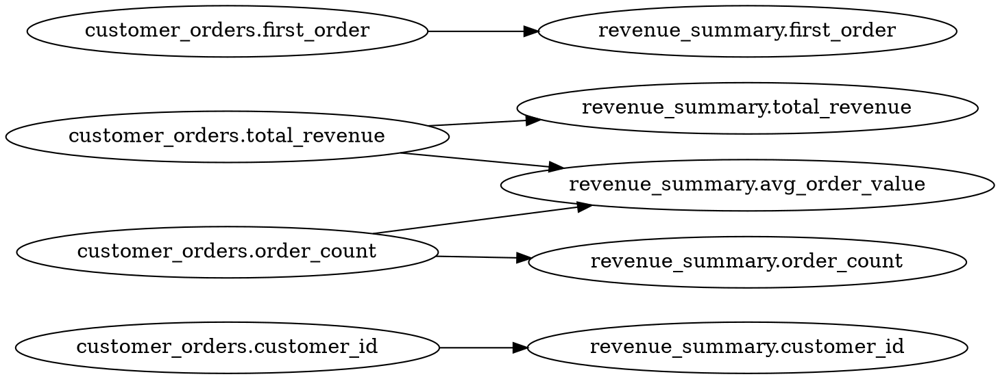

The Rocky playground creates a self-contained sample project that runs entirely on DuckDB. No warehouse credentials, no Fivetran account, no external services. It is the fastest way to experience Rocky's compiler, type system, lineage engine, and AI features.

## 1. Create the Playground

```bash
rocky playground my-project
```

This creates a directory with everything you need:

```
my-project/
├── rocky.toml                           # DuckDB pipeline config
├── models/
│   ├── raw_orders.sql                   # SQL replication model
│   ├── raw_orders.toml                  # Model config
│   ├── customer_orders.rocky            # Rocky DSL transformation
│   ├── customer_orders.toml             # Model config
│   ├── revenue_summary.sql              # SQL transformation
│   └── revenue_summary.toml             # Model config
├── contracts/
│   └── revenue_summary.contract.toml    # Data contract
└── data/
    └── seed.sql                         # DuckDB seed data
```

The default template is `quickstart` (3 models). Two larger templates are available for exploring more features:

```bash
rocky playground my-project --template ecommerce   # 11 models, sources/staging/marts
rocky playground my-project --template showcase    # ecommerce + Rocky DSL + extra contracts
```

Enter the project directory:

```bash
cd my-project
```

## 2. Explore the Generated Files

### rocky.toml

The pipeline config uses a local DuckDB adapter instead of Databricks. No credentials are required:

```toml
[adapter.local]
type = "duckdb"
path = "playground.duckdb"

[pipeline.playground]
type = "replication"
strategy = "full_refresh"
timestamp_column = "_updated_at"

[pipeline.playground.source]
adapter = "local"

[pipeline.playground.source.discovery]
adapter = "local"

[pipeline.playground.source.schema_pattern]
prefix = "raw__"
separator = "__"
components = ["source"]

[pipeline.playground.target]
adapter = "local"
catalog_template = "playground"
schema_template = "staging__{source}"

[state]
backend = "local"
```

The same `local` DuckDB adapter is used for discovery, the source, and the target — they all share the same `playground.duckdb` file, so writes from the warehouse side are visible to the discovery side. `rocky test` ignores `path` and runs models against an in-memory database with `data/seed.sql` auto-loaded; `rocky discover/plan/run` use the file at `path`, which you seed once with:

```bash
duckdb playground.duckdb < data/seed.sql
```

### raw_orders.sql + raw_orders.toml

The first model is a replication layer that selects raw order data:

**raw_orders.sql:**

```sql
SELECT
    order_id,
    customer_id,
    product_id,
    amount,
    status,
    order_date
FROM raw__orders.orders
```

The seed file in `data/seed.sql` creates the `raw__orders.orders` table — the schema name matches the pipeline's `prefix = "raw__"` so `rocky discover` finds it.

**raw_orders.toml:**

```toml
name = "raw_orders"

[strategy]
type = "full_refresh"

[target]
catalog = "playground"
schema = "staging"
table = "raw_orders"
```

### customer_orders.rocky

This model uses the Rocky DSL -- a concise syntax for common aggregation patterns:

```
-- Customer orders aggregation (Rocky DSL)
from raw_orders
where status != "cancelled"
group customer_id {
    total_revenue: sum(amount),
    order_count: count(),
    first_order: min(order_date)
}
where total_revenue > 0
```

The Rocky DSL compiles to standard SQL. The compiler type-checks column references, validates aggregation semantics, and resolves the `raw_orders` dependency automatically.

### revenue_summary.sql

A standard SQL transformation that builds on `customer_orders`:

```sql
SELECT
    customer_id,
    total_revenue,
    order_count,
    total_revenue / order_count AS avg_order_value,
    first_order
FROM customer_orders
WHERE order_count >= 2
```

### revenue_summary.contract.toml

A data contract that enforces the output schema of `revenue_summary`:

```toml
# Loose contract suitable for the playground.
# Type checker can't infer non-null from `SELECT col FROM raw__orders.orders`
# (the source schema is unknown to the compiler), so columns are declared
# nullable here to keep `rocky compile --contracts contracts` clean.

[[columns]]
name = "customer_id"
type = "Int64"
nullable = true

[[columns]]
name = "total_revenue"
type = "Decimal"
nullable = true

[[columns]]
name = "order_count"
type = "Int64"
nullable = true

[rules]
required = ["customer_id", "total_revenue", "order_count"]
protected = ["customer_id"]
```

The contract declares two rules:
- **required**: These columns must exist with the specified types. The compiler fails if they are missing or have the wrong type.
- **protected**: These columns cannot be removed in future changes. The compiler warns if a protected column disappears from the model's output.

The columns are marked `nullable = true` because the upstream `raw__orders` model selects from a schema the compiler cannot introspect, so it cannot prove non-nullability. A strict-contract walkthrough that pins types and nullability lives in the dedicated POCs.

## 3. Compile the Models

Run the compiler to type-check all models, resolve dependencies, and validate contracts:

```bash
rocky compile
```

Expected output:

```
  ✓ raw_orders (6 columns)
  ✓ customer_orders (4 columns)
  ✓ revenue_summary (5 columns)

  Compiled: 3 models, 0 errors, 0 warnings
```

The compiler performs several checks:
- **Dependency resolution**: Builds a DAG from model configs. `customer_orders` depends on `raw_orders`; `revenue_summary` depends on `customer_orders`.
- **Type inference**: Resolves column types through the chain. `amount` in `raw_orders` propagates through `sum(amount)` in `customer_orders` to `total_revenue / order_count` in `revenue_summary`.
- **Contract validation**: Checks that `revenue_summary` outputs `customer_id` (Int64), `total_revenue` (Decimal), and `order_count` (Int64) as required by the contract.

### Try introducing an error

Edit `revenue_summary.sql` and reference a column that does not exist:

```sql
SELECT
    customer_id,
    nonexistent_column,    -- does not exist in customer_orders
    order_count
FROM customer_orders
```

Run `rocky compile` again:

```
  ✓ raw_orders (6 columns)
  ✓ customer_orders (4 columns)
  ✗ revenue_summary

  error[E0001]: unknown column 'nonexistent_column'
    --> models/revenue_summary.sql:3:5
    |
  3 |     nonexistent_column,
    |     ^^^^^^^^^^^^^^^^^^ not found in customer_orders
    |
    = available columns: customer_id, total_revenue, order_count, first_order

  Compiled: 3 models, 1 error, 0 warnings
```

Revert the change before continuing.

## 4. Run the Tests

Rocky can execute models locally using DuckDB without any warehouse connection:

```bash
rocky test
```

Expected output:

```
Testing 3 models...

  All 3 models passed

  Result: 3 passed, 0 failed
```

The test runner:
1. Compiles all models
2. Executes each model's SQL against DuckDB in dependency order
3. Validates contract assertions against actual output
4. Reports pass/fail for each model

### Test a single model

```bash
rocky test --model revenue_summary
```

## 5. View Column Lineage

Rocky traces data flow at the column level. See the full lineage for a model:

```bash
rocky lineage revenue_summary
```

```
Model: revenue_summary
Upstream: customer_orders
Downstream:

Columns:
  customer_id <- customer_orders.customer_id (Direct)
  total_revenue <- customer_orders.total_revenue (Direct)
  order_count <- customer_orders.order_count (Direct)
  avg_order_value <- customer_orders.total_revenue, customer_orders.order_count (Derived)
  first_order <- customer_orders.first_order (Direct)
```

### Trace a single column through the entire chain

```bash
rocky lineage revenue_summary --column avg_order_value
```

```
Column trace: revenue_summary.avg_order_value
  <- customer_orders.total_revenue (Derived)
  <- customer_orders.order_count (Derived)
```

### Generate Graphviz output

```bash
rocky lineage revenue_summary --format dot
```



Pipe this to Graphviz to generate an SVG: `rocky lineage revenue_summary --format dot | dot -Tsvg -o lineage.svg`

## 6. Try AI Features

If you have an Anthropic API key, you can generate models from natural language:

```bash
export ANTHROPIC_API_KEY="sk-ant-..."
```

### Generate a new model

```bash
rocky ai "monthly revenue per customer from raw_orders, only completed orders"
```

Rocky sends your intent to Claude, receives generated code, and compiles it to verify correctness. If compilation fails, it retries with the error context (up to 3 attempts).

### Add intent to existing models

```bash
rocky ai-explain --all --save
```

This reads each model's SQL, generates a plain-English description, and saves it to the model's TOML config as an `intent` field. The intent is used later by `ai-sync` to automatically update models when upstream schemas change.

### Generate tests from intent

```bash
rocky ai-test --all --save
```

Generates test assertions based on each model's SQL logic and intent description, and saves them to the `tests/` directory.

See the [AI Features guide](/rocky/guides/ai-features/) for a complete walkthrough.

## 7. Run CI Locally

The `ci` command combines compilation and testing into a single pass with an exit code suitable for CI pipelines:

```bash
rocky ci
```

```
Rocky CI Pipeline

  Compile: PASS (3 models)
  Test:    PASS (3 passed, 0 failed)

  Exit code: 0
```

Exit code 0 means all checks passed. A non-zero exit code fails the CI job.

## Next Steps

- [Migrating from dbt](/rocky/guides/migrate-from-dbt/) -- import an existing dbt project
- [IDE Setup](/rocky/guides/ide-setup/) -- install the VS Code extension for hover types, go-to-definition, and inline lineage
- [CI/CD Integration](/rocky/guides/ci-cd/) -- add Rocky to your GitHub Actions or GitLab CI pipeline
- [AI Features](/rocky/guides/ai-features/) -- generate models, sync schema changes, and create tests with AI
- [Data Governance](/rocky/guides/governance/) -- configure contracts, permissions, and quality checks
