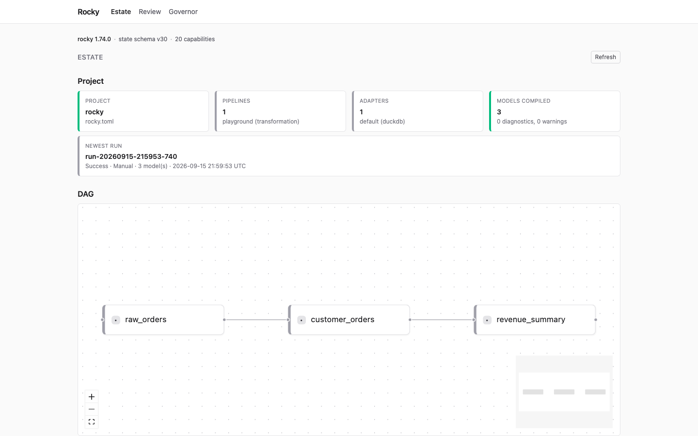

# rocky-ui

The browser UI that `rocky serve --ui` embeds. A React shell over `/api/v1`; every value it shows comes from a typed engine payload, and nothing it loads comes from another host. Release binaries and the container image already include it. The [browser UI guide](https://rocky-data.dev/guides/browser-ui/) shows each screen.



```bash
npm ci
npm run build      # writes dist/, then refuses any external load
npm test           # vitest
npm run typecheck
npm run lint
```

`cargo build --features ui` (from `engine/`) embeds `dist/` into the binary. Plain `cargo build` needs no node toolchain. The generated TypeScript types come from `just codegen` and are imported through the `@rocky-types/*` alias, so this package has no copy of them.

Local development, one command from the repository root:

```bash
just ui-dev                          # the playground's default POC, a transformation pipeline
just ui-dev path/to/your/project
```

It builds this checkout's `rocky`, starts `rocky serve` in that project (default `examples/playground/pocs/00-foundations/00-playground-default`) on port 8080 with a read-only token (`dev`), waits for `/api/v1/health`, then starts Vite on 5173. Open `http://localhost:5173/ui/#token=dev`. Ctrl-C stops both; if either process dies the other is stopped. `ROCKY_UI_DEV_PORT` and `ROCKY_UI_DEV_TOKEN` override the port and the token, and Vite's proxy follows the port (`ROCKY_API` in `vite.config.ts`), so the two cannot disagree.

By hand: run `rocky serve --token t --token-scope read-only` on port 8080, then `npm run dev` and open the printed Vite address with `#token=t`.
